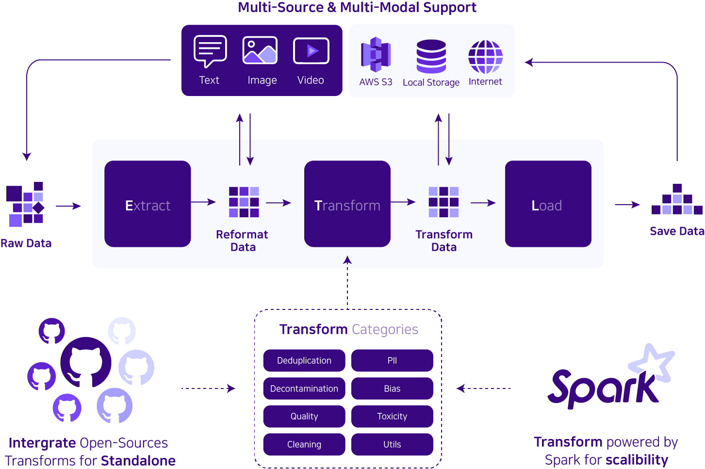
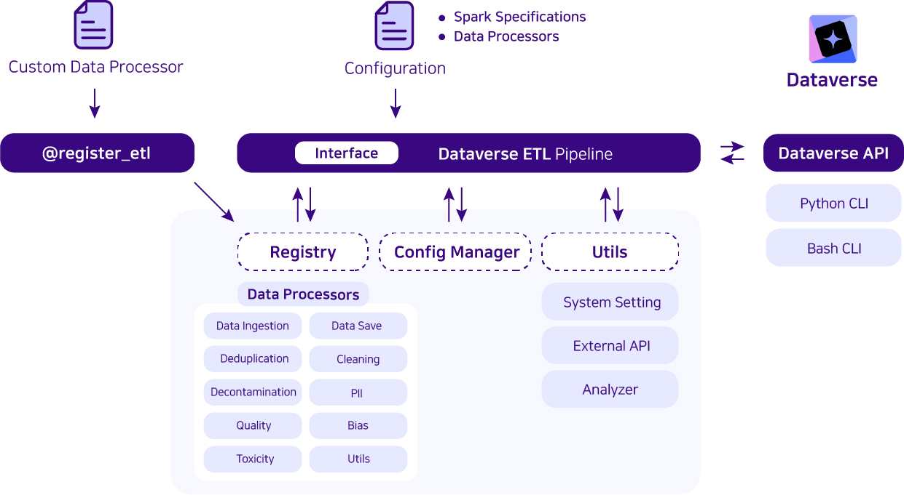

# Dataverse 项目推出了一款开源的 ETL 管道，旨在为大型语言模型提供数据提取、转换和加载的服务。

发布时间：2024年03月28日

`LLM应用` `大数据` `ETL流程`

> Dataverse: Open-Source ETL (Extract, Transform, Load) Pipeline for Large Language Models

# 摘要

> 为了解决大规模数据处理的难题，我们推出了Dataverse——一个以用户友好性为核心的统一开源ETL流水线，专为大型语言模型（LLMs）设计。Dataverse支持通过块状界面轻松添加个性化处理器，让用户能够便捷地打造定制化的ETL流程。我们期望Dataverse能够助力LLM的发展，并全面开源，以吸引社区的积极参与。同时，我们还制作了一个简短的两分钟视频，直观展示了系统的能力和实际操作。

> To address the challenges associated with data processing at scale, we propose Dataverse, a unified open-source Extract-Transform-Load (ETL) pipeline for large language models (LLMs) with a user-friendly design at its core. Easy addition of custom processors with block-based interface in Dataverse allows users to readily and efficiently use Dataverse to build their own ETL pipeline. We hope that Dataverse will serve as a vital tool for LLM development and open source the entire library to welcome community contribution. Additionally, we provide a concise, two-minute video demonstration of our system, illustrating its capabilities and implementation.

[Arxiv](https://arxiv.org/abs/2403.19340)