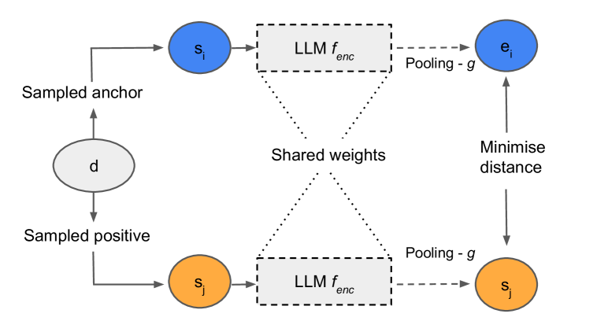
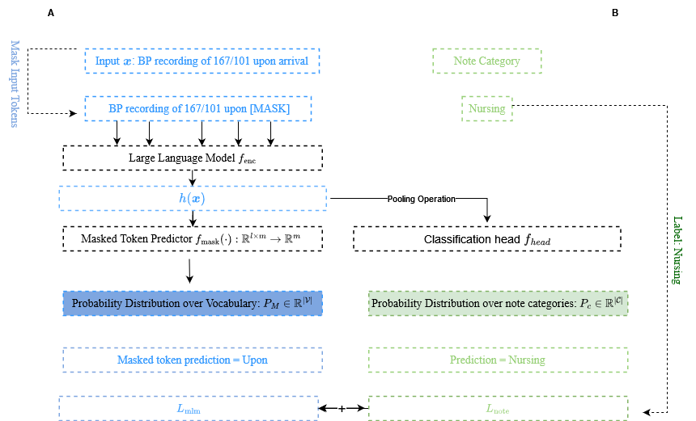
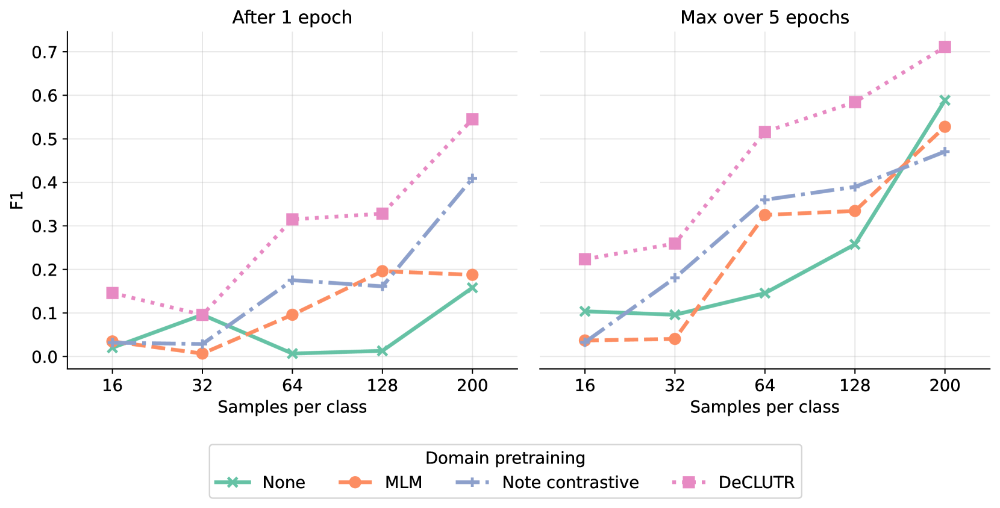
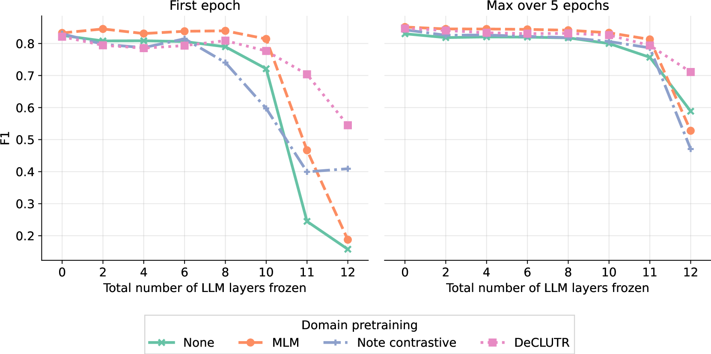
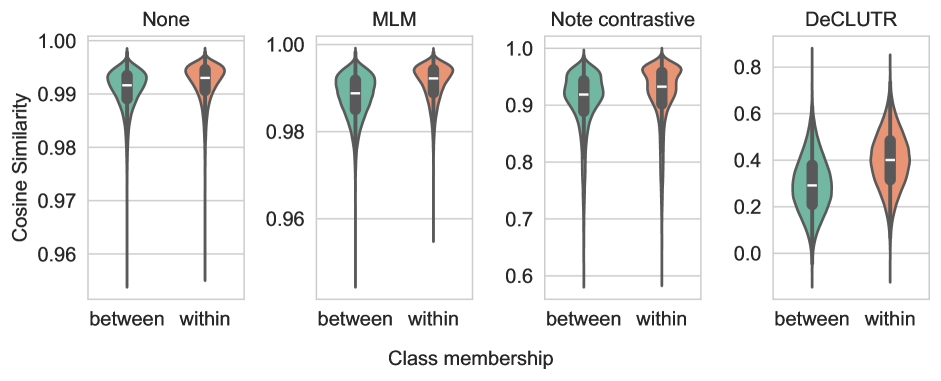
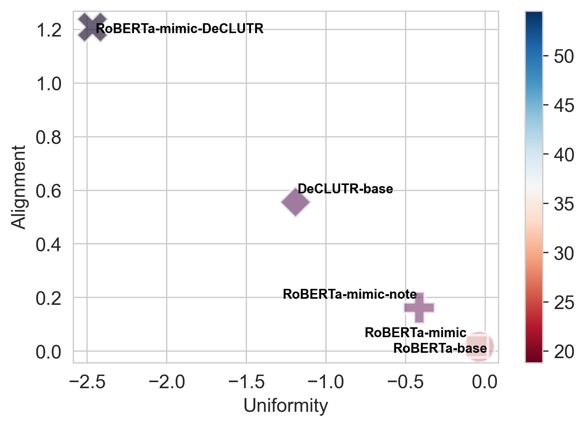
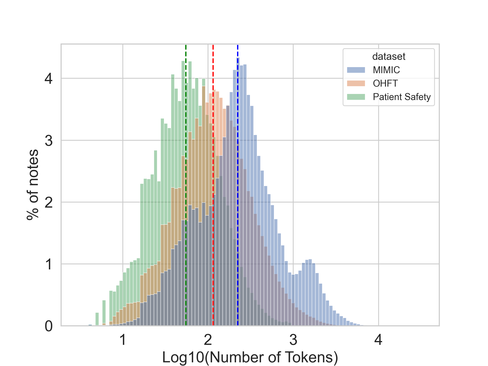

# 构建医疗领域语言模型的嵌入向量空间

发布时间：2024年03月28日

`LLM应用` `医疗保健`

> Developing Healthcare Language Model Embedding Spaces

# 摘要

> 预训练的大型语言模型（LLMs）在处理医疗保健等非专业领域的文本数据时常常遇到困难。本研究尝试通过专门预训练，让规模较小的LLMs更好地适应各类医疗保健数据集。我们评估了三种不同的方法：传统的掩码语言模型、深度对比学习（DeCLUTR）以及一种新颖的利用医疗保健领域元数据类别的预训练目标。这些方法在各个数据集的文档分类任务上进行了测试，并对生成的嵌入空间进行了深入分析。结果显示，对比学习训练的模型在分类任务上表现最佳，能够在标签数据有限且模型参数更新次数较少的情况下，取得出色的性能。尽管基于元数据的预训练并未在所有数据集上进一步提升分类效果，但它确实提高了嵌入聚类的区分度。所有经过领域适应的LLMs均优于通用的基础模型，这证明了领域专业化的重要性。本研究为在资源有限的情况下，如何高效地提升小型LLMs在医疗保健领域的能力提供了指导，这对于在本地医疗环境中负责任和可持续地部署AI技术至关重要。我们不仅给出了专门针对医疗保健领域的LLMs预训练的建议，还鼓励持续探索对比学习的目标，并展示了如何将小型LLMs适配到对隐私敏感的医疗任务上。

> Pre-trained Large Language Models (LLMs) often struggle on out-of-domain datasets like healthcare focused text. We explore specialized pre-training to adapt smaller LLMs to different healthcare datasets. Three methods are assessed: traditional masked language modeling, Deep Contrastive Learning for Unsupervised Textual Representations (DeCLUTR), and a novel pre-training objective utilizing metadata categories from the healthcare settings. These schemes are evaluated on downstream document classification tasks for each dataset, with additional analysis of the resultant embedding spaces. Contrastively trained models outperform other approaches on the classification tasks, delivering strong performance from limited labeled data and with fewer model parameter updates required. While metadata-based pre-training does not further improve classifications across the datasets, it yields interesting embedding cluster separability. All domain adapted LLMs outperform their publicly available general base LLM, validating the importance of domain-specialization. This research illustrates efficient approaches to instill healthcare competency in compact LLMs even under tight computational budgets, an essential capability for responsible and sustainable deployment in local healthcare settings. We provide pre-training guidelines for specialized healthcare LLMs, motivate continued inquiry into contrastive objectives, and demonstrates adaptation techniques to align small LLMs with privacy-sensitive medical tasks.

[Arxiv](https://arxiv.org/abs/2403.19802)