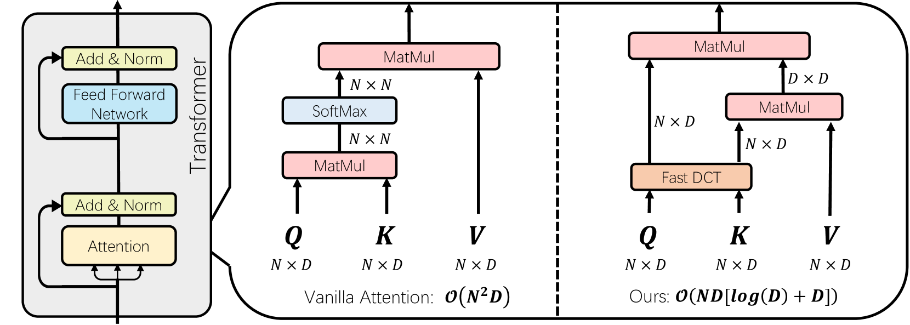
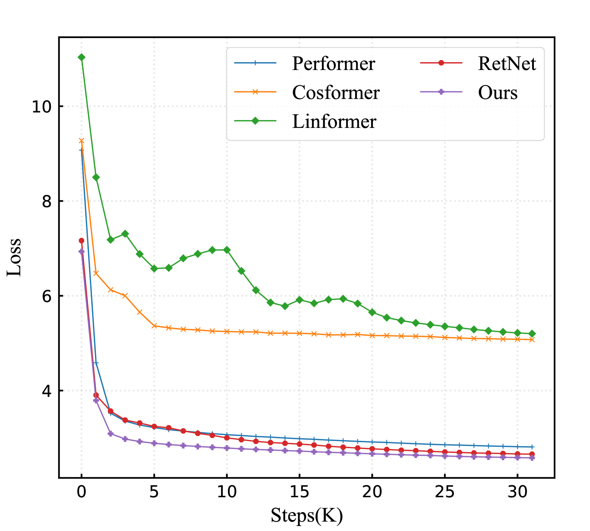
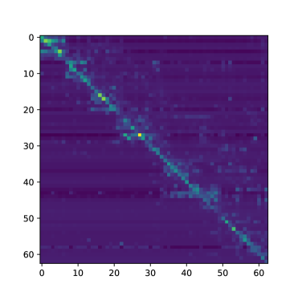
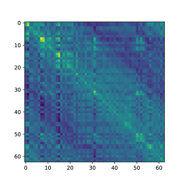
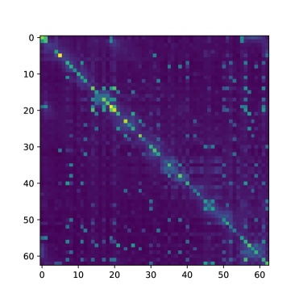
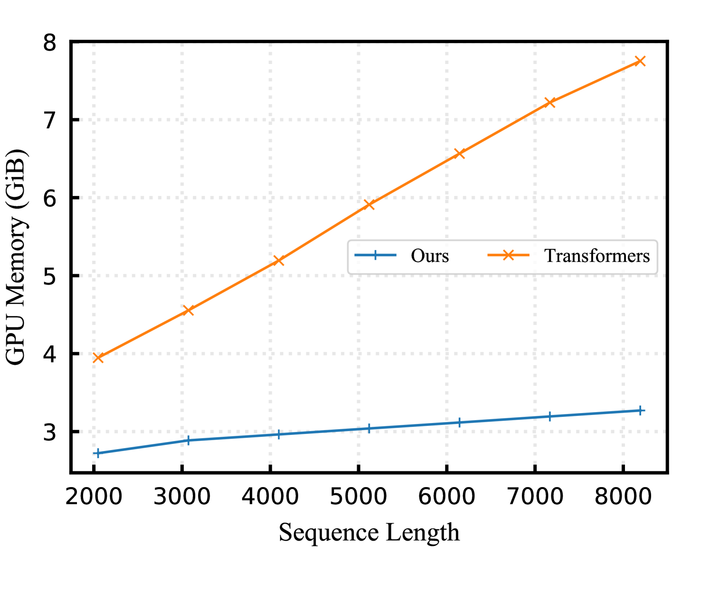
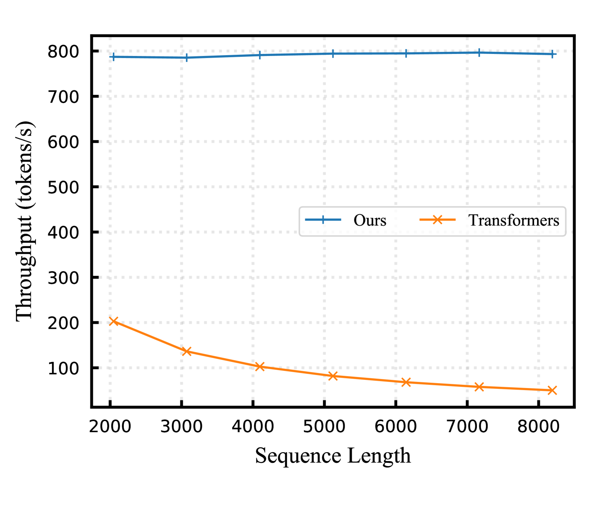

# DiJiang：通过精巧核化技术，打造高效的大型语言模型

发布时间：2024年03月28日

`LLM理论` `计算机科学` `模型优化`

> DiJiang: Efficient Large Language Models through Compact Kernelization

# 摘要

> 为了降低Transformer的计算压力，线性注意力机制的研究正迅速发展。然而，改进注意力机制往往需要大量重新训练，这对于参数众多的大型语言模型而言并不现实。本文介绍了DiJiang，这是一种创新的频域核化技术，它能够以极低的训练代价，将标准的预训练Transformer转变为具有线性复杂度的模型。该方法利用加权准蒙特卡洛采样，理论上能提供更高的近似效率。为了进一步降低训练难度，DiJiang采用了离散余弦变换（DCT）运算。实验证明，该方法在多个基准测试中与原版Transformer表现相当，但训练成本大幅降低，推理速度显著提升。DiJiang-7B在各项基准测试中与LLaMA2-7B性能不相上下，却只需约五分之一的训练成本。相关代码已在GitHub上提供。

> In an effort to reduce the computational load of Transformers, research on linear attention has gained significant momentum. However, the improvement strategies for attention mechanisms typically necessitate extensive retraining, which is impractical for large language models with a vast array of parameters. In this paper, we present DiJiang, a novel Frequency Domain Kernelization approach that enables the transformation of a pre-trained vanilla Transformer into a linear complexity model with little training costs. By employing a weighted Quasi-Monte Carlo method for sampling, the proposed approach theoretically offers superior approximation efficiency. To further reduce the training computational complexity, our kernelization is based on Discrete Cosine Transform (DCT) operations. Extensive experiments demonstrate that the proposed method achieves comparable performance to the original Transformer, but with significantly reduced training costs and much faster inference speeds. Our DiJiang-7B achieves comparable performance with LLaMA2-7B on various benchmark while requires only about 1/50 training cost. Code is available at https://github.com/YuchuanTian/DiJiang.

[Arxiv](https://arxiv.org/abs/2403.19928)