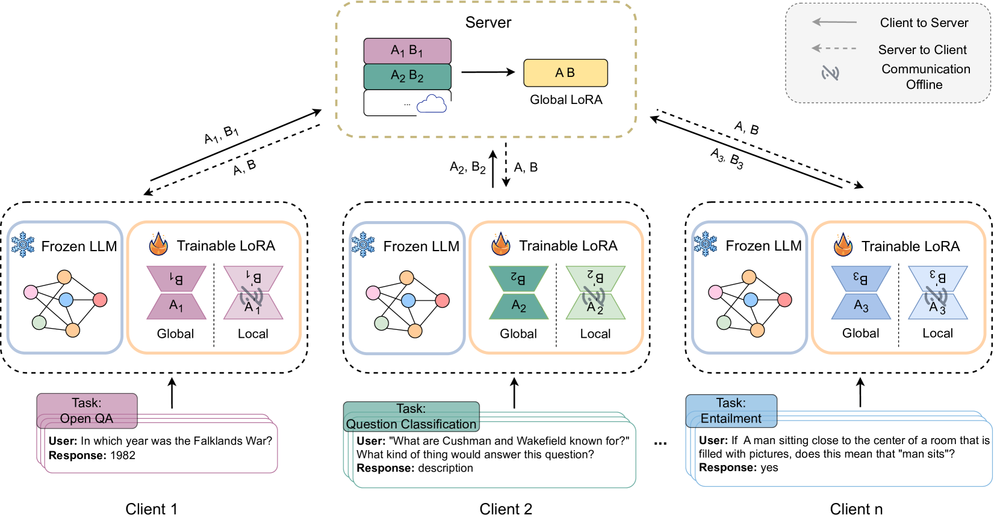
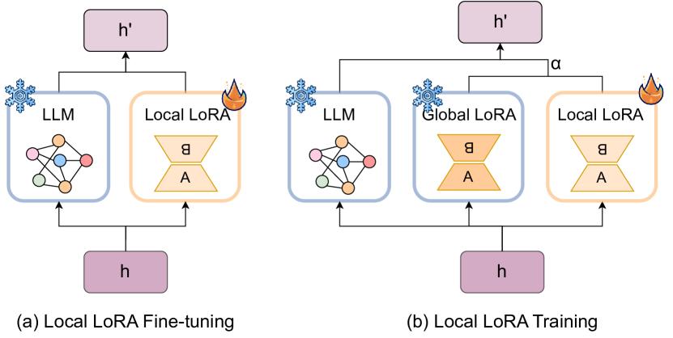
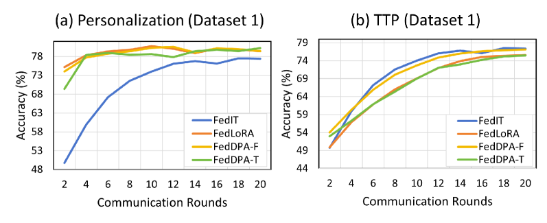
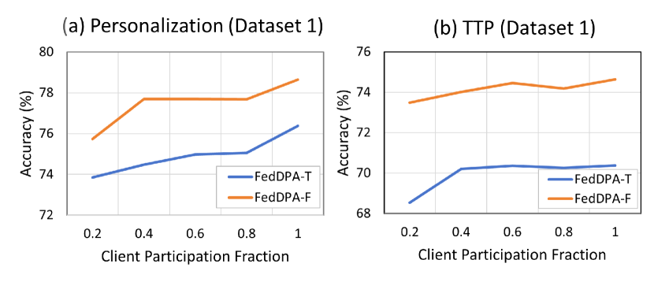
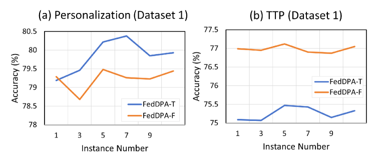

# 在联邦基础模型中，我们采用了双个性化适配器技术，以实现更加精准的个性化服务。

发布时间：2024年03月28日

`LLM应用` `隐私保护` `个性化推荐`

> Dual-Personalizing Adapter for Federated Foundation Models

# 摘要

> 近期，基础模型尤其是大型语言模型（LLMs）通过大量指令数据的微调，展现出了适应多样任务的卓越能力。联合基础模型作为保护隐私的新兴方法，在联合学习（FL）环境下利用众多分布式非独立同分布数据集，实现模型的协同微调。为降低通信和计算负担，研究引入了高效的参数方法，并针对用户偏好对联合基础模型进行了个性化改进。然而，现有研究忽略了实际应用中测试阶段的分布变化问题。为此，我们提出了“测试时个性化”的新概念，旨在不仅针对特定本地任务，也能覆盖测试阶段出现分布变化的其他任务。面对新设置的挑战，我们探索了一种学习全面基础模型的有效方法。我们提出了双重个性化适配器架构（FedDPA），包含全局和本地两个适配器，分别应对测试时的分布变化和个性化需求。同时，引入了逐例动态加权机制，优化全局与本地适配器的协调，以提升整体效能。这一方法已在多个NLP任务的标准数据集上得到了验证。

> Recently, foundation models, particularly large language models (LLMs), have demonstrated an impressive ability to adapt to various tasks by fine-tuning large amounts of instruction data. Notably, federated foundation models emerge as a privacy preservation method to fine-tune models collaboratively under federated learning (FL) settings by leveraging many distributed datasets with non-IID data. To alleviate communication and computation overhead, parameter-efficient methods are introduced for efficiency, and some research adapted personalization methods to federated foundation models for better user preferences alignment. However, a critical gap in existing research is the neglect of test-time distribution shifts in real-world applications. Therefore, to bridge this gap, we propose a new setting, termed test-time personalization, which not only concentrates on the targeted local task but also extends to other tasks that exhibit test-time distribution shifts. To address challenges in this new setting, we explore a simple yet effective solution to learn a comprehensive foundation model. Specifically, a dual-personalizing adapter architecture (FedDPA) is proposed, comprising a global adapter and a local adapter for addressing test-time distribution shifts and personalization, respectively. Additionally, we introduce an instance-wise dynamic weighting mechanism to optimize the balance between the global and local adapters, enhancing overall performance. The effectiveness of the proposed method has been evaluated on benchmark datasets across different NLP tasks.

[Arxiv](https://arxiv.org/abs/2403.19211)