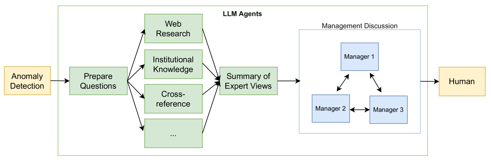
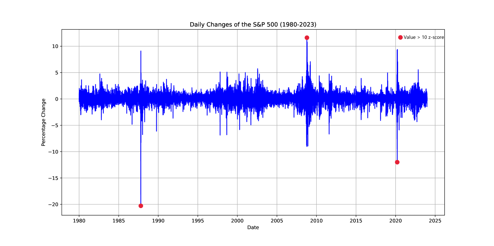

# 借助基于大型语言模型的多智能体框架，提升金融市场异常检测的能力。

发布时间：2024年03月28日

`Agent` `金融市场` `异常检测`

> Enhancing Anomaly Detection in Financial Markets with an LLM-based Multi-Agent Framework

# 摘要

> 本文提出了一种新型的多智能体框架，它基于大型语言模型（LLM），致力于提升金融市场数据异常检测的能力，应对人工核实系统警报的难题。该框架构建了一个AI智能体的协作网络，各智能体分工明确，涵盖数据转换、网络深度专家分析、机构知识应用、以及报告的整合与管理等关键职能。通过协同作业，这一框架实现了对财务数据异常的全面自动化验证与解读。通过对标准普尔500指数的分析，本研究证实了该框架在提升市场监控效率、精确度和降低人力需求方面的卓越表现。AI的自主功能与传统分析方法的融合，不仅凸显了框架在异常检测上的强大效能，也预示着其在金融市场监控支持领域的广泛应用前景。

> This paper introduces a Large Language Model (LLM)-based multi-agent framework designed to enhance anomaly detection within financial market data, tackling the longstanding challenge of manually verifying system-generated anomaly alerts. The framework harnesses a collaborative network of AI agents, each specialised in distinct functions including data conversion, expert analysis via web research, institutional knowledge utilization or cross-checking and report consolidation and management roles. By coordinating these agents towards a common objective, the framework provides a comprehensive and automated approach for validating and interpreting financial data anomalies. I analyse the S&P 500 index to demonstrate the framework's proficiency in enhancing the efficiency, accuracy and reduction of human intervention in financial market monitoring. The integration of AI's autonomous functionalities with established analytical methods not only underscores the framework's effectiveness in anomaly detection but also signals its broader applicability in supporting financial market monitoring.

[Arxiv](https://arxiv.org/abs/2403.19735)