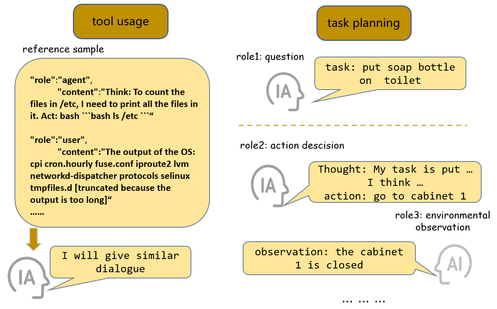
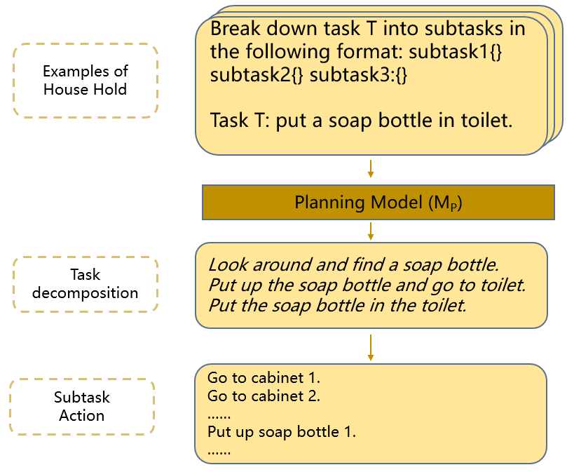
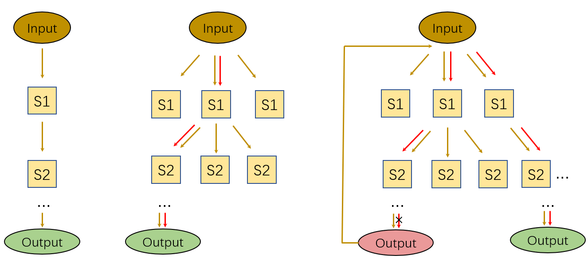
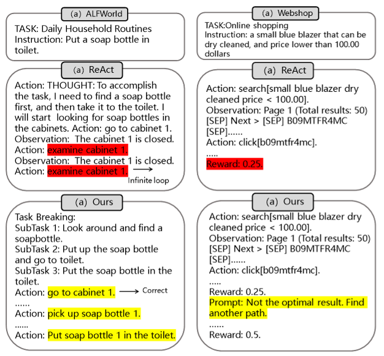

# 通过精细调优和多路径推理，提升低参数大型语言模型的泛化能力。

发布时间：2024年03月28日

`Agent` `智能代理` `任务规划`

> Enhancing the General Agent Capabilities of Low-Parameter LLMs through Tuning and Multi-Branch Reasoning

# 摘要

> 开源的大型语言模型（LLMs）在理解和生成语言方面表现出色，广泛应用于多种任务并取得显著成效。但面对现实世界的复杂问题，其表现却难与ChatGPT、GPT-4等商业模型媲美。LLMs作为智能代理，需具备任务规划、长期记忆和运用外部资源的能力，以实现卓越性能。为此，研究者们提出了多种提升LLMs代理能力的策略。我们针对7B和13B模型，一方面构建特定代理的数据并对模型进行精细调整，另一方面设计有效的提示以激发LLMs的推理潜能。我们采用GPT-4提出了一套全面的构建代理特定数据的方法。经过监督学习微调后，我们发现这种方法能显著降低任务中的幻觉和格式错误。同时，通过多路径推理和任务分解等技巧，我们有效简化了问题，提升了LLMs作为代理的性能。在AgentBench的五项代理任务评估中，我们的方法取得了令人满意的成果。

> Open-source pre-trained Large Language Models (LLMs) exhibit strong language understanding and generation capabilities, making them highly successful in a variety of tasks. However, when used as agents for dealing with complex problems in the real world, their performance is far inferior to large commercial models such as ChatGPT and GPT-4. As intelligent agents, LLMs need to have the capabilities of task planning, long-term memory, and the ability to leverage external tools to achieve satisfactory performance. Various methods have been proposed to enhance the agent capabilities of LLMs. On the one hand, methods involve constructing agent-specific data and fine-tuning the models. On the other hand, some methods focus on designing prompts that effectively activate the reasoning abilities of the LLMs. We explore both strategies on the 7B and 13B models. We propose a comprehensive method for constructing agent-specific data using GPT-4. Through supervised fine-tuning with constructed data, we find that for these models with a relatively small number of parameters, supervised fine-tuning can significantly reduce hallucination outputs and formatting errors in agent tasks. Furthermore, techniques such as multi-path reasoning and task decomposition can effectively decrease problem complexity and enhance the performance of LLMs as agents. We evaluate our method on five agent tasks of AgentBench and achieve satisfactory results.

[Arxiv](https://arxiv.org/abs/2403.19962)