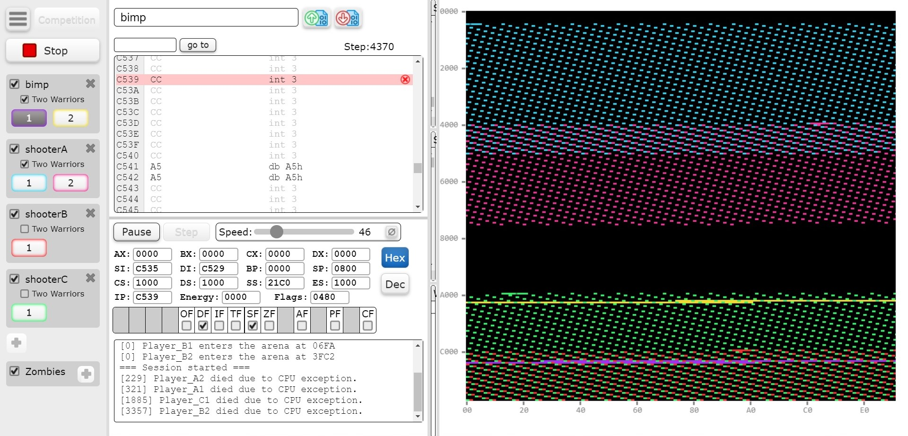
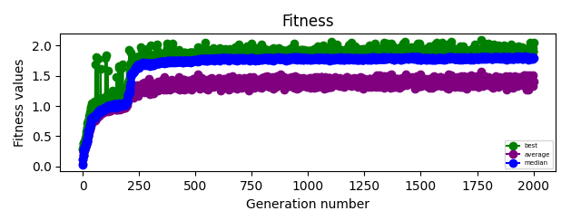
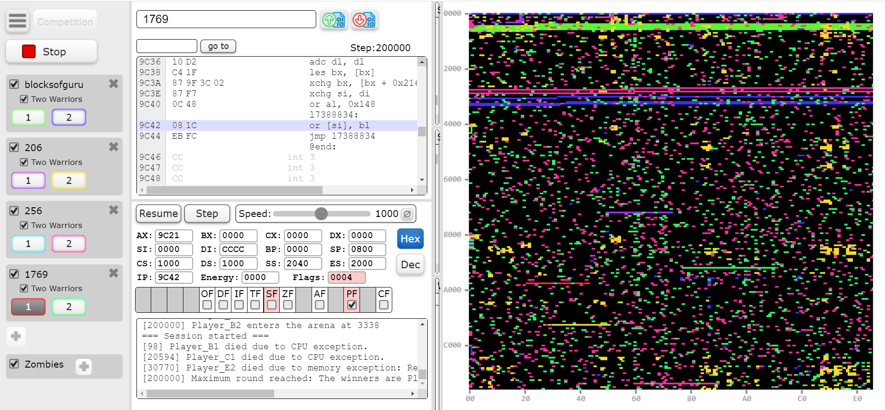
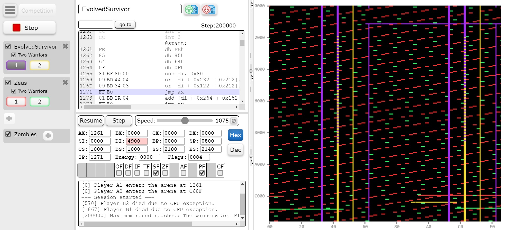
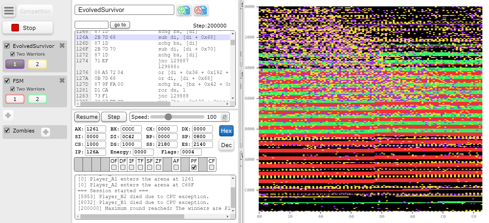

# 在充满挑战的环境中，汇编代码不断进化以适应和提升性能。

发布时间：2024年03月28日

`RAG` `网络安全` `遗传编程`

> Evolving Assembly Code in an Adversarial Environment

# 摘要

> 在本研究中，我们针对CodeGuru竞赛优化汇编代码，旨在打造一个能在共享内存中持续运行最久的程序，它能够抵御对手攻击并利用它们的漏洞。我们定义了汇编语言的巴科斯范式（BNF），并通过遗传编程（GP）从零开始合成代码，以培育出高质量的解算器。通过与人类编写的优胜程序进行CodeGuru对抗赛，我们评估了这些程序的强度。我们培育的程序不仅发现了对手程序的弱点，还巧妙地加以利用。此外，我们还将这种方法与大型语言模型进行了对比，结果显示后者无法创造出能够赢得比赛的程序。这项研究在网络安全领域具有深远意义，因为我们运用演化策略来识别程序的潜在漏洞。由于汇编BNF的通用性，只需调整适应度函数，即可应用于检测和修复代码中的弱点。CodeGuru竞赛提供了一个独特的平台，用于研究GP和代码在对抗性环境中的演化。为了推动相关领域的研究，我们对演化出的幸存者及其暴露的弱点进行了详尽的定性分析。

> In this work, we evolve assembly code for the CodeGuru competition. The competition's goal is to create a survivor -- an assembly program that runs the longest in shared memory, by resisting attacks from adversary survivors and finding their weaknesses. For evolving top-notch solvers, we specify a Backus Normal Form (BNF) for the assembly language and synthesize the code from scratch using Genetic Programming (GP). We evaluate the survivors by running CodeGuru games against human-written winning survivors. Our evolved programs found weaknesses in the programs they were trained against and utilized them. In addition, we compare our approach with a Large-Language Model, demonstrating that the latter cannot generate a survivor that can win at any competition. This work has important applications for cyber-security, as we utilize evolution to detect weaknesses in survivors. The assembly BNF is domain-independent; thus, by modifying the fitness function, it can detect code weaknesses and help fix them. Finally, the CodeGuru competition offers a novel platform for analyzing GP and code evolution in adversarial environments. To support further research in this direction, we provide a thorough qualitative analysis of the evolved survivors and the weaknesses found.

[Arxiv](https://arxiv.org/abs/2403.19489)