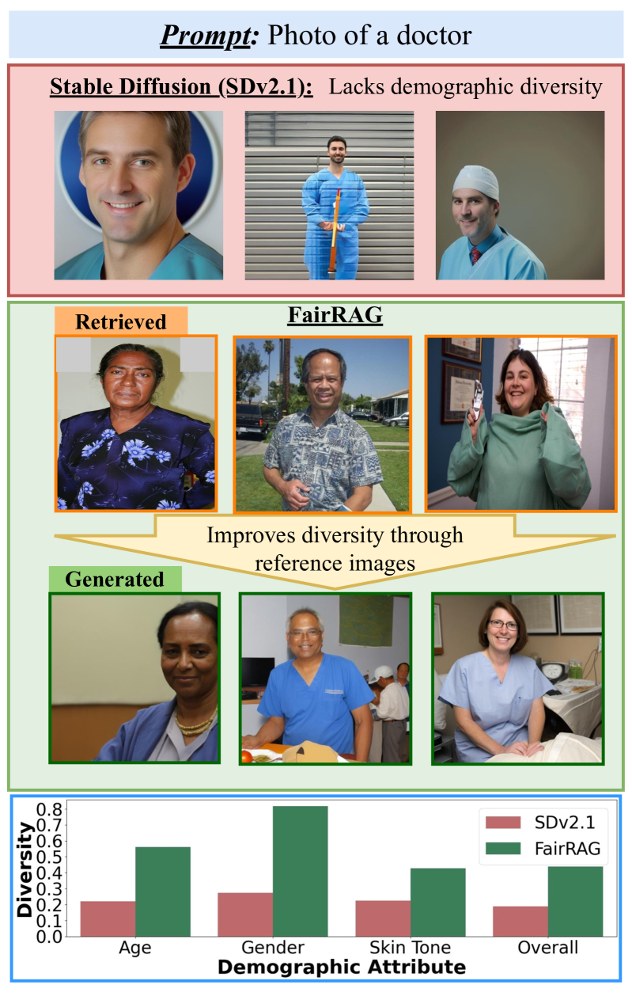
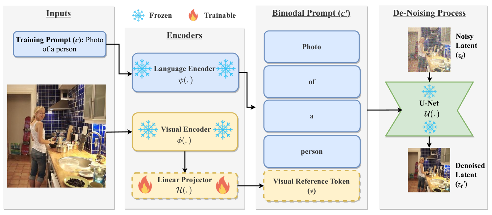

# FairRAG：借助公平检索扩展，实现公正的人工智能人物创作

发布时间：2024年03月28日

`RAG` `计算机视觉` `社会公平`

> FairRAG: Fair Human Generation via Fair Retrieval Augmentation

# 摘要

> 目前的文本到图像生成模型往往复制或加剧了训练数据中的社会偏见，尤其在生成人物图像时，对某些人群存在不公平的偏见。以往的纠正尝试受到预训练模型限制的制约，未能有效提升图像生成的人口多样性。本研究提出了一种名为公平检索增强生成（FairRAG）的新框架，它利用外部图像数据库中的参考图像来引导预训练模型，从而提高生成人物图像的公平性。FairRAG通过一个轻量化的线性模块，将参考图像映射到文本领域，同时采用简单有效的去偏技术，在生成过程中引入多样化人群的图像。大量实验证明，FairRAG在提升人口多样性、图像与文本的一致性以及图像真实度方面超越了现有技术，且在推理阶段的计算成本极低。

> Existing text-to-image generative models reflect or even amplify societal biases ingrained in their training data. This is especially concerning for human image generation where models are biased against certain demographic groups. Existing attempts to rectify this issue are hindered by the inherent limitations of the pre-trained models and fail to substantially improve demographic diversity. In this work, we introduce Fair Retrieval Augmented Generation (FairRAG), a novel framework that conditions pre-trained generative models on reference images retrieved from an external image database to improve fairness in human generation. FairRAG enables conditioning through a lightweight linear module that projects reference images into the textual space. To enhance fairness, FairRAG applies simple-yet-effective debiasing strategies, providing images from diverse demographic groups during the generative process. Extensive experiments demonstrate that FairRAG outperforms existing methods in terms of demographic diversity, image-text alignment, and image fidelity while incurring minimal computational overhead during inference.

[Arxiv](https://arxiv.org/abs/2403.19964)