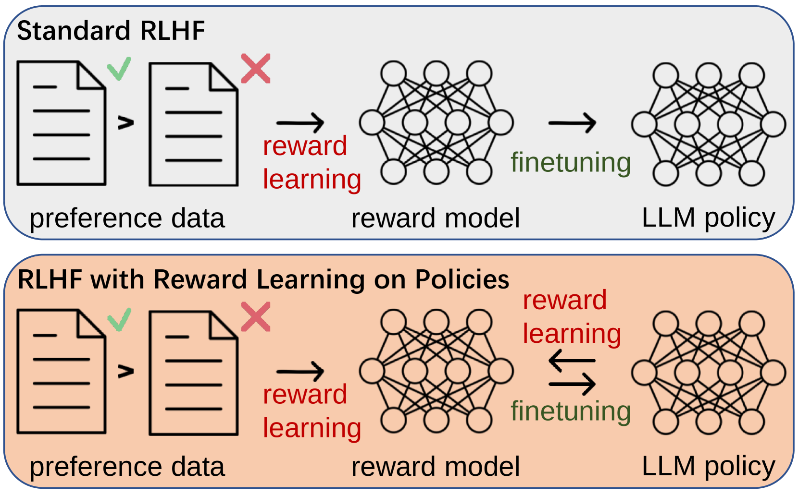
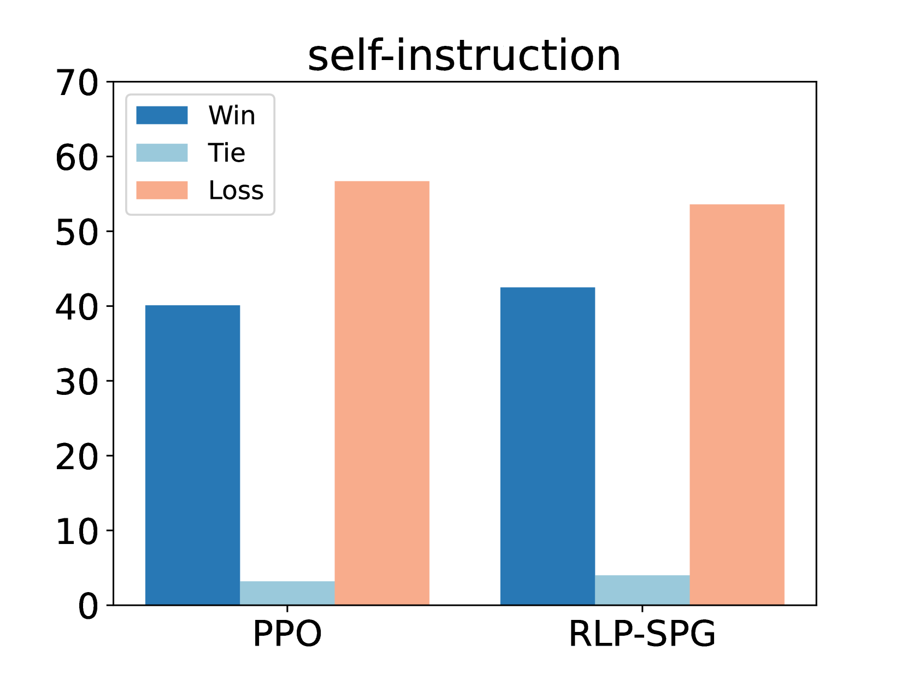
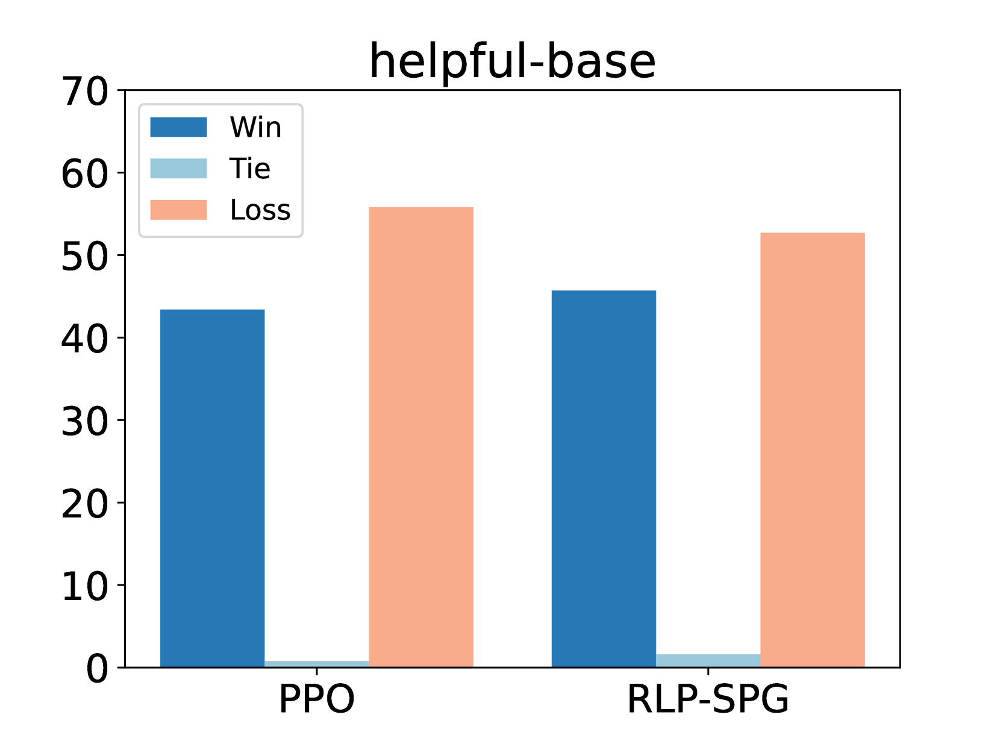
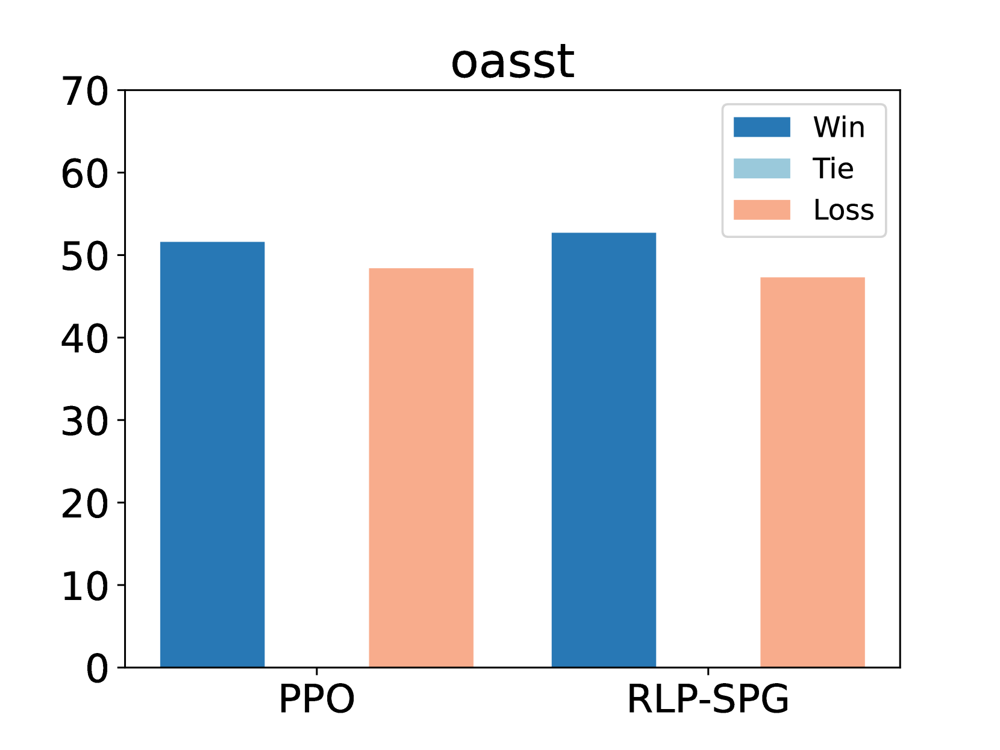
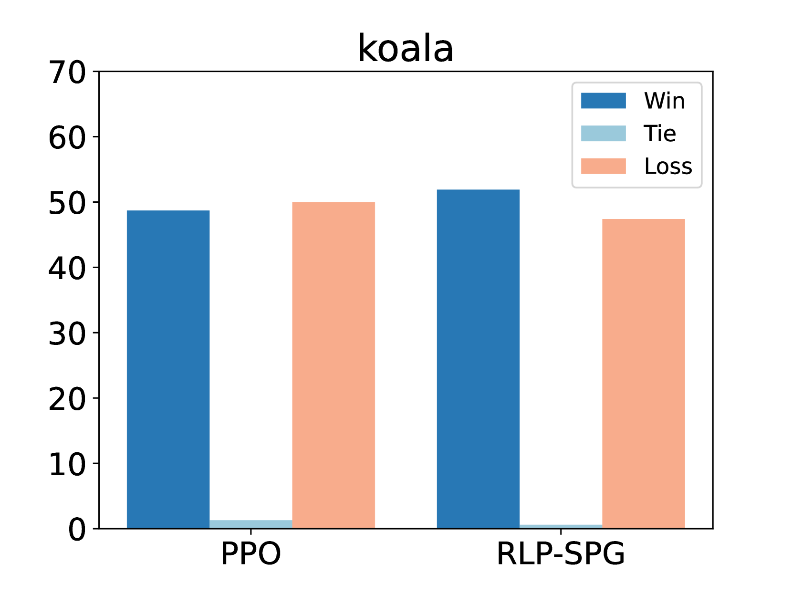

# 在策略上运用奖励学习对语言模型进行精细调整

发布时间：2024年03月28日

`LLM应用` `人工智能`

> Fine-Tuning Language Models with Reward Learning on Policy

# 摘要

> 人类反馈驱动的强化学习（RLHF）正成为大型语言模型（LLMs）与人类偏好对接的有效途径。RLHF分为三步：搜集人类偏好、学习奖励模型和优化策略，通常依次进行。然而，这种固定奖励模型可能因策略优化导致数据分布偏移而出现不准确的问题。通过不断从最新模型搜集偏好数据虽可缓解此问题，却也使得系统变得复杂，优化难度加大。本文提出了一种新的无监督策略奖励学习框架（RLP），通过策略样本来微调奖励模型，确保其准确性。我们引入了一种无监督的多视角学习方法，用以提取策略样本的稳健特征，并开发了一种合成偏好生成技术，以策略输出模拟出高质量的偏好数据。在三大基准数据集上的广泛测试显示，RLP的表现始终超越当前最先进的技术。相关代码已在 \url{https://github.com/AlibabaResearch/DAMO-ConvAI/tree/main/rlp} 上发布。

> Reinforcement learning from human feedback (RLHF) has emerged as an effective approach to aligning large language models (LLMs) to human preferences. RLHF contains three steps, i.e., human preference collecting, reward learning, and policy optimization, which are usually performed serially. Despite its popularity, however, (fixed) reward models may suffer from inaccurate off-distribution, since policy optimization continuously shifts LLMs' data distribution. Repeatedly collecting new preference data from the latest LLMs may alleviate this issue, which unfortunately makes the resulting system more complicated and difficult to optimize. In this paper, we propose reward learning on policy (RLP), an unsupervised framework that refines a reward model using policy samples to keep it on-distribution. Specifically, an unsupervised multi-view learning method is introduced to learn robust representations of policy samples. Meanwhile, a synthetic preference generation approach is developed to simulate high-quality preference data with policy outputs. Extensive experiments on three benchmark datasets show that RLP consistently outperforms the state-of-the-art. Our code is available at \url{https://github.com/AlibabaResearch/DAMO-ConvAI/tree/main/rlp}.

[Arxiv](https://arxiv.org/abs/2403.19279)