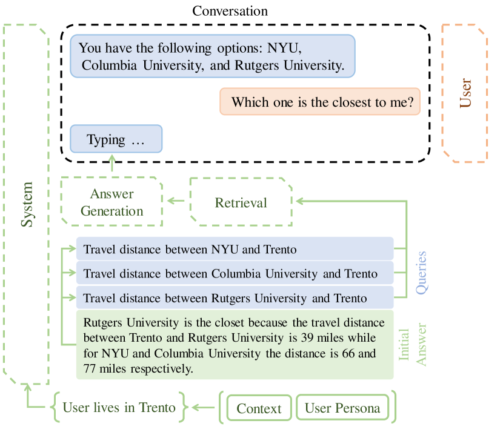
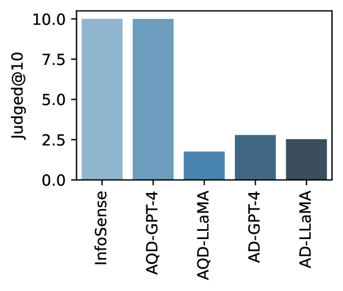
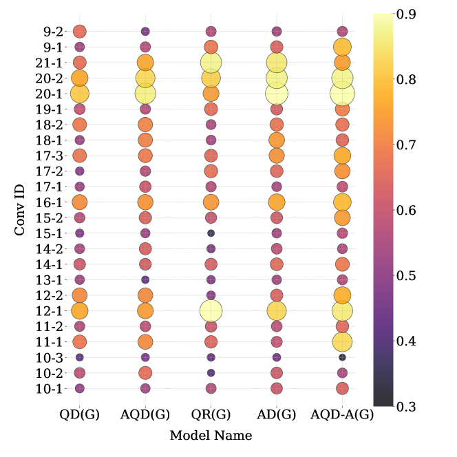
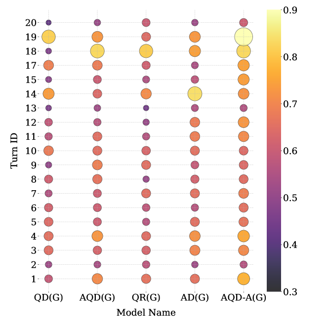

# 先生成后检索：借助大型语言模型打造对话式回答检索，实现智能问答生成与查询。

发布时间：2024年03月28日

`LLM应用` `信息检索` `交互式知识助手`

> Generate then Retrieve: Conversational Response Retrieval Using LLMs as Answer and Query Generators

# 摘要

> 交互式知识助手（CIS）是信息检索（IR）领域的重要分支，致力于构建能够与用户互动的知识助理。这类系统需巧妙掌握对话背景下的用户信息需求，并提供相关信息。为此，传统方法通过一个重写查询来捕捉用户需求，并用之检索文本。本文提出了三种创新方法，通过生成多个查询来提升检索效果。我们利用大型语言模型（如 GPT-4 和 Llama-2）的深度理解与响应生成能力，来创造多样化的查询。在零-shot 和少-shot 环境下，我们对这些模型进行了实施和评估。同时，我们还基于 gpt 3.5 的评估结果，为 TREC iKAT 设立了新的基准。实验证明，这些新模型在 TREC iKAT 数据集上表现出色。

> CIS is a prominent area in IR that focuses on developing interactive knowledge assistants. These systems must adeptly comprehend the user's information requirements within the conversational context and retrieve the relevant information. To this aim, the existing approaches model the user's information needs with one query called rewritten query and use this query for passage retrieval. In this paper, we propose three different methods for generating multiple queries to enhance the retrieval. In these methods, we leverage the capabilities of large language models (LLMs) in understanding the user's information need and generating an appropriate response, to generate multiple queries. We implement and evaluate the proposed models utilizing various LLMs including GPT-4 and Llama-2 chat in zero-shot and few-shot settings. In addition, we propose a new benchmark for TREC iKAT based on gpt 3.5 judgments. Our experiments reveal the effectiveness of our proposed models on the TREC iKAT dataset.

[Arxiv](https://arxiv.org/abs/2403.19302)