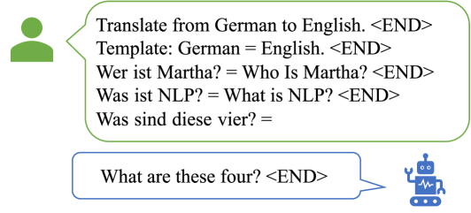
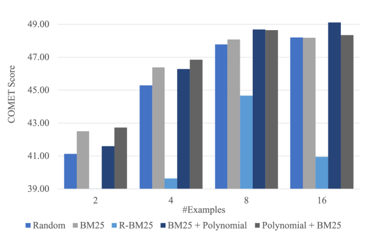

# 不只匹配单词：句法优化了机器翻译的上下文示例挑选过程

发布时间：2024年03月28日

`LLM应用` `机器翻译` `上下文学习`

> Going Beyond Word Matching: Syntax Improves In-context Example Selection for Machine Translation

# 摘要

> 在大型语言模型盛行的今天，上下文学习（ICL）作为一种新兴的提示策略，通过展示少量示例来唤醒LLM解决特定任务的潜力。如何挑选富有信息的示例仍是一个挑战。以往针对机器翻译的ICL示例挑选研究多集中于单词层面的特征，而忽视了深层句法知识的价值。本文提出了一种基于句法的ICL示例挑选方法，通过多项式距离来衡量依赖树之间的相似度。同时，我们还设计了一种融合单词级和句法级标准的集成策略。实验数据显示，句法的引入显著提升了机器翻译的ICL效果，在12个翻译方向中11个获得了最高的COMET评分。

> In-context learning (ICL) is the trending prompting strategy in the era of large language models (LLMs), where a few examples are demonstrated to evoke LLMs' power for a given task. How to select informative examples remains an open issue. Previous works on in-context example selection for machine translation (MT) focus on superficial word-level features while ignoring deep syntax-level knowledge. In this paper, we propose a syntax-based in-context example selection method for MT, by computing the syntactic similarity between dependency trees using Polynomial Distance. In addition, we propose an ensemble strategy combining examples selected by both word-level and syntax-level criteria. Experimental results between English and 6 common languages indicate that syntax can effectively enhancing ICL for MT, obtaining the highest COMET scores on 11 out of 12 translation directions.

[Arxiv](https://arxiv.org/abs/2403.19285)