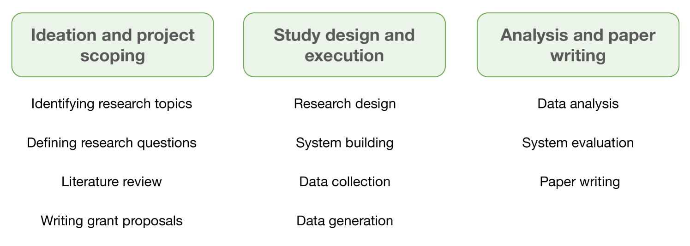

# 将

发布时间：2024年03月28日

`LLM应用` `人机交互` `伦理问题`

> "I'm categorizing LLM as a productivity tool": Examining ethics of LLM use in HCI research practices

# 摘要

> 大型语言模型正越来越多地被应用于现实世界的各种场景，如研究和教育。然而，这些模型存在众所周知的伦理问题，这些问题在与人类密切互动的人机交互研究中可能以出人意料的方式表现出来。本文通过16次半结构化访谈和对50位HCI研究者的调查，探讨了LLM在HCI研究全流程中的运用，从构思到系统开发再到撰写论文。研究人员虽然对伦理问题有着深入的认识，但在实际项目中往往难以完全识别和应对这些伦理挑战。这种不作为和对权宜之计的依赖源于对LLM供应链中控制力的缺失、责任分散、伦理参与的条件性以及优先事项的冲突。最后，我们对研究结果进行了反思，并提出了在HCI研究中与大型语言模型互动的新兴规范形成的机会。

> Large language models are increasingly applied in real-world scenarios, including research and education. These models, however, come with well-known ethical issues, which may manifest in unexpected ways in human-computer interaction research due to the extensive engagement with human subjects. This paper reports on research practices related to LLM use, drawing on 16 semi-structured interviews and a survey conducted with 50 HCI researchers. We discuss the ways in which LLMs are already being utilized throughout the entire HCI research pipeline, from ideation to system development and paper writing. While researchers described nuanced understandings of ethical issues, they were rarely or only partially able to identify and address those ethical concerns in their own projects. This lack of action and reliance on workarounds was explained through the perceived lack of control and distributed responsibility in the LLM supply chain, the conditional nature of engaging with ethics, and competing priorities. Finally, we reflect on the implications of our findings and present opportunities to shape emerging norms of engaging with large language models in HCI research.

[Arxiv](https://arxiv.org/abs/2403.19876)