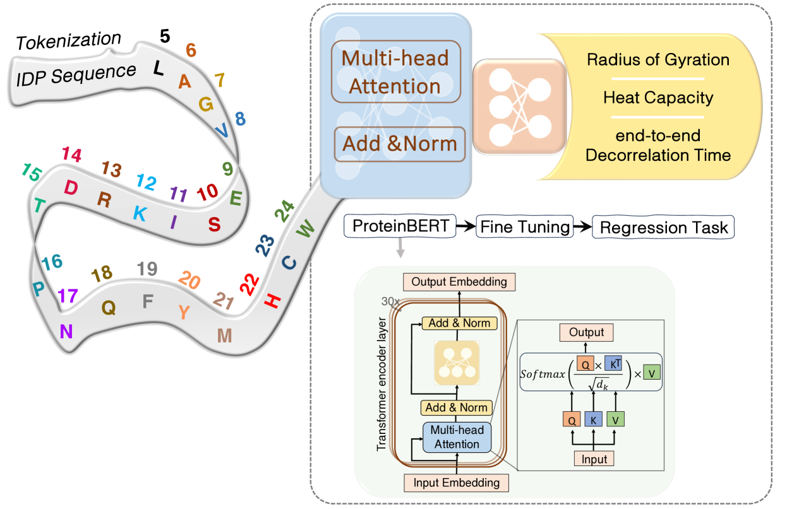
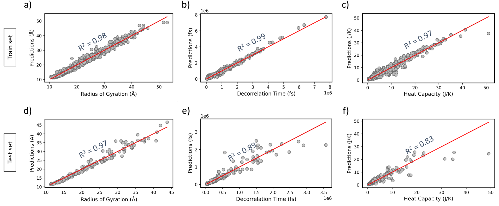
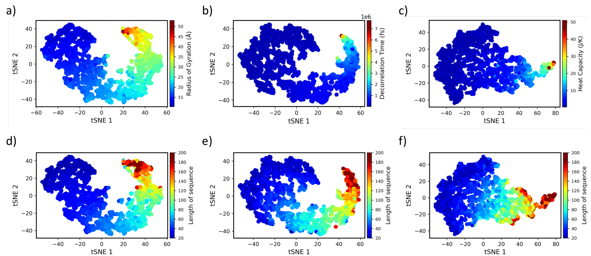
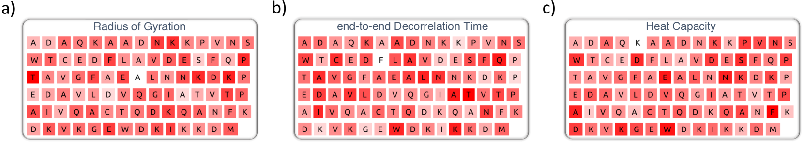

# IDP-Bert：借助大型语言模型预测内在无序蛋白特性

发布时间：2024年03月28日

`LLM应用` `生物信息学` `机器学习`

> IDP-Bert: Predicting Properties of Intrinsically Disordered Proteins (IDP) Using Large Language Models

# 摘要

> 内在无序蛋白（IDPs）是一类结构松散但功能重要的蛋白质。它们的存在颠覆了蛋白质功能必须依赖于其三维结构的传统认知。尽管缺乏固定空间结构，IDPs仍然能够执行多样的生物学功能，对细胞过程产生影响，并帮助我们理解疾病机制。鉴于直接通过实验或模拟来研究这类蛋白质的成本较高，我们开发了一种新型的机器学习模型，该模型仅需氨基酸序列即可。本研究中，我们推出了IDP-Bert模型，这是一个基于深度学习的架构，它运用Transformers和蛋白质语言模型（PLMs）技术，能够直接将序列信息映射到IDPs的特性上。实验结果显示，该模型在预测IDPs的多种属性，如旋转半径、端到端衰减时间和热容量方面表现出了高度的准确性。

> Intrinsically Disordered Proteins (IDPs) constitute a large and structure-less class of proteins with significant functions. The existence of IDPs challenges the conventional notion that the biological functions of proteins rely on their three-dimensional structures. Despite lacking well-defined spatial arrangements, they exhibit diverse biological functions, influencing cellular processes and shedding light on the disease mechanisms. However, it is expensive to run experiments or simulations to characterize this class of proteins. Consequently, we designed an ML model that relies solely on amino acid sequences. In this study, we introduce IDP-Bert model, a deep-learning architecture leveraging Transformers and Protein Language Models (PLMs) to map sequences directly to IDPs properties. Our experiments demonstrate accurate predictions of IDPs properties, including Radius of Gyration, end-to-end Decorrelation Time, and Heat Capacity.

[Arxiv](https://arxiv.org/abs/2403.19762)