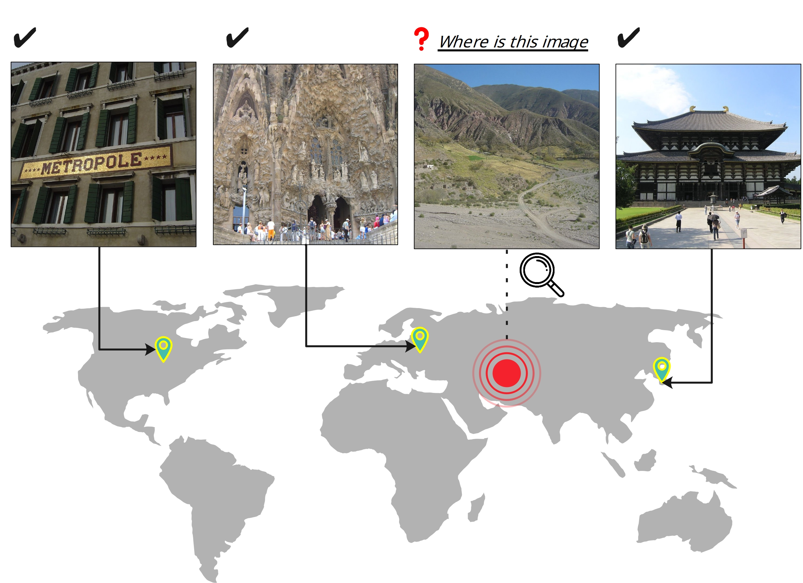
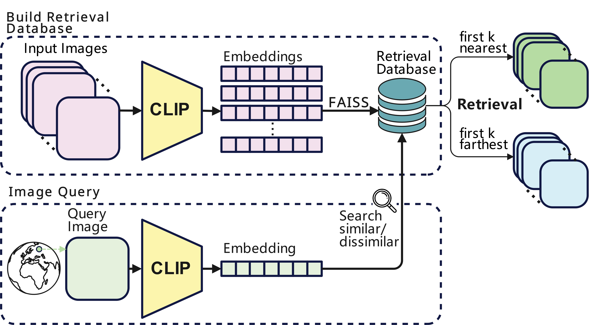

# Img2Loc: 利用多模态基础模型与图像检索增强生成技术，再次探讨图像的地理定位问题。

发布时间：2024年03月28日

`LLM应用` `计算机视觉` `地理信息系统`

> Img2Loc: Revisiting Image Geolocalization using Multi-modality Foundation Models and Image-based Retrieval-Augmented Generation

# 摘要

> 图像中的精准定位问题一直是计算机视觉和信息检索领域的难题。传统手段不外乎分类法，即将地球划分成网格来对图像进行分类，或是检索法，通过匹配图像与位置数据库来确定地点。但前者受限于网格大小，难以精确预测；后者则常因搜索质量不佳和对全球景观的覆盖不足而受限。为解决这些问题，我们推出了Img2Loc系统，它创新性地将图像地理定位任务转化为文本生成问题。该系统利用最先进的多模态模型，如GPT4V或LLaVA，结合检索增强生成技术，首先基于CLIP创建图像坐标查询数据库，然后将查询结果与图像结合，为大型语言模型量身打造精细的提示。在Im2GPS3k和YFCC4k等标准数据集上的测试显示，Img2Loc不仅超越了现有顶尖模型，而且实现了无需训练的突破性成果。

> Geolocating precise locations from images presents a challenging problem in computer vision and information retrieval.Traditional methods typically employ either classification, which dividing the Earth surface into grid cells and classifying images accordingly, or retrieval, which identifying locations by matching images with a database of image-location pairs. However, classification-based approaches are limited by the cell size and cannot yield precise predictions, while retrieval-based systems usually suffer from poor search quality and inadequate coverage of the global landscape at varied scale and aggregation levels. To overcome these drawbacks, we present Img2Loc, a novel system that redefines image geolocalization as a text generation task. This is achieved using cutting-edge large multi-modality models like GPT4V or LLaVA with retrieval augmented generation. Img2Loc first employs CLIP-based representations to generate an image-based coordinate query database. It then uniquely combines query results with images itself, forming elaborate prompts customized for LMMs. When tested on benchmark datasets such as Im2GPS3k and YFCC4k, Img2Loc not only surpasses the performance of previous state-of-the-art models but does so without any model training.

[Arxiv](https://arxiv.org/abs/2403.19584)