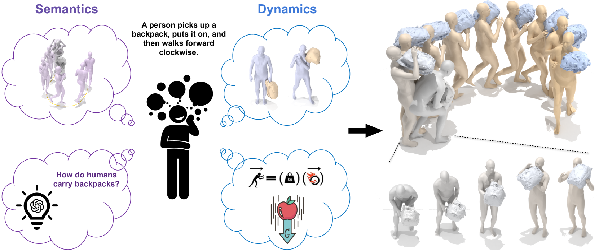
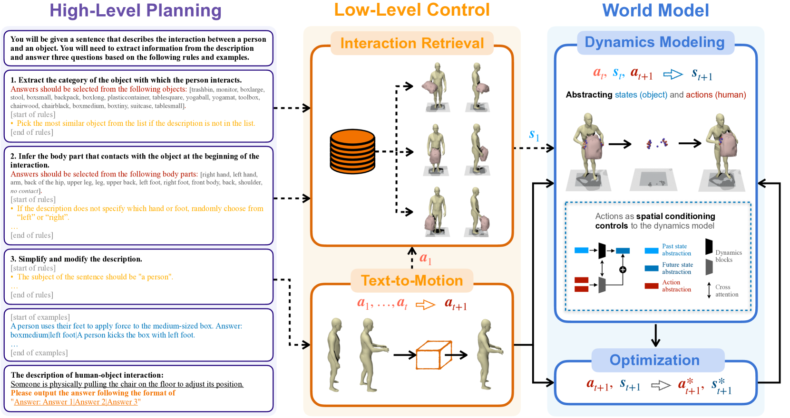
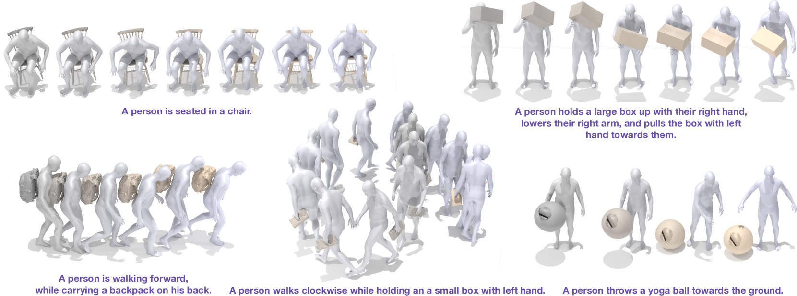
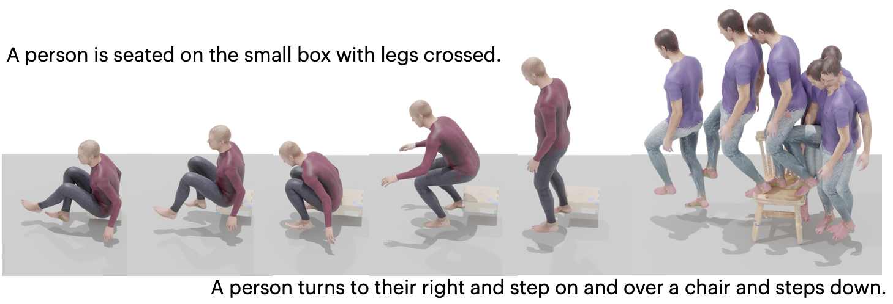
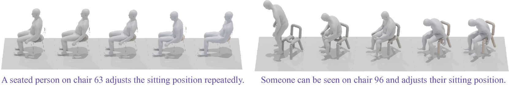
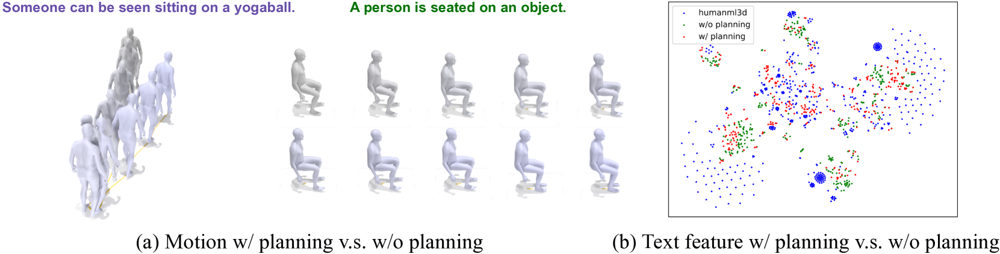
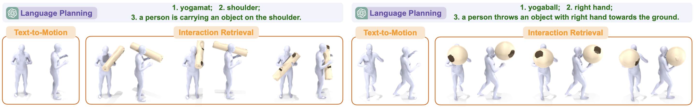
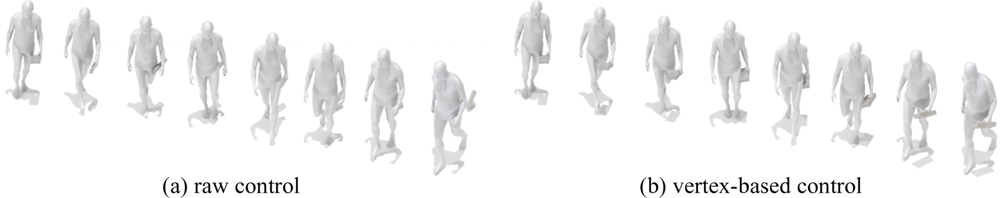
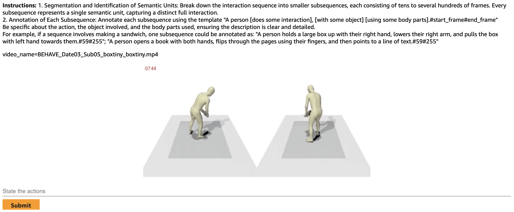
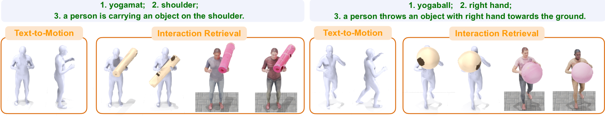

# InterDreamer：零样本学习实现文本描述至三维动态人与物体互动的转化。

发布时间：2024年03月28日

`LLM应用` `计算机图形学` `人工智能`

> InterDreamer: Zero-Shot Text to 3D Dynamic Human-Object Interaction

# 摘要

> 随着扩散模型在大量运动捕捉和文本注释数据上的训练，文本条件化的人类运动生成技术已取得重大突破。然而，在3D动态人-物体交互（HOI）生成方面复制这一成功仍面临挑战，主要原因在于大规模交互数据及其精确描述的缺失。本研究开拓性地展示了一种无需直接训练文本-交互对即可生成人-物体交互的新方法。我们的核心发现是，交互的语义和动态可以分开处理。由于缺乏通过监督学习来掌握交互语义的途径，我们利用预训练的大型模型，整合了大型语言模型和文本到运动模型的知识。尽管这种知识能够实现对交互语义的高级控制，但对于低层次的交互动态细节却无能为力。为解决这一问题，我们引入了一个简单的物理世界模型，用以模拟人类行为如何作用于物体运动。结合这些技术，我们创新的框架InterDreamer能够在无需样本的情况下，生成与文本相符的3D HOI交互序列。我们在BEHAVE和CHAIRS数据集上应用InterDreamer，并通过一系列全面的实验分析，证明了其能够创造出与文本指令完美融合的真实且连贯的交互序列。

> Text-conditioned human motion generation has experienced significant advancements with diffusion models trained on extensive motion capture data and corresponding textual annotations. However, extending such success to 3D dynamic human-object interaction (HOI) generation faces notable challenges, primarily due to the lack of large-scale interaction data and comprehensive descriptions that align with these interactions. This paper takes the initiative and showcases the potential of generating human-object interactions without direct training on text-interaction pair data. Our key insight in achieving this is that interaction semantics and dynamics can be decoupled. Being unable to learn interaction semantics through supervised training, we instead leverage pre-trained large models, synergizing knowledge from a large language model and a text-to-motion model. While such knowledge offers high-level control over interaction semantics, it cannot grasp the intricacies of low-level interaction dynamics. To overcome this issue, we further introduce a world model designed to comprehend simple physics, modeling how human actions influence object motion. By integrating these components, our novel framework, InterDreamer, is able to generate text-aligned 3D HOI sequences in a zero-shot manner. We apply InterDreamer to the BEHAVE and CHAIRS datasets, and our comprehensive experimental analysis demonstrates its capability to generate realistic and coherent interaction sequences that seamlessly align with the text directives.

[Arxiv](https://arxiv.org/abs/2403.19652)