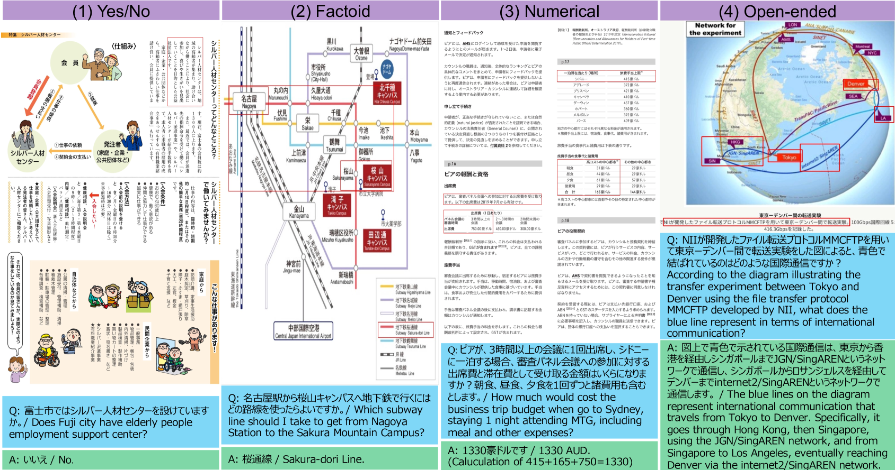
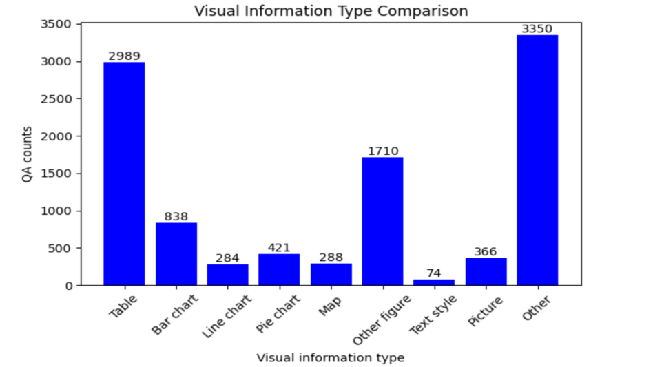
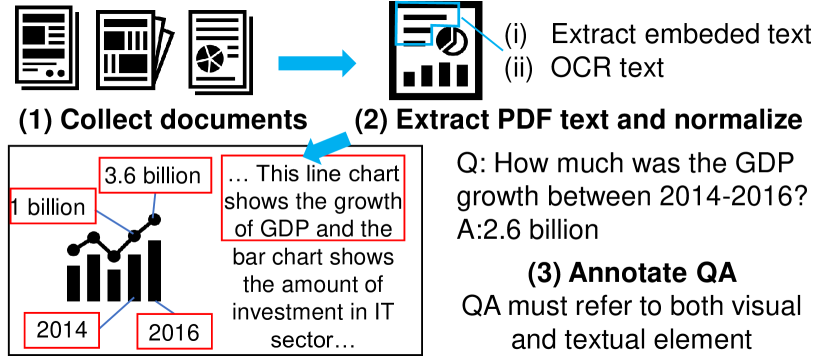
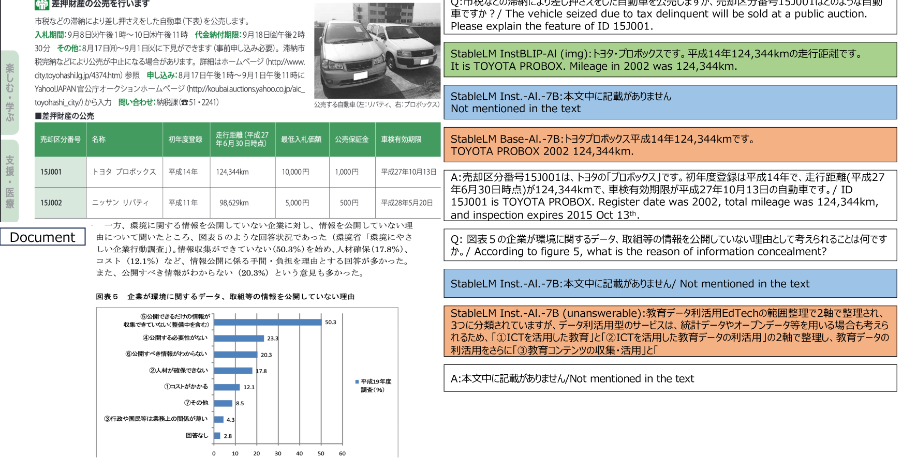

# JDocQA：面向生成式语言模型的日文文档问答数据集

发布时间：2024年03月28日

`LLM应用` `文档问题回答` `多模态`

> JDocQA: Japanese Document Question Answering Dataset for Generative Language Models

# 摘要

> 文档问题回答任务，即在报告、幻灯片、小册子和网站等文档上进行问题解答，因其在社会中的普遍性而极具挑战性。这项任务不仅考验文本理解能力，还需理解图表和表格，故视觉问题回答（VQA）方法常与文本方法一同被检验。我们推出了日本文档问题回答（JDocQA）数据集，这是一个大型基于文档的问答集，包含5,504份PDF文档和11,600个标注的日文问答实例，每个实例均指明文档页码和答案线索的边界框。我们涵盖了多种问题类型及无法解答的问题，以贴近实际应用。通过大型语言模型（LLMs）和多模态模型，我们对数据集的有效性进行了验证。在微调过程中考虑无法解答的问题，有助于防止所谓的“幻觉”生成。

> Document question answering is a task of question answering on given documents such as reports, slides, pamphlets, and websites, and it is a truly demanding task as paper and electronic forms of documents are so common in our society. This is known as a quite challenging task because it requires not only text understanding but also understanding of figures and tables, and hence visual question answering (VQA) methods are often examined in addition to textual approaches. We introduce Japanese Document Question Answering (JDocQA), a large-scale document-based QA dataset, essentially requiring both visual and textual information to answer questions, which comprises 5,504 documents in PDF format and annotated 11,600 question-and-answer instances in Japanese. Each QA instance includes references to the document pages and bounding boxes for the answer clues. We incorporate multiple categories of questions and unanswerable questions from the document for realistic question-answering applications. We empirically evaluate the effectiveness of our dataset with text-based large language models (LLMs) and multimodal models. Incorporating unanswerable questions in finetuning may contribute to harnessing the so-called hallucination generation.

[Arxiv](https://arxiv.org/abs/2403.19454)