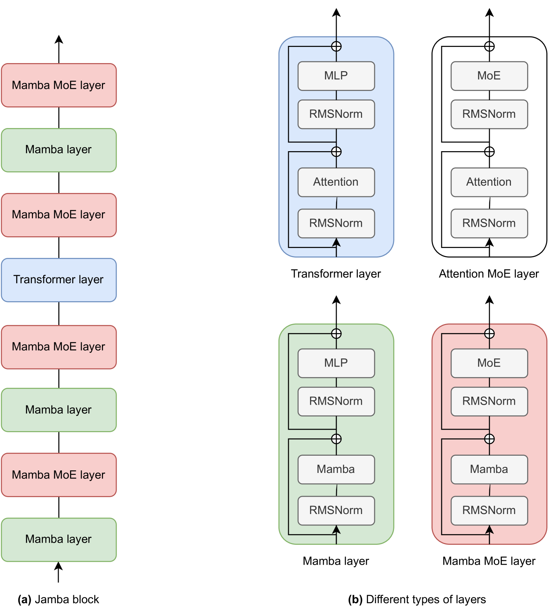
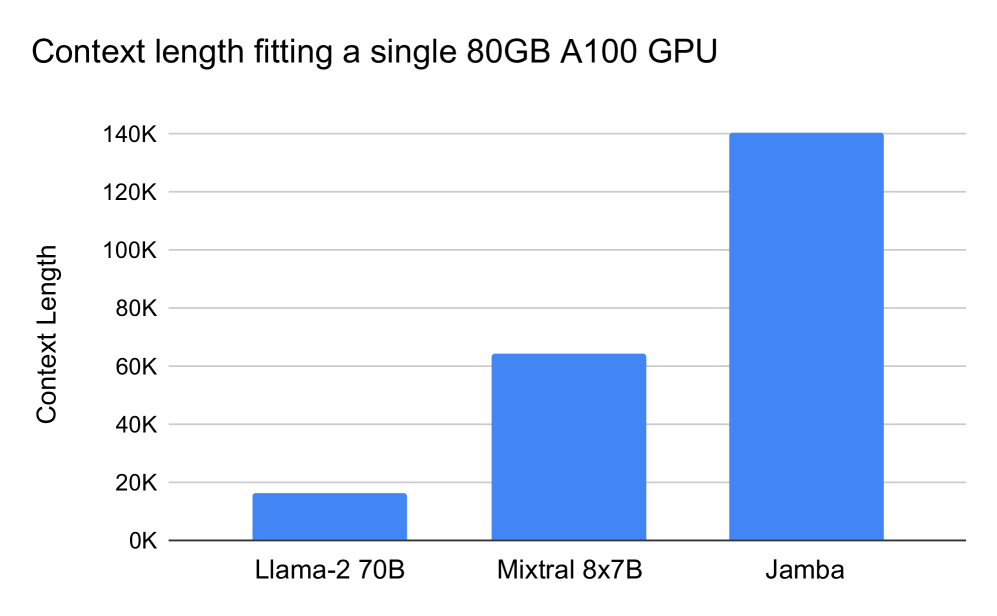
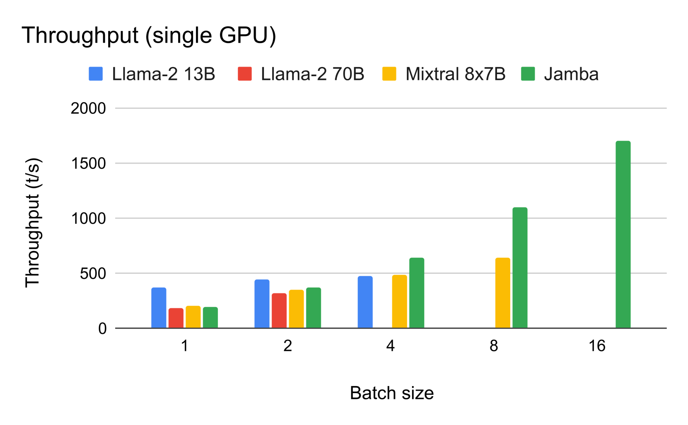
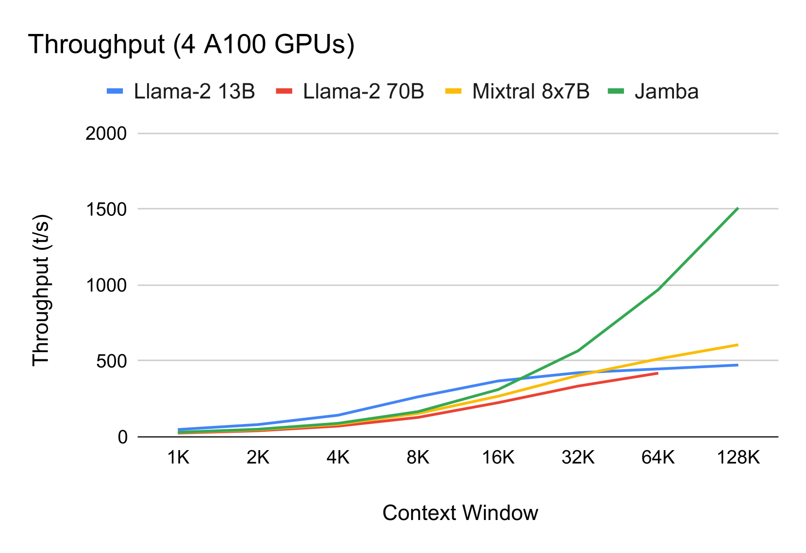
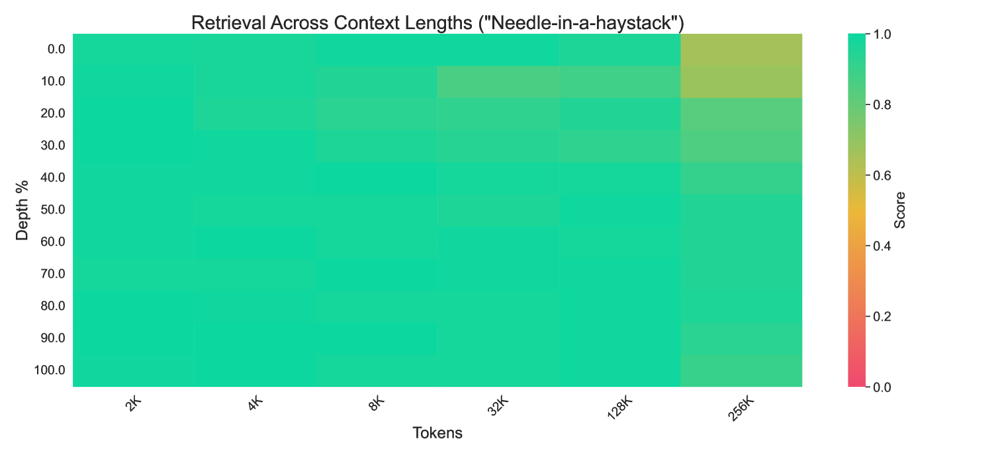
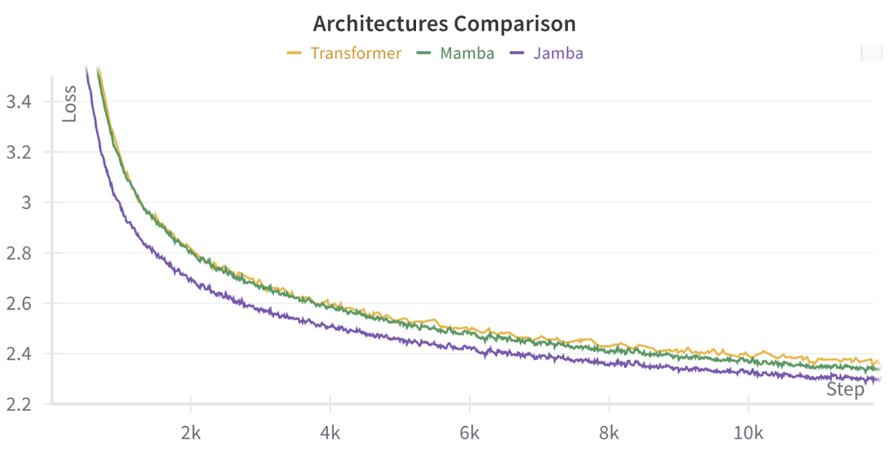
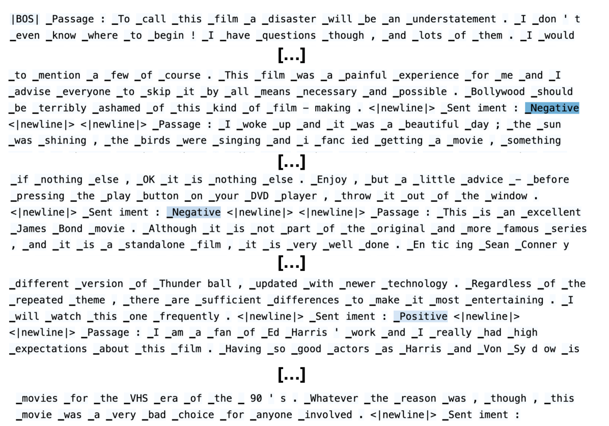
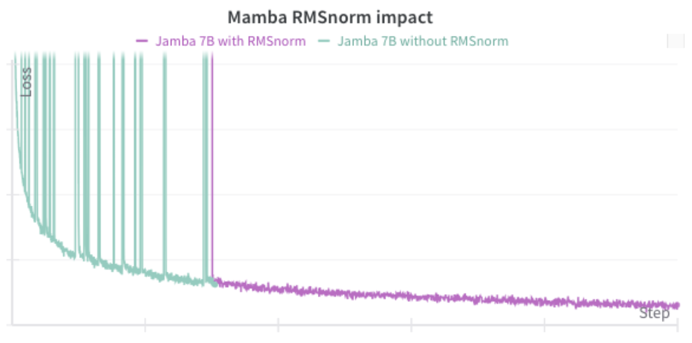

# Jamba：融合变压器与曼巴特性的创新型语言模型

发布时间：2024年03月28日

`LLM理论` `语言模型` `大规模计算`

> Jamba: A Hybrid Transformer-Mamba Language Model

# 摘要

> 我们自豪地介绍Jamba，一款新型的大型语言模型，它采用了创新的Transformer-Mamba混合专家系统（MoE）架构。Jamba巧妙地融合了Transformer和Mamba层的优势，同时在部分层中融入MoE技术，扩大了模型的容量，又确保了参数的高效运用。这种设计灵活性使其能够针对不同的资源和目标进行定制配置。我们所实现的Jamba模型，强大而紧凑，能够在一块80GB的GPU上运行。在大规模应用中，Jamba不仅吞吐量高、内存占用小，与标准Transformer相比，在语言模型的标准基准测试和长文本上下文评估中也展现出卓越的性能。尤为引人注目的是，Jamba在处理高达256K个令牌的上下文时仍能保持出色的表现。我们深入研究了结合Transformer和Mamba层的方法，以及如何有效地整合专家系统，并发现这些设计选择对于构建大规模模型至关重要。此外，我们还揭示了Jamba训练过程中的一些有趣特性，并计划分享各种变体的检查点，以促进对这种创新架构的深入研究。我们还将Jamba的模型权重在宽松许可下公开，以供大众使用。

> We present Jamba, a new base large language model based on a novel hybrid Transformer-Mamba mixture-of-experts (MoE) architecture. Specifically, Jamba interleaves blocks of Transformer and Mamba layers, enjoying the benefits of both model families. MoE is added in some of these layers to increase model capacity while keeping active parameter usage manageable. This flexible architecture allows resource- and objective-specific configurations. In the particular configuration we have implemented, we end up with a powerful model that fits in a single 80GB GPU. Built at large scale, Jamba provides high throughput and small memory footprint compared to vanilla Transformers, and at the same time state-of-the-art performance on standard language model benchmarks and long-context evaluations. Remarkably, the model presents strong results for up to 256K tokens context length. We study various architectural decisions, such as how to combine Transformer and Mamba layers, and how to mix experts, and show that some of them are crucial in large scale modeling. We also describe several interesting properties of these architectures which the training and evaluation of Jamba have revealed, and plan to release checkpoints from various ablation runs, to encourage further exploration of this novel architecture. We make the weights of our implementation of Jamba publicly available under a permissive license.

[Arxiv](https://arxiv.org/abs/2403.19887)