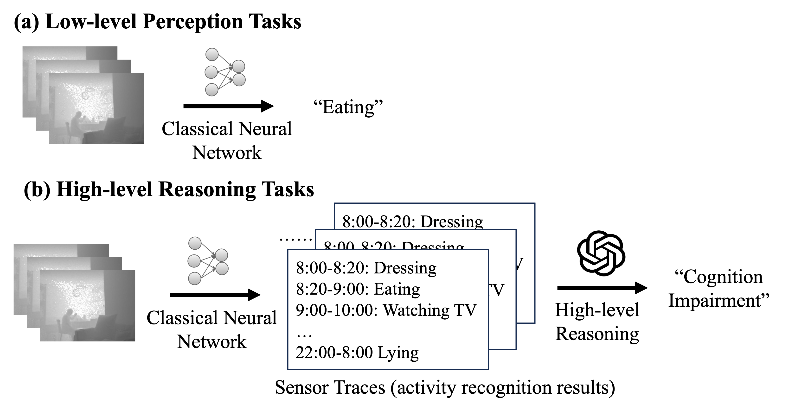
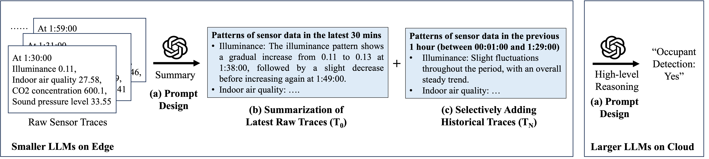
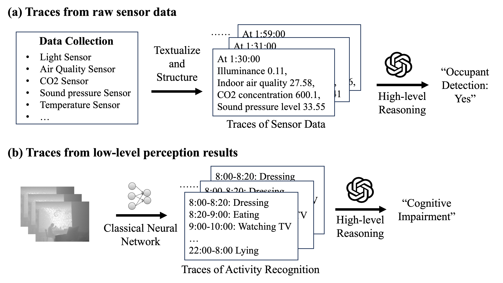
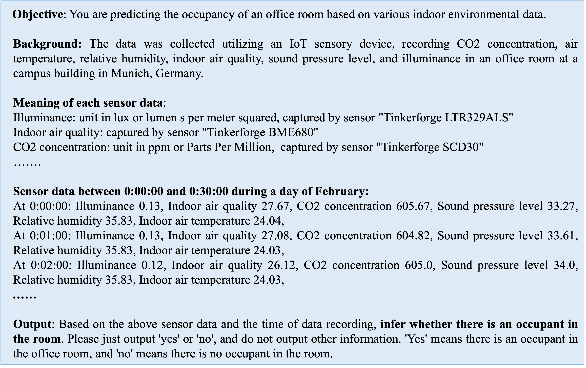
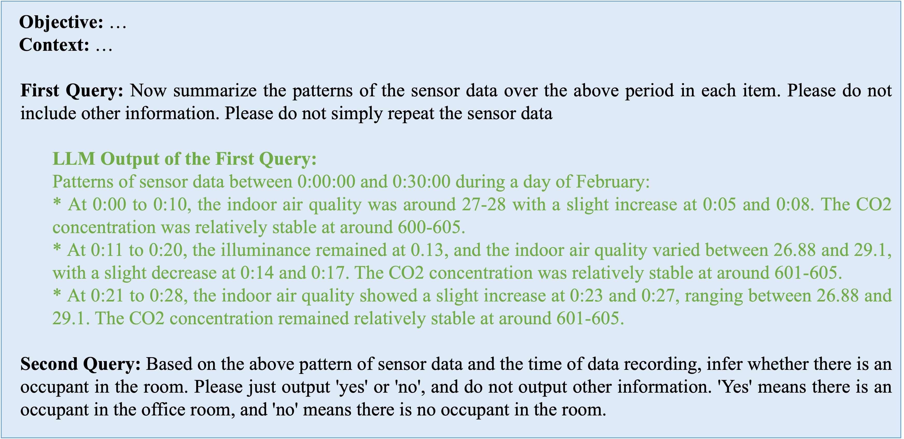
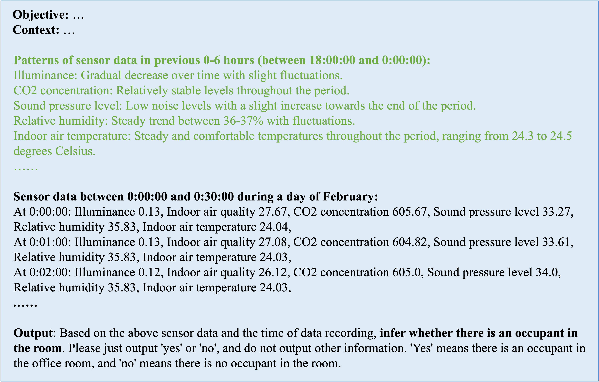
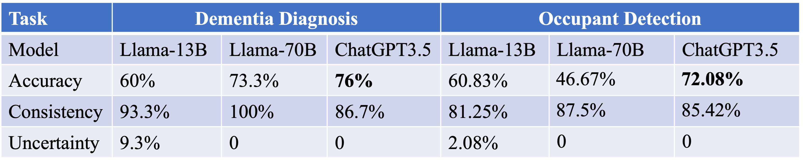
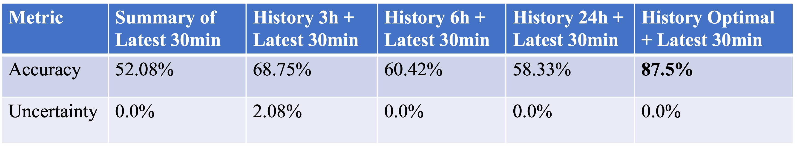
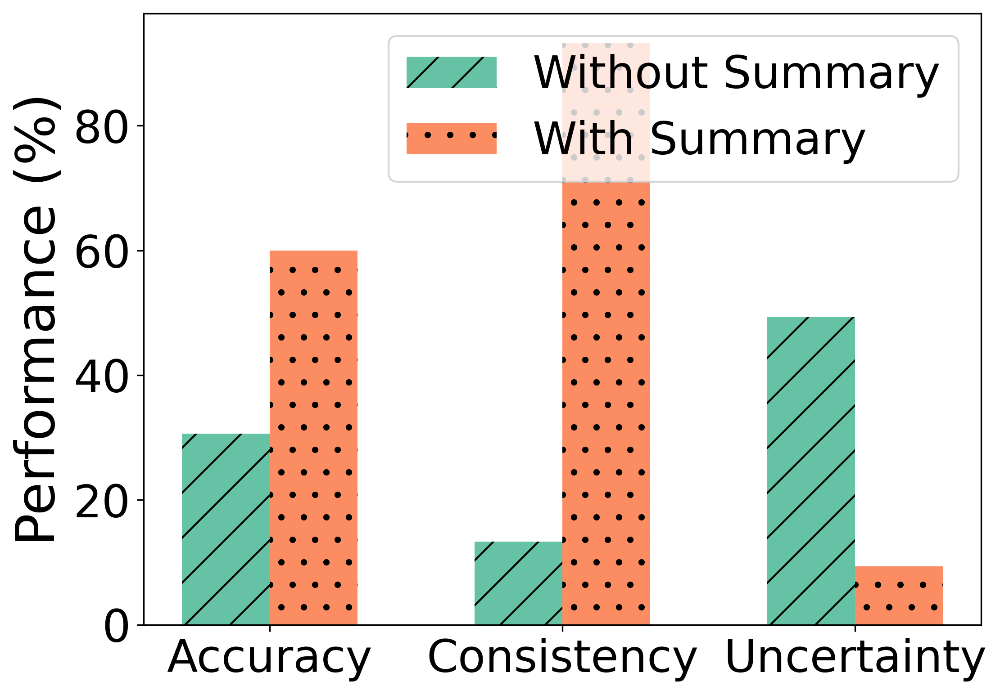
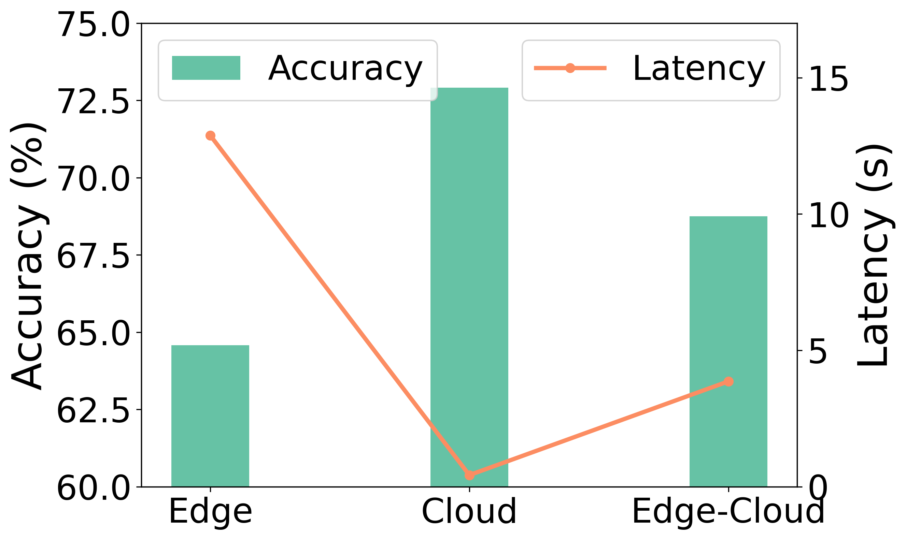

# LLMSense: 运用大型语言模型实现对时空传感器数据的深度分析

发布时间：2024年03月28日

`LLM应用` `传感器系统` `机器学习`

> LLMSense: Harnessing LLMs for High-level Reasoning Over Spatiotemporal Sensor Traces

# 摘要

> 在传感系统中，机器学习研究多集中于处理短期原始感官数据的初级感知任务。然而，实际应用如人类行为建模和空间占用追踪等，却需借助高级推理能力，从长期传感器数据中提炼概念并做出推断。现有机器学习方法在处理此类复杂任务时，因样本有限和数据维度高而难以泛化，亟需融入人类知识，构建基于第一性原理的模型或逻辑推理方法。我们探问：能否借助大型语言模型（LLMs）的推理与知识，从长期时空传感器数据中识别复杂事件？为解答此问，我们构建了一个针对LLMs的高层次推理任务有效提示框架，能同时处理原始传感器数据和初级感知结果。我们还制定了两种策略，以提升对长期传感器数据的处理能力，包括推理前的数据摘要和历史数据的选择性整合。该框架适用于边缘-云架构，通过在边缘部署小型LLMs进行数据摘要，在云端执行高级推理，确保隐私安全。实验结果显示，LLMSense在痴呆诊断和空间占用追踪等高级推理任务上，准确率超过80%。本文为利用LLM进行传感器数据的高级推理提供了洞见和指导，同时指出了未来研究的多个方向。

> Most studies on machine learning in sensing systems focus on low-level perception tasks that process raw sensory data within a short time window. However, many practical applications, such as human routine modeling and occupancy tracking, require high-level reasoning abilities to comprehend concepts and make inferences based on long-term sensor traces. Existing machine learning-based approaches for handling such complex tasks struggle to generalize due to the limited training samples and the high dimensionality of sensor traces, necessitating the integration of human knowledge for designing first-principle models or logic reasoning methods. We pose a fundamental question: Can we harness the reasoning capabilities and world knowledge of Large Language Models (LLMs) to recognize complex events from long-term spatiotemporal sensor traces? To answer this question, we design an effective prompting framework for LLMs on high-level reasoning tasks, which can handle traces from the raw sensor data as well as the low-level perception results. We also design two strategies to enhance performance with long sensor traces, including summarization before reasoning and selective inclusion of historical traces. Our framework can be implemented in an edge-cloud setup, running small LLMs on the edge for data summarization and performing high-level reasoning on the cloud for privacy preservation. The results show that LLMSense can achieve over 80\% accuracy on two high-level reasoning tasks such as dementia diagnosis with behavior traces and occupancy tracking with environmental sensor traces. This paper provides a few insights and guidelines for leveraging LLM for high-level reasoning on sensor traces and highlights several directions for future work.

[Arxiv](https://arxiv.org/abs/2403.19857)