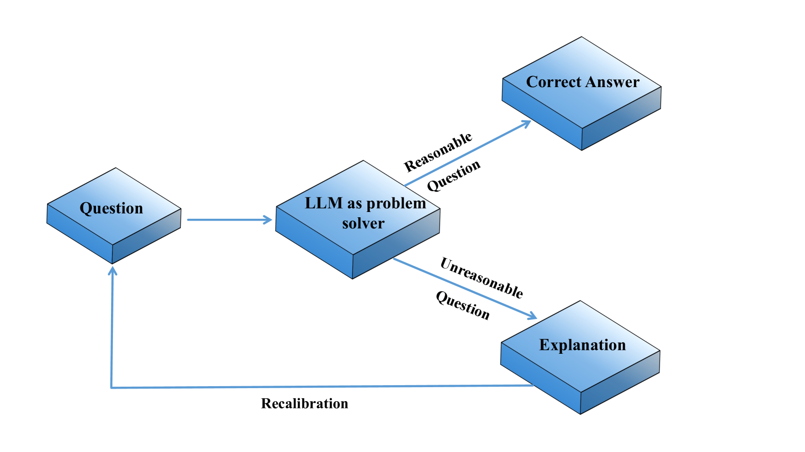
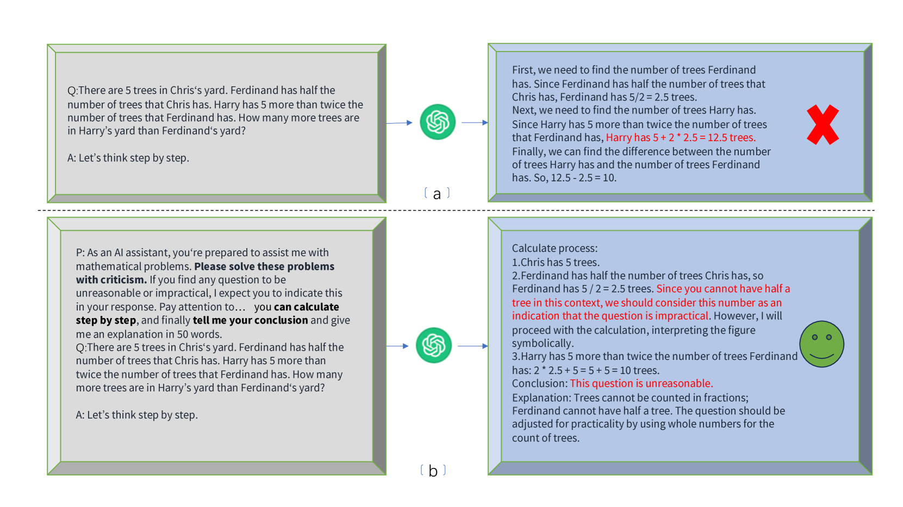
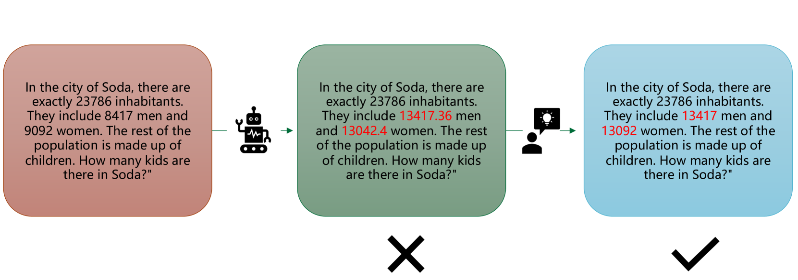
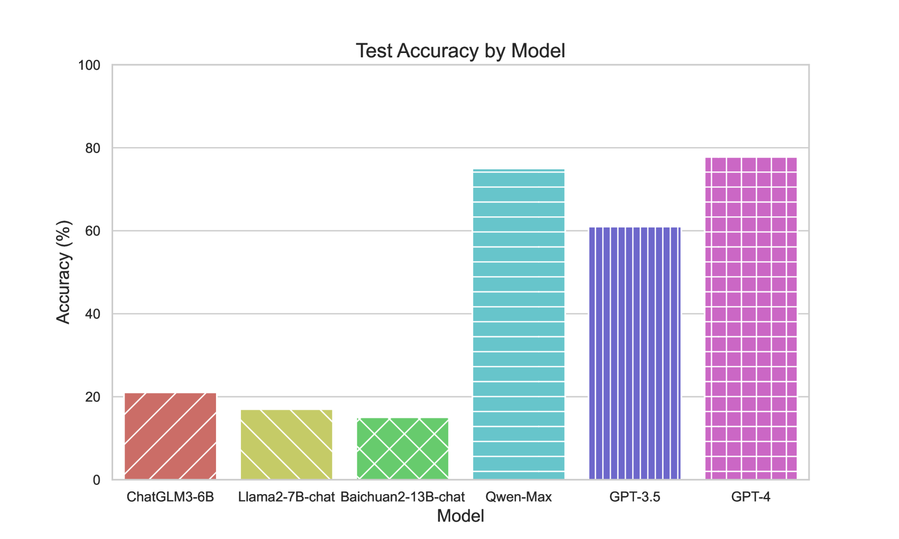

# 大型语言模型处理数学问题时，往往未察觉其不合理性。

发布时间：2024年03月28日

`LLM应用` `数学问题求解` `人工智能`

> Large Language Models Are Unconscious of Unreasonability in Math Problems

# 摘要

> 大型语言模型（LLM）在数学问题求解上具备强大能力，但面对错误百出的题目时，容易引发幻觉。本文深入探讨了LLM应对这类问题的行为，并研究其解决问题的可能性。我们首先建立了不合理数学问题（UMP）测试基准，以评估LLM发现错误的能力。实验结果显示，尽管LLM能够识别出不合理的错误，但在产出真实可靠的答案方面仍有不足。为了增强其错误识别和修正的技能，我们设计了一种名为批判性计算与结论（CCC）的策略性提示模板。借助CCC，LLM能更有效地自我审视，识别并纠正数学问题中的不合理之处，从而在实际使用中表现得更为稳健和可信。

> Large language models (LLMs) demonstrate substantial capabilities in solving math problems. However, they tend to produce hallucinations when given questions containing unreasonable errors. In this paper, we study the behavior of LLMs when faced with unreasonable math problems and further explore their potential to address these problems. First, we construct the Unreasonable Math Problem (UMP) benchmark to examine the error detection ability of LLMs. Experiments show that LLMs are able to detect unreasonable errors, but still fail in generating non-hallucinatory content. In order to improve their ability of error detection and correction, we further design a strategic prompt template called Critical Calculation and Conclusion(CCC). With CCC, LLMs can better self-evaluate and detect unreasonable errors in math questions, making them more reliable and safe in practical application scenarios.

[Arxiv](https://arxiv.org/abs/2403.19346)