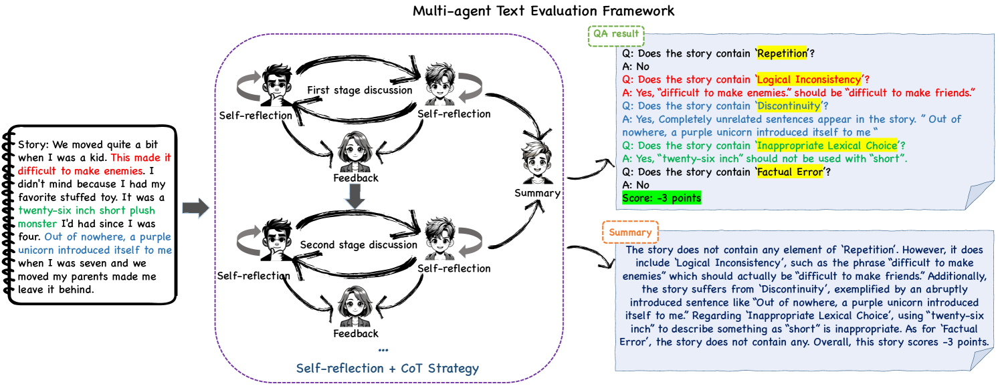
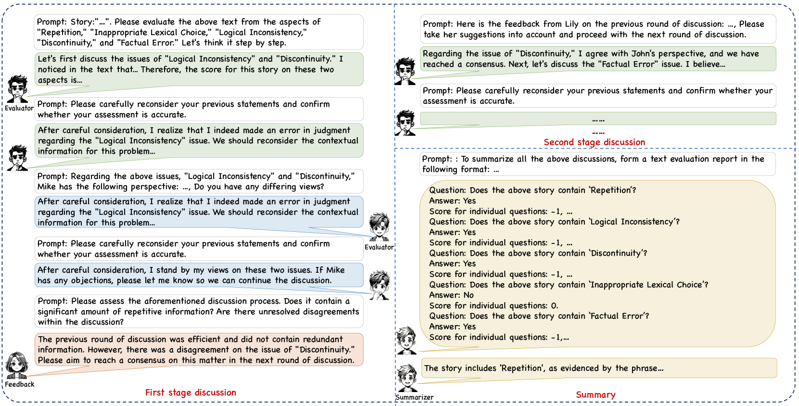
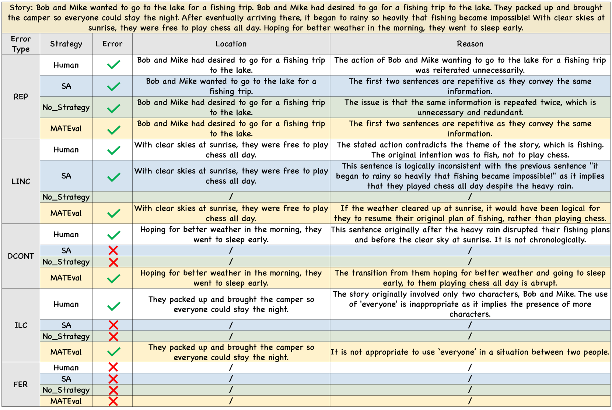

# MATEval：促进开放式文本评估的多智能体讨论新框架

发布时间：2024年03月28日

`LLM应用` `人工智能` `文本评估`

> MATEval: A Multi-Agent Discussion Framework for Advancing Open-Ended Text Evaluation

# 摘要

> 生成性大型语言模型（LLMs）的最新进展令人瞩目，但其生成文本的质量仍存在不少问题。尤其是在开放式文本评估方面，一直是个难题。为应对这一挑战，最新研究尝试让LLMs担任评估角色。尽管单一LLM作为评估者显示出潜力，但其结果却不稳定、不确定。为此，我们提出了MATEval——一种“多智能体文本评估框架”，它利用GPT-4等LLMs模拟人类协作讨论，通过智能体间的互动来评估文本。该框架融合自我反思、思维链策略和反馈机制，深化并拓宽评估维度，引导讨论达成共识，并生成包含错误定位、类型和评分的综合评估报告。实验显示，MATEval在开放式文本评估中超越了现有方法，并与人类评估高度一致，证明了其在提高LLMs文本评估准确性和稳定性方面的有效性。此外，该框架还显著提升了工业应用中文本评估和模型迭代的效率。

> Recent advancements in generative Large Language Models(LLMs) have been remarkable, however, the quality of the text generated by these models often reveals persistent issues. Evaluating the quality of text generated by these models, especially in open-ended text, has consistently presented a significant challenge. Addressing this, recent work has explored the possibility of using LLMs as evaluators. While using a single LLM as an evaluation agent shows potential, it is filled with significant uncertainty and instability. To address these issues, we propose the MATEval: A "Multi-Agent Text Evaluation framework" where all agents are played by LLMs like GPT-4. The MATEval framework emulates human collaborative discussion methods, integrating multiple agents' interactions to evaluate open-ended text. Our framework incorporates self-reflection and Chain-of-Thought (CoT) strategies, along with feedback mechanisms, enhancing the depth and breadth of the evaluation process and guiding discussions towards consensus, while the framework generates comprehensive evaluation reports, including error localization, error types and scoring. Experimental results show that our framework outperforms existing open-ended text evaluation methods and achieves the highest correlation with human evaluation, which confirms the effectiveness and advancement of our framework in addressing the uncertainties and instabilities in evaluating LLMs-generated text. Furthermore, our framework significantly improves the efficiency of text evaluation and model iteration in industrial scenarios.

[Arxiv](https://arxiv.org/abs/2403.19305)