# MUGC：区分机器创作与用户创作的内容

发布时间：2024年03月28日

`LLM应用` `内容鉴别` `文本分析`

> MUGC: Machine Generated versus User Generated Content Detection

# 摘要

> 随着深度神经网络和生成性AI等现代系统在创造逼真内容方面的不断进步，辨别用户创作与机器创作内容的需求日益凸显。本研究对比了八种传统机器学习算法，旨在识别出自三个不同数据集（诗歌、摘要和论文）的机器创作与人类创作数据。研究发现，这些传统方法在甄别机器创作内容方面极为准确，这也印证了RoBERT等流行预训练模型的有效性。机器创作文本通常较短，词汇变化也不如人类创作的丰富。尽管当前的大型语言模型忽略了人类常用的特定领域关键词，这些关键词却有助于提高检测的准确率，而深层词表示技术如word2vec能够捕捉到细微的语义变化。此外，对可读性、偏见、道德观和情感的比较也揭示了机器创作与人类创作内容之间的显著差异。这些差异不仅体现在表达风格上，还可能源于数据源（人类与机器创作）的潜在偏见。本研究为理解机器创作内容在不同领域的进步及其带来的挑战提供了深刻见解。

> As advanced modern systems like deep neural networks (DNNs) and generative AI continue to enhance their capabilities in producing convincing and realistic content, the need to distinguish between user-generated and machine generated content is becoming increasingly evident. In this research, we undertake a comparative evaluation of eight traditional machine-learning algorithms to distinguish between machine-generated and human-generated data across three diverse datasets: Poems, Abstracts, and Essays. Our results indicate that traditional methods demonstrate a high level of accuracy in identifying machine-generated data, reflecting the documented effectiveness of popular pre-trained models like RoBERT. We note that machine-generated texts tend to be shorter and exhibit less word variety compared to human-generated content. While specific domain-related keywords commonly utilized by humans, albeit disregarded by current LLMs (Large Language Models), may contribute to this high detection accuracy, we show that deeper word representations like word2vec can capture subtle semantic variances. Furthermore, readability, bias, moral, and affect comparisons reveal a discernible contrast between machine-generated and human generated content. There are variations in expression styles and potentially underlying biases in the data sources (human and machine-generated). This study provides valuable insights into the advancing capacities and challenges associated with machine-generated content across various domains.

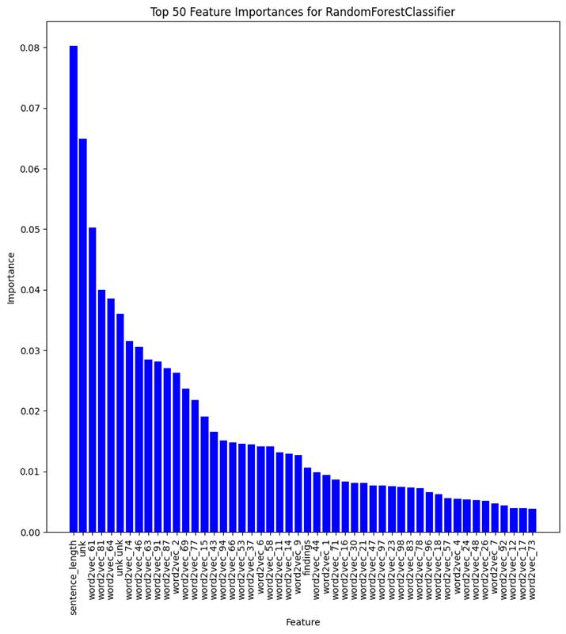

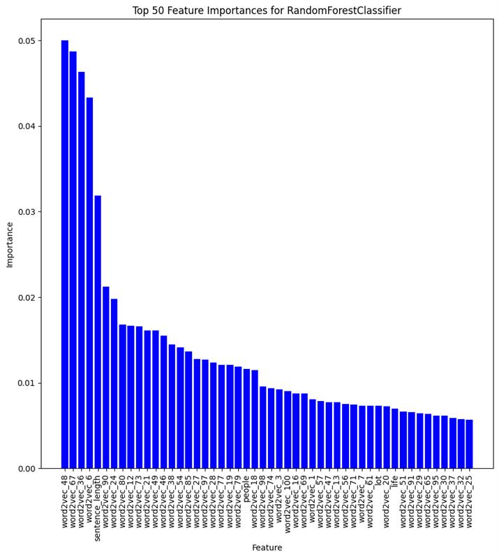

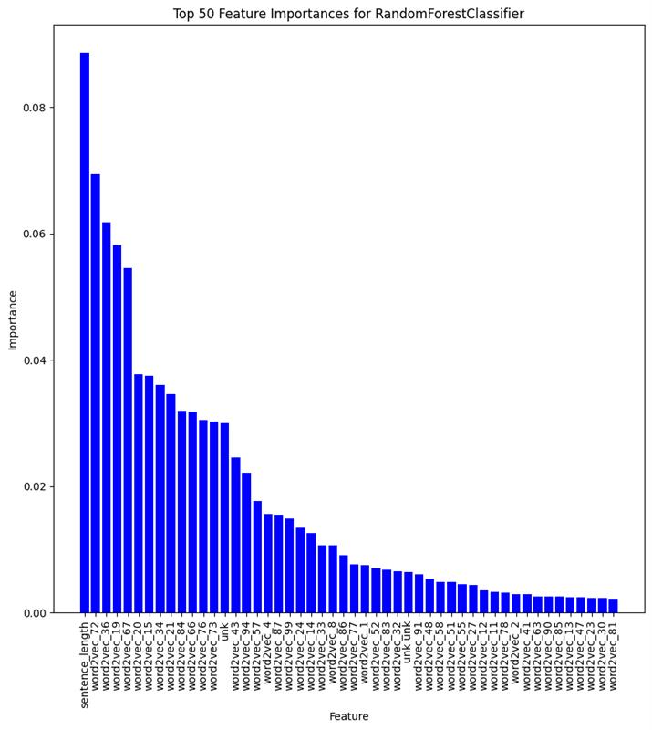

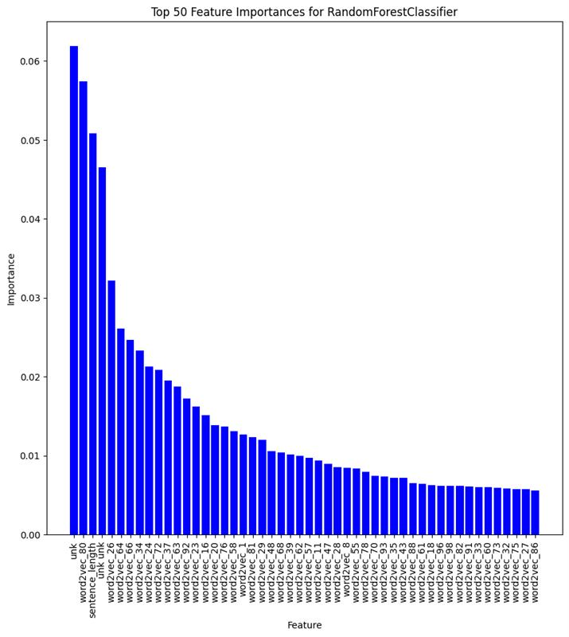

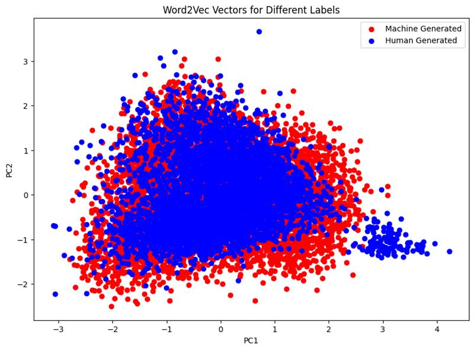

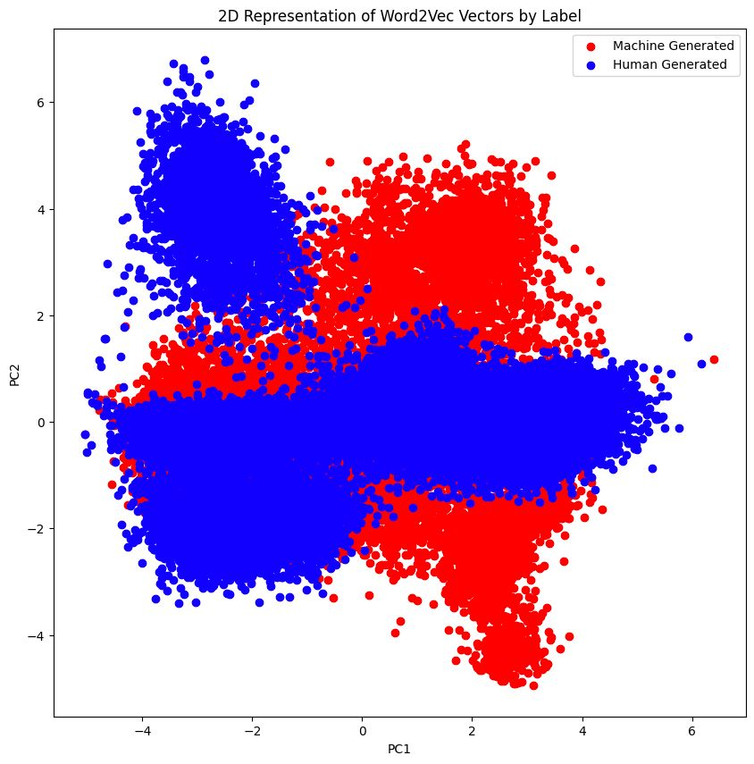

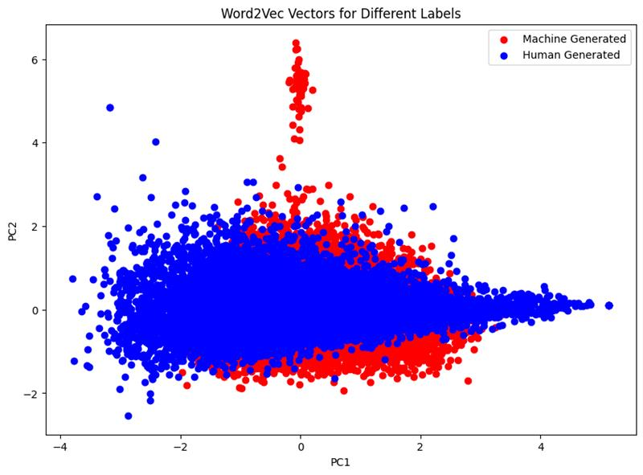

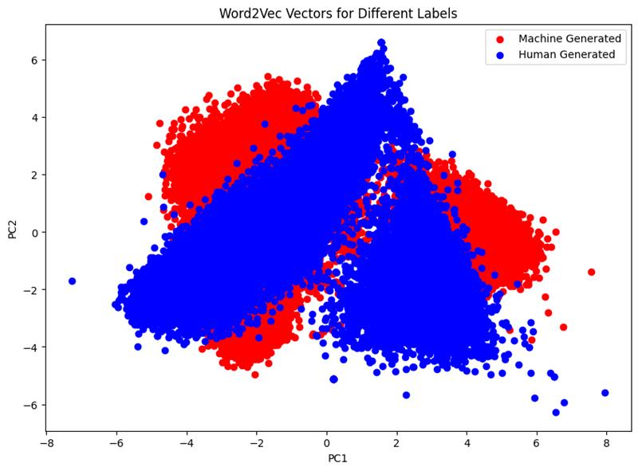

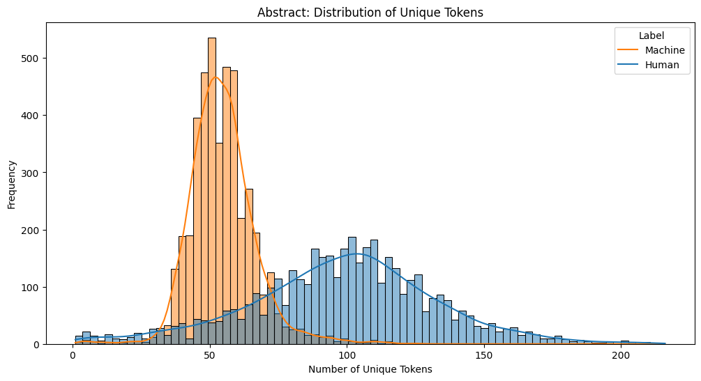

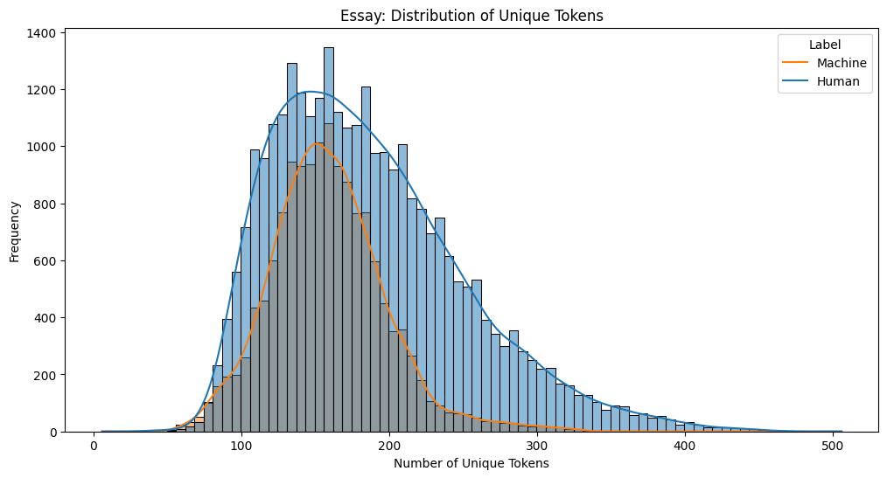

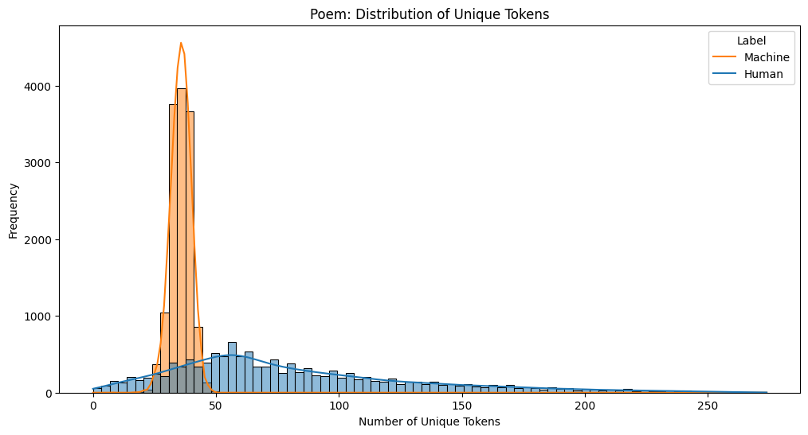

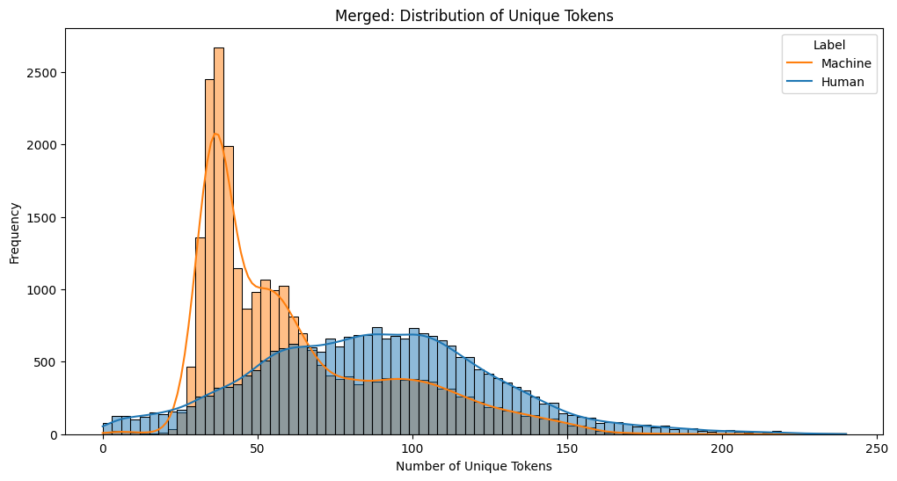

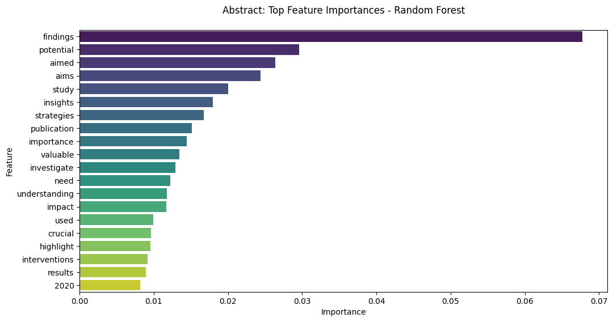

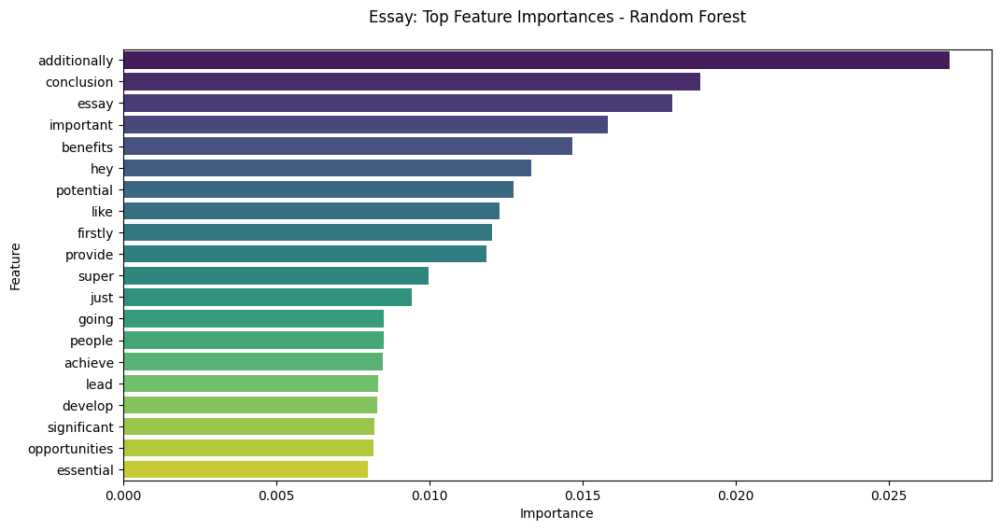

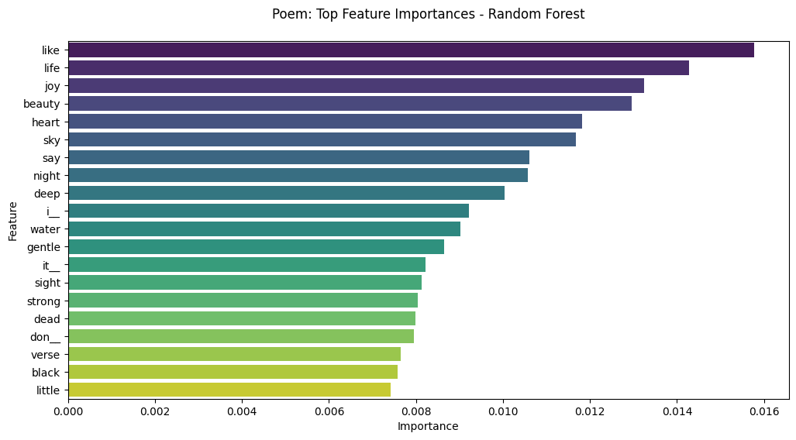

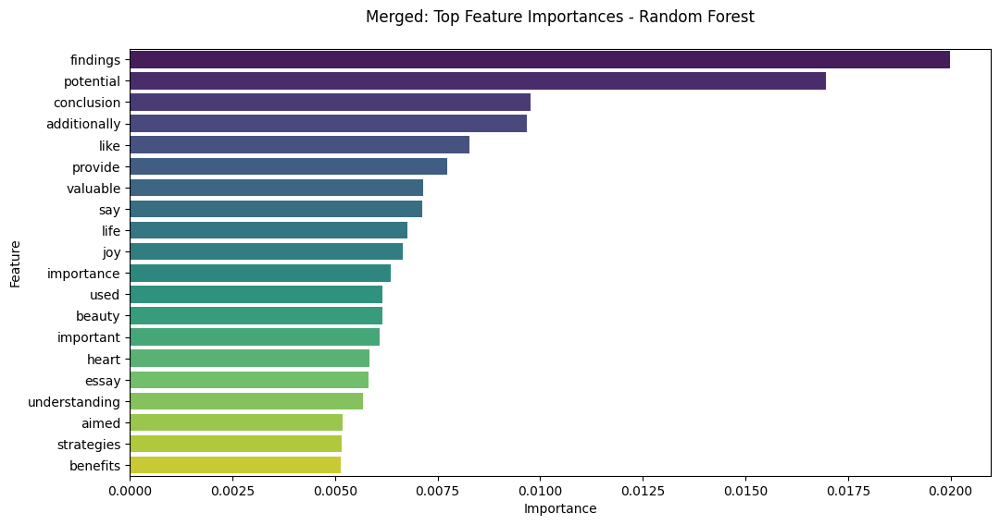

[Arxiv](https://arxiv.org/abs/2403.19725)