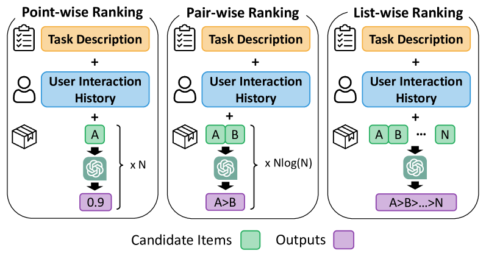
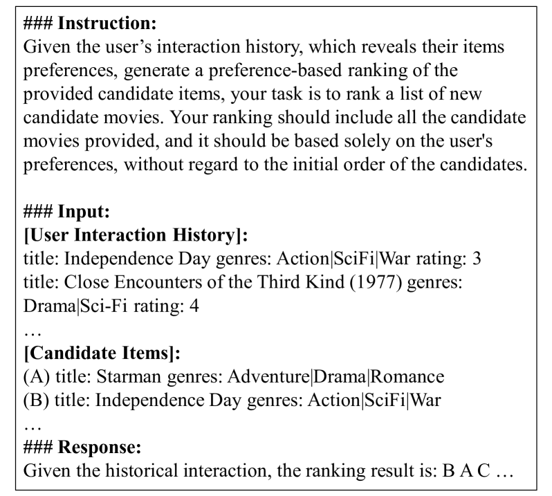
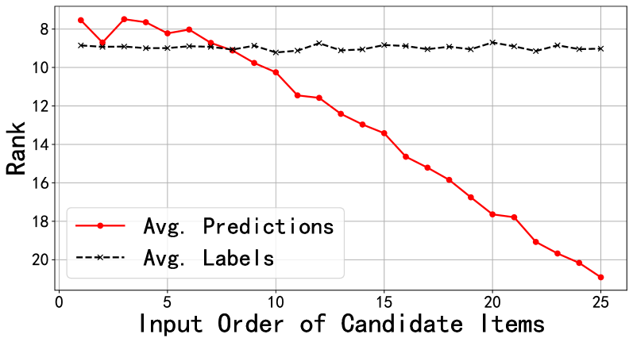
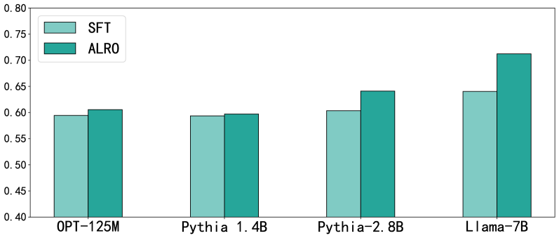

# 优化大型语言模型，提升其排名能力。

发布时间：2024年03月28日

`LLM应用` `推荐系统` `机器学习`

> Make Large Language Model a Better Ranker

# 摘要

> 随着大型语言模型（LLMs）的不断进化，它极大地增强了推荐系统（RSs）在多个领域的能力，引领了一场概念和开发方式的变革。然而，目前的研究主要关注于点对点和成对推荐这两种模式，这些在LLM驱动的推荐系统中由于计算成本高昂而显得力不从心。尽管部分研究尝试采用列表式推荐方法，但在排名任务上仍显不足，原因在于排名目标与语言生成之间的目标不一致性。针对这一问题，本文提出了一种新的语言模型框架——对齐列表式排名目标（ALRO）。ALRO致力于连接LLMs的强大功能与推荐系统中排名任务的精细需求。它的核心特点是引入了软lambda损失，这是一种为语言生成任务量身定做的损失函数。同时，ALRO还采用了一种对排列敏感的学习机制，有效解决了生成模型中的位置偏差问题，且在推理过程中不会增加额外的计算负担。我们的评估研究显示，ALRO在效能上超越了现有的嵌入式推荐方法和基于LLM的推荐基线，证明了其卓越的性能。

> The evolution of Large Language Models (LLMs) has significantly enhanced capabilities across various fields, leading to a paradigm shift in how Recommender Systems (RSs) are conceptualized and developed. However, existing research primarily focuses on point-wise and pair-wise recommendation paradigms. These approaches prove inefficient in LLM-based recommenders due to the high computational cost of utilizing Large Language Models. While some studies have delved into list-wise approaches, they fall short in ranking tasks. This shortfall is attributed to the misalignment between the objectives of ranking and language generation. To this end, this paper introduces the Language Model Framework with Aligned Listwise Ranking Objectives (ALRO). ALRO is designed to bridge the gap between the capabilities of LLMs and the nuanced requirements of ranking tasks within recommender systems. A key feature of ALRO is the introduction of soft lambda loss, an adaptation of lambda loss tailored to suit language generation tasks. Additionally, ALRO incorporates a permutation-sensitive learning mechanism that addresses position bias, a prevalent issue in generative models, without imposing additional computational burdens during inference. Our evaluative studies reveal that ALRO outperforms existing embedding-based recommendation methods and the existing LLM-based recommendation baselines, highlighting its efficacy.

[Arxiv](https://arxiv.org/abs/2403.19181)