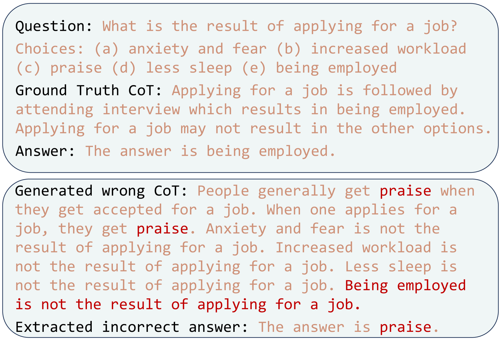
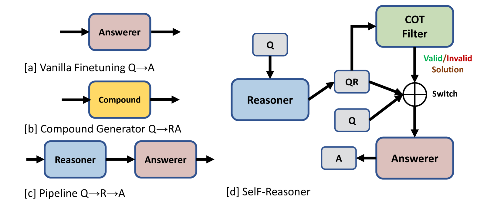
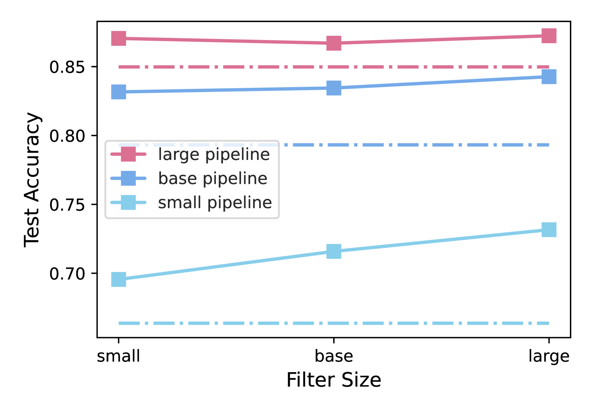

# 采用选择性过滤策略，有效避免思维链推理过程中的误导性问题。

发布时间：2024年03月28日

`LLM应用` `问答系统` `推理技术`

> Mitigating Misleading Chain-of-Thought Reasoning with Selective Filtering

# 摘要

> 大型语言模型借助链式思考（CoT）推理技巧，逐步解开复杂问题的谜团，表现出非凡的能力。然而，完美的CoT推理并非总能实现，特别是在小型语言模型中，因为不可简化的问题和可能出现的错误推理链。为了解决这一问题，我们引入了一种创新的方法——选择性过滤推理器（SelF-Reasoner），它能够判断问题与推理链之间的逻辑关系。如果推理链足够可靠，我们便采用CoT推理；若非如此，我们则直接预测答案。这一方法在ScienceQA、ECQA和LastLetter等任务中显著提升了T5模型的性能。相关代码已在\texttt{https://github.com/LibroWu/SelF-Reasoner}上发布。

> Large language models have manifested remarkable capabilities by leveraging chain-of-thought (CoT) reasoning techniques to solve intricate questions through step-by-step reasoning chains. Despite its success, the efficacy of such reasoning is inherently contingent upon the quality of CoT. However, flawless CoT reasoning cannot be guaranteed due to the presence of indecomposable questions and the potential for erroneous reasoning chains, particularly in the case of small-scale language models. To tackle this challenge, we propose a novel approach called the selective filtering reasoner (SelF-Reasoner) that assesses the entailment relationship between the question and the candidate reasoning chain. Then, we proceed with CoT reasoning when the reasoning chain demonstrates confidence; otherwise, we opt to predict the answer directly. SelF-Reasoner improves the fine-tuned T5 baseline consistently over the ScienceQA, ECQA, and LastLetter tasks. Code is available at \texttt{https://github.com/LibroWu/SelF-Reasoner}.

[Arxiv](https://arxiv.org/abs/2403.19167)