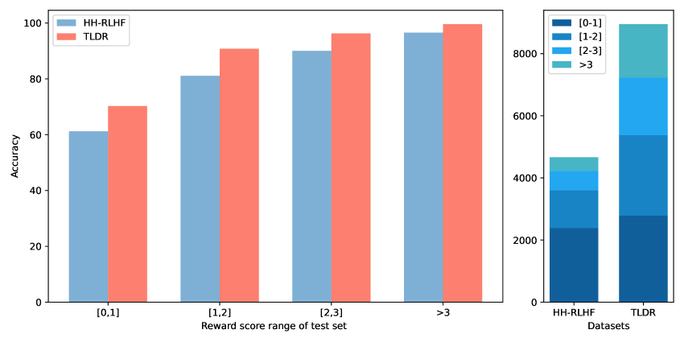
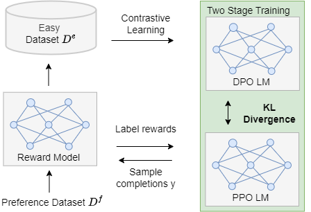
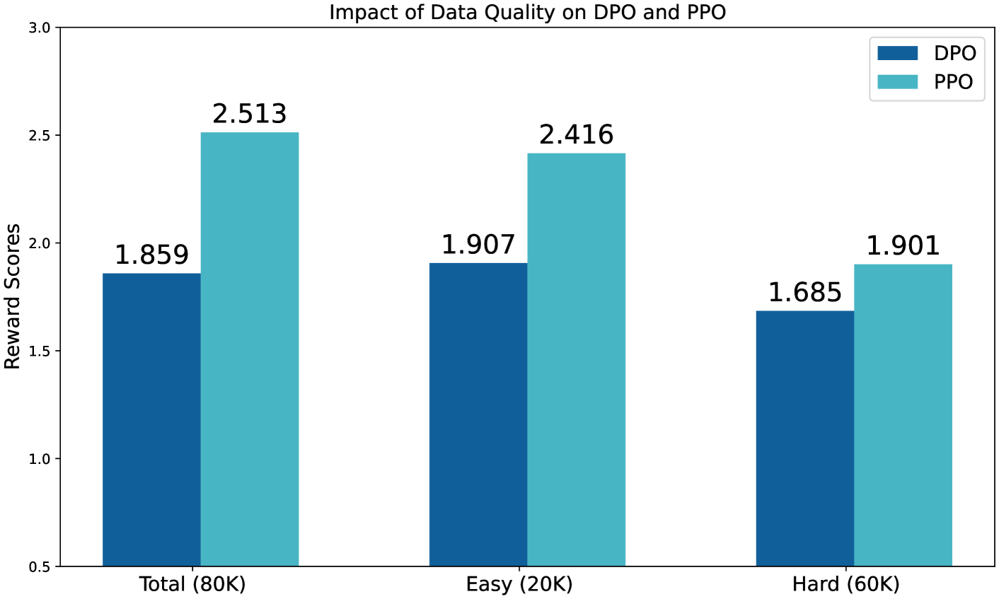
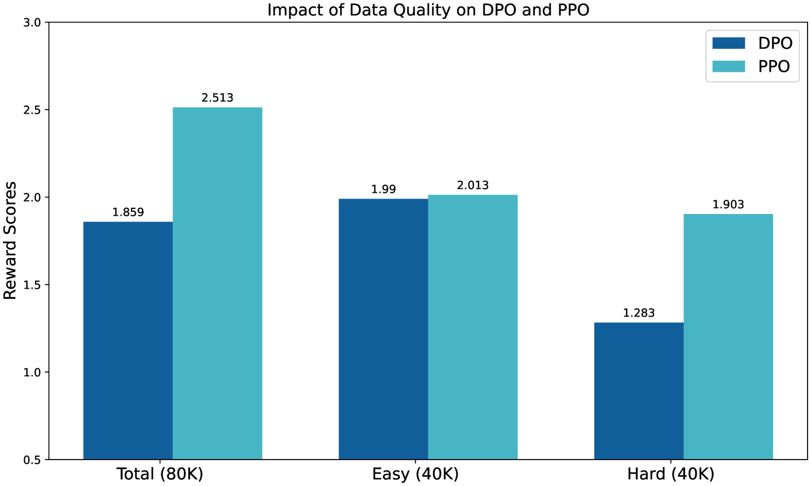

# 在强化学习领域，通过结合数据选择和优化参考模型，我们提出了一种混合偏好优化方法，旨在提升学习效率和决策质量。

发布时间：2024年03月28日

`LLM理论` `人工智能` `伦理与偏见`

> Mixed Preference Optimization: Reinforcement Learning with Data Selection and Better Reference Model

# 摘要

> 大型语言模型（LLMs）凭借其处理和生成自然语言的能力而广受欢迎。但它们在训练过程中可能会吸收并放大文本数据中的有害偏见，导致输出与人类价值观不符。本研究探讨了两种LLM对齐策略：基于人类反馈的强化学习（RLHF）和对比学习驱动的直接偏好优化（DPO）。我们通过对比分析RLHF和DPO的稳定性与鲁棒性，提出了一种新方法——混合偏好优化（MPO），旨在克服这两种方法的不足。我们设计了一个分两阶段的训练流程：先在简单数据集上训练DPO模型，然后在复杂数据集上应用RLHF，并将DPO作为参照模型。这些数据集由一个成熟的奖励模型生成，它根据奖励差异的大小将响应对分为简单和困难两类。第一阶段让我们能够迅速得到一个接近最优的策略模型，第二阶段则通过实时RLHF对模型进行微调，以解决DPO可能带来的分布偏移问题。我们在HH-RLHF和TLDR两个公开对齐数据集上进行了实验，结果显示MPO在GPT4性能和人类评估方面都表现出色。

> Large Language Models (LLMs) have become increasingly popular due to their ability to process and generate natural language. However, as they are trained on massive datasets of text, LLMs can inherit harmful biases and produce outputs that are not aligned with human values. This paper studies two main approaches to LLM alignment: Reinforcement Learning with Human Feedback (RLHF) and contrastive learning-based methods like Direct Preference Optimization (DPO). By analyzing the stability and robustness of RLHF and DPO, we propose MPO (Mixed Preference Optimization), a novel method that mitigates the weaknesses of both approaches. Specifically, we propose a two-stage training procedure: first train DPO on an easy dataset, and then perform RLHF on a difficult set with DPO model being the reference model. Here, the easy and difficult sets are constructed by a well-trained reward model that splits response pairs into those with large gaps of reward (easy), and those with small gaps (difficult). The first stage allows us to obtain a relatively optimal policy (LLM) model quickly, whereas the second stage refines LLM with online RLHF, thus mitigating the distribution shift issue associated with DPO. Experiments are conducted on two public alignment datasets, namely HH-RLHF and TLDR, demonstrating the effectiveness of MPO, both in terms of GPT4 and human evaluation.

[Arxiv](https://arxiv.org/abs/2403.19443)