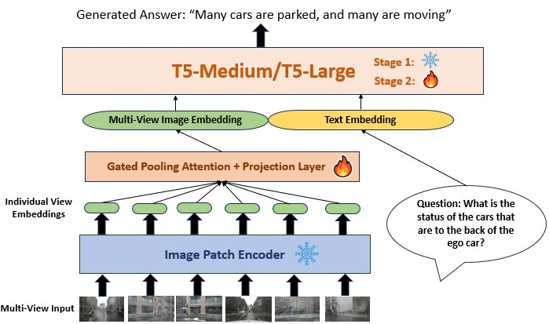
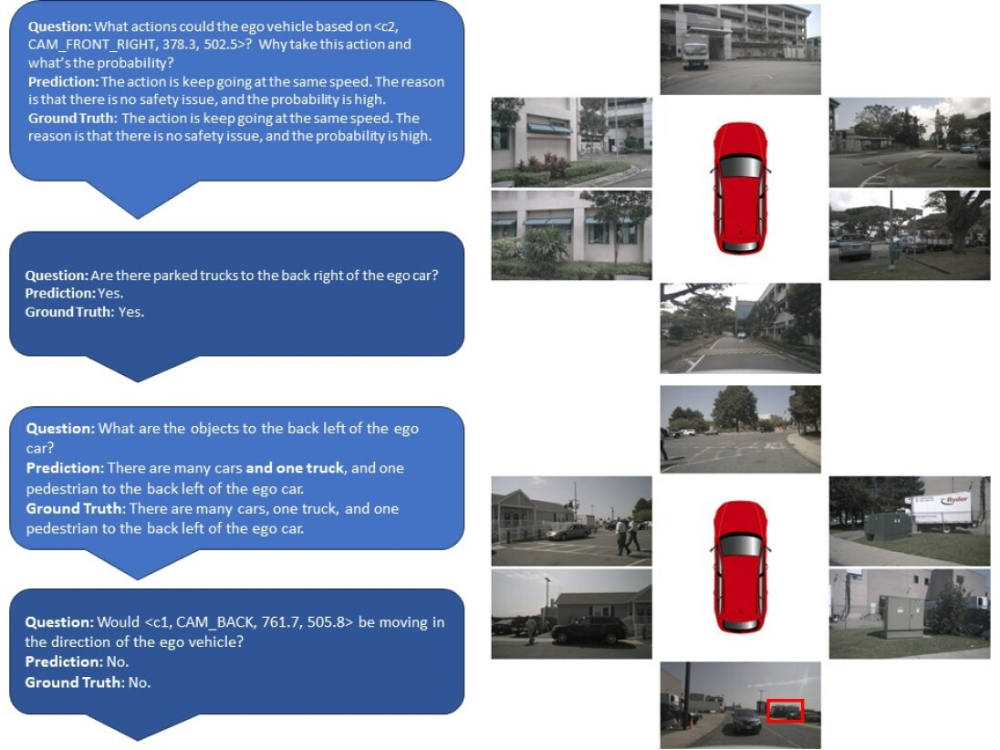
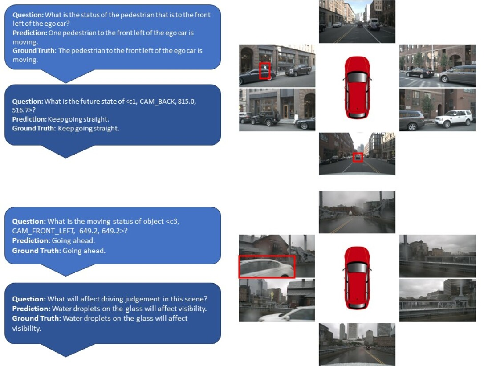
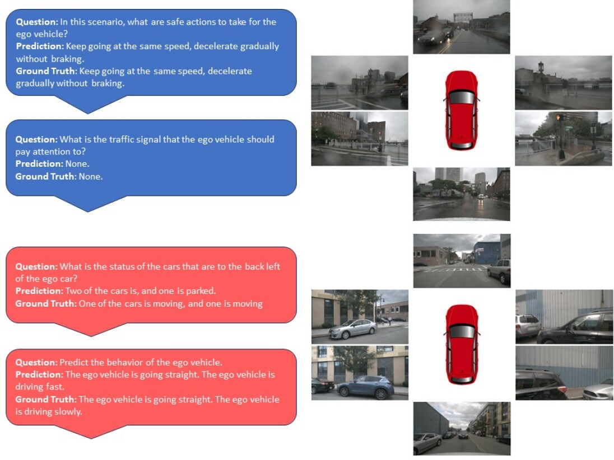

# 为自动驾驶中的问题解答，我们研发了多帧、轻巧高效的视语模型。

发布时间：2024年03月28日

`LLM应用` `自动驾驶` `多模态模型`

> Multi-Frame, Lightweight & Efficient Vision-Language Models for Question Answering in Autonomous Driving

# 摘要

> 视觉-语言模型（VLMs）和多模态语言模型（MMLMs）在自动驾驶领域崭露头角，它们能够利用交通场景图像等多种数据，为自动驾驶安全任务提供可理解的文本推理和回应。然而，目前这些系统的实现依赖于成本高昂的大型语言模型（LLM）和图像编码器，对于实时自动驾驶系统而言并不适用，因为这些系统对内存要求严格，且需要快速的推理能力。为应对这些挑战，我们推出了EM-VLM4AD——一款高效、轻量级的多帧视觉语言模型，专为自动驾驶的视觉问答设计。相较于传统方法，EM-VLM4AD至少节省了10倍的内存和浮点运算需求，同时在DriveLM数据集上取得了超越现有基准的BLEU-4、METEOR、CIDEr和ROGUE评分。EM-VLM4AD还能够精准提取与提示相关的交通信息，并应对各类自动驾驶子任务的提问。我们的训练与评估代码已在GitHub上公开：https://github.com/akshaygopalkr/EM-VLM4AD。

> Vision-Language Models (VLMs) and Multi-Modal Language models (MMLMs) have become prominent in autonomous driving research, as these models can provide interpretable textual reasoning and responses for end-to-end autonomous driving safety tasks using traffic scene images and other data modalities. However, current approaches to these systems use expensive large language model (LLM) backbones and image encoders, making such systems unsuitable for real-time autonomous driving systems where tight memory constraints exist and fast inference time is necessary. To address these previous issues, we develop EM-VLM4AD, an efficient, lightweight, multi-frame vision language model which performs Visual Question Answering for autonomous driving. In comparison to previous approaches, EM-VLM4AD requires at least 10 times less memory and floating point operations, while also achieving higher BLEU-4, METEOR, CIDEr, and ROGUE scores than the existing baseline on the DriveLM dataset. EM-VLM4AD also exhibits the ability to extract relevant information from traffic views related to prompts and can answer questions for various autonomous driving subtasks. We release our code to train and evaluate our model at https://github.com/akshaygopalkr/EM-VLM4AD.

[Arxiv](https://arxiv.org/abs/2403.19838)