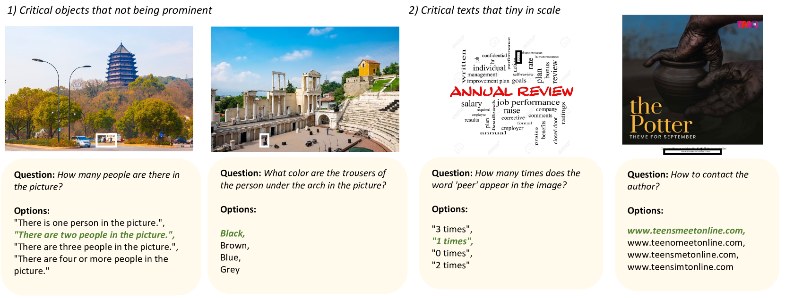

# 多模态大型语言模型中的推理基础定位，通过即插即用的方式实现了卓越的性能。

发布时间：2024年03月28日

`LLM应用` `视觉推理` `多模态学习`

> Plug-and-Play Grounding of Reasoning in Multimodal Large Language Models

# 摘要

> 随着多模态大型语言模型（MLLMs）在遵循指令和推理能力上的显著进步，视觉推理领域迎来了飞跃。然而，由于图像标记化过程中的信息损失，MLLMs在捕捉高分辨率图像中的文本和对象细节方面仍有不足。为此，我们引入了P2G框架，它能够利用MLLMs的潜能，通过专家代理实时定位图像中的关键视觉和文本元素，实现精准推理。此外，我们还建立了P2GB基准，旨在测试MLLMs在解析高分辨率图像中对象关系和文本方面的理解力。实验表明，P2G在视觉推理任务上展现出卓越性能，尤其在P2GB基准上，搭载7B规模的模型便能与GPT-4V相媲美。我们的研究展示了即插即用式推理基础定位的巨大潜力，为超越单纯模型扩展提供了新的可能。

> The surge of Multimodal Large Language Models (MLLMs), given their prominent emergent capabilities in instruction following and reasoning, has greatly advanced the field of visual reasoning. However, constrained by their non-lossless image tokenization, most MLLMs fall short of comprehensively capturing details of text and objects, especially in high-resolution images. To address this, we propose P2G, a novel framework for plug-and-play grounding of reasoning in MLLMs. Specifically, P2G exploits the tool-usage potential of MLLMs to employ expert agents to achieve on-the-fly grounding to critical visual and textual objects of image, thus achieving deliberate reasoning via multimodal prompting. We further create P2GB, a benchmark aimed at assessing MLLMs' ability to understand inter-object relationships and text in challenging high-resolution images. Comprehensive experiments on visual reasoning tasks demonstrate the superiority of P2G. Noteworthy, P2G achieved comparable performance with GPT-4V on P2GB, with a 7B backbone. Our work highlights the potential of plug-and-play grounding of reasoning and opens up a promising alternative beyond model scaling.

[Arxiv](https://arxiv.org/abs/2403.19322)