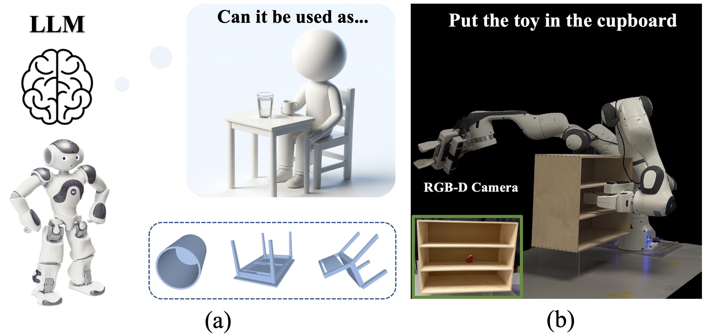
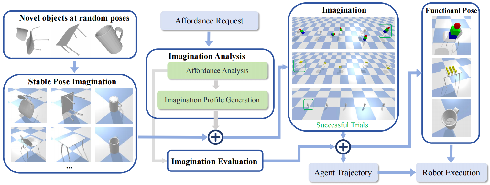
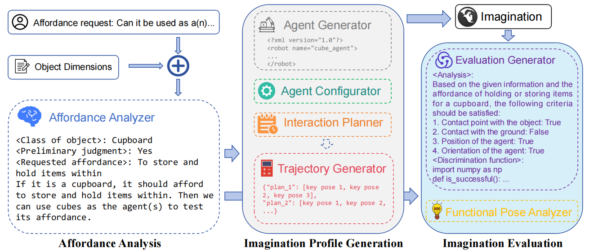
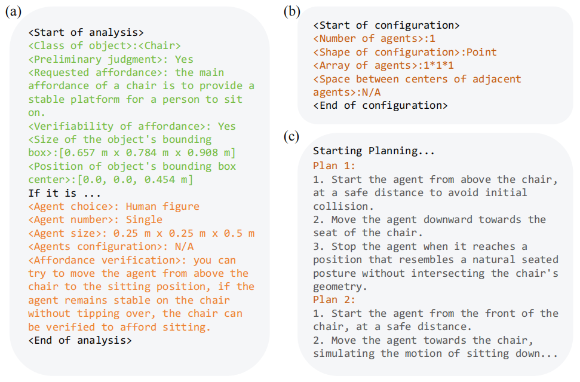
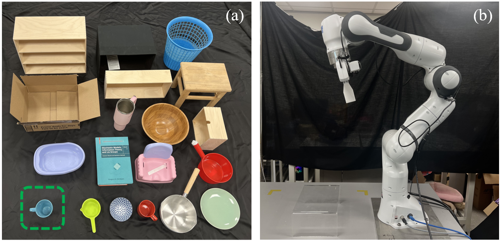
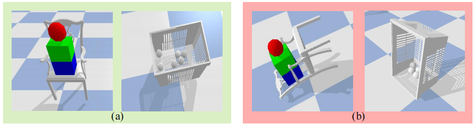

# RAIL：借助大型语言模型，探索机器人的可操作性想象

发布时间：2024年03月28日

`Agent` `家庭自动化` `机器人技术`

> RAIL: Robot Affordance Imagination with Large Language Models

# 摘要

> 本研究提出了一种针对简化语义输入的自动可利用性推理新方法，有效应对家庭环境中对未知物体类别进行识别和操作的难题。借鉴人类认知过程，该方法融合了生成性语言模型与物理模拟技术，激发对新可利用性的深入分析与创新想象。系统架构分为分析、想象和评估三个部分，先对所请求的可利用性名称进行交互式定义分析，接着构建虚拟场景进行想象，最后对物体的可利用性进行评估。若识别出物体具备所需可利用性，方法还能预测其最佳姿态及用户潜在的交互方式。仅通过极少的合成样本训练，该流程在八个新颖物体类别的可利用性分类和功能姿态预测上便取得了卓越成效，表现优于传统学习型基线。通过真实环境下的机器人操作实验验证了该方法的实用性，展现了系统在日常生活中独立理解和操作新物体的能力。

> This paper introduces an automatic affordance reasoning paradigm tailored to minimal semantic inputs, addressing the critical challenges of classifying and manipulating unseen classes of objects in household settings. Inspired by human cognitive processes, our method integrates generative language models and physics-based simulators to foster analytical thinking and creative imagination of novel affordances. Structured with a tripartite framework consisting of analysis, imagination, and evaluation, our system "analyzes" the requested affordance names into interaction-based definitions, "imagines" the virtual scenarios, and "evaluates" the object affordance. If an object is recognized as possessing the requested affordance, our method also predicts the optimal pose for such functionality, and how a potential user can interact with it. Tuned on only a few synthetic examples across 3 affordance classes, our pipeline achieves a very high success rate on affordance classification and functional pose prediction of 8 classes of novel objects, outperforming learning-based baselines. Validation through real robot manipulating experiments demonstrates the practical applicability of the imagined user interaction, showcasing the system's ability to independently conceptualize unseen affordances and interact with new objects and scenarios in everyday settings.

[Arxiv](https://arxiv.org/abs/2403.19369)