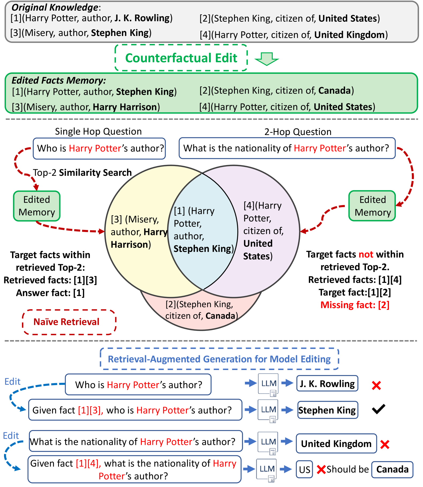
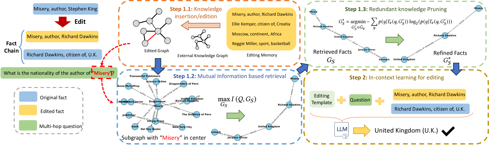
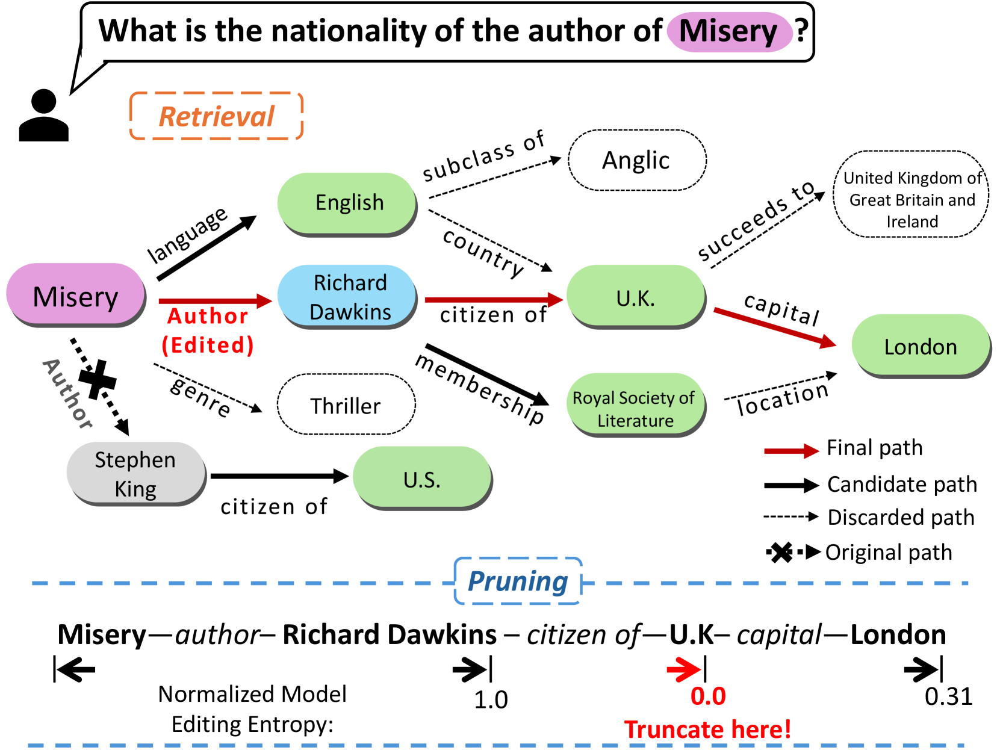
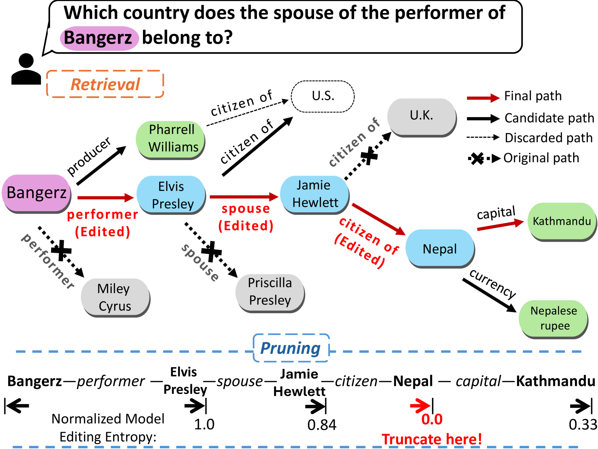

# 本文介绍了一种结合检索增强和知识编辑的方法，用于语言模型中的多跳问答任务，旨在提高问题解答的准确性和效率。

发布时间：2024年03月28日

`LLM应用` `问答系统` `信息检索`

> Retrieval-Enhanced Knowledge Editing for Multi-Hop Question Answering in Language Models

# 摘要

> 大型语言模型（LLMs）擅长解答问题，但在实时更新知识方面常常力不从心，容易给出陈旧或错误的答案。尤其在面对需要综合多个知识点的多跳问题时，挑战更为严峻。为此，我们提出了检索增强模型编辑（RAE）框架，专门针对多跳问答问题。RAE通过检索修订过的事实，并利用上下文学习进一步优化语言模型。我们的检索策略利用互信息最大化原理，发挥LLMs的推理功能，找出可能被传统相似性搜索忽略的关联事实链。同时，框架采用修剪机制剔除冗余信息，提升编辑精确度，减少误导性答案的出现。该框架得到了事实检索效果的理论上的支持。经过对多种LLMs的全面测试，RAE在提供准确且更新答案方面的能力得到了验证。

> Large Language Models (LLMs) have shown proficiency in question-answering tasks but often struggle to integrate real-time knowledge updates, leading to potentially outdated or inaccurate responses. This problem becomes even more challenging when dealing with multi-hop questions since they require LLMs to update and integrate multiple knowledge pieces relevant to the questions. To tackle the problem, we propose the Retrieval-Augmented model Editing (RAE) framework tailored for multi-hop question answering. RAE first retrieves edited facts and then refines the language model through in-context learning. Specifically, our retrieval approach, based on mutual information maximization, leverages the reasoning abilities of LLMs to identify chain facts that naïve similarity-based searches might miss. Additionally, our framework incorporates a pruning strategy to eliminate redundant information from the retrieved facts, which enhances the editing accuracy and mitigates the hallucination problem. Our framework is supported by theoretical justification for its fact retrieval efficacy. Finally, comprehensive evaluation across various LLMs validates RAE's ability in providing accurate answers with updated knowledge.

[Arxiv](https://arxiv.org/abs/2403.19631)