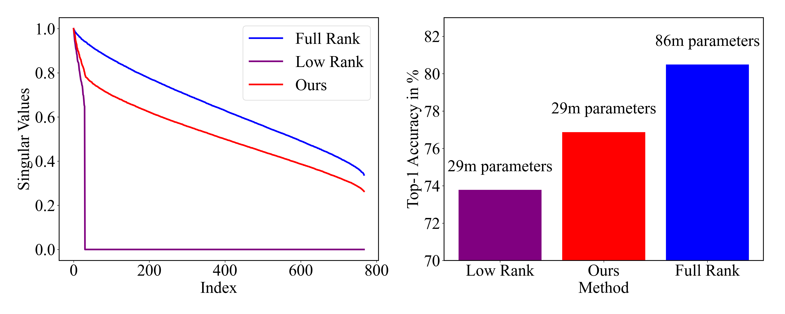
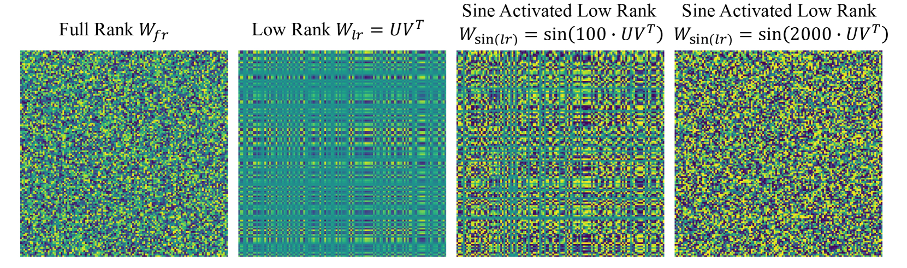
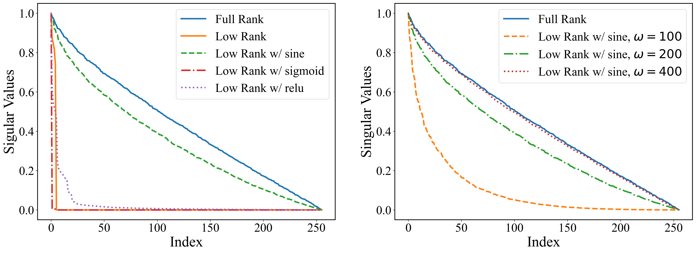

# 通过采用正弦激活的低秩矩阵，本文提出了一种参数高效的学习方法。

发布时间：2024年03月28日

`LLM理论` `机器学习` `计算机视觉`

> Sine Activated Low-Rank Matrices for Parameter Efficient Learning

# 摘要

> 低秩分解技术因其在神经网络中提升参数使用效率而备受青睐，广泛应用于机器学习领域。它通过大幅削减参数数量，实现了模型紧凑与性能的双赢。然而，参数精简往往伴随着准确性的损失，这是一个长期存在的难题。本研究提出了一种创新的框架，将正弦函数融入低秩分解之中，既保持了参数精简的优势，又通过提升分解的秩来增强模型的准确性。我们的方案已在视觉变换器（ViT）、大型语言模型（LLMs）、神经辐射场（NeRF）和3D形状建模等领域得到成功应用，展现了其强大的适用性和高效性。

> Low-rank decomposition has emerged as a vital tool for enhancing parameter efficiency in neural network architectures, gaining traction across diverse applications in machine learning. These techniques significantly lower the number of parameters, striking a balance between compactness and performance. However, a common challenge has been the compromise between parameter efficiency and the accuracy of the model, where reduced parameters often lead to diminished accuracy compared to their full-rank counterparts. In this work, we propose a novel theoretical framework that integrates a sinusoidal function within the low-rank decomposition process. This approach not only preserves the benefits of the parameter efficiency characteristic of low-rank methods but also increases the decomposition's rank, thereby enhancing model accuracy. Our method proves to be an adaptable enhancement for existing low-rank models, as evidenced by its successful application in Vision Transformers (ViT), Large Language Models (LLMs), Neural Radiance Fields (NeRF), and 3D shape modeling. This demonstrates the wide-ranging potential and efficiency of our proposed technique.

[Arxiv](https://arxiv.org/abs/2403.19243)