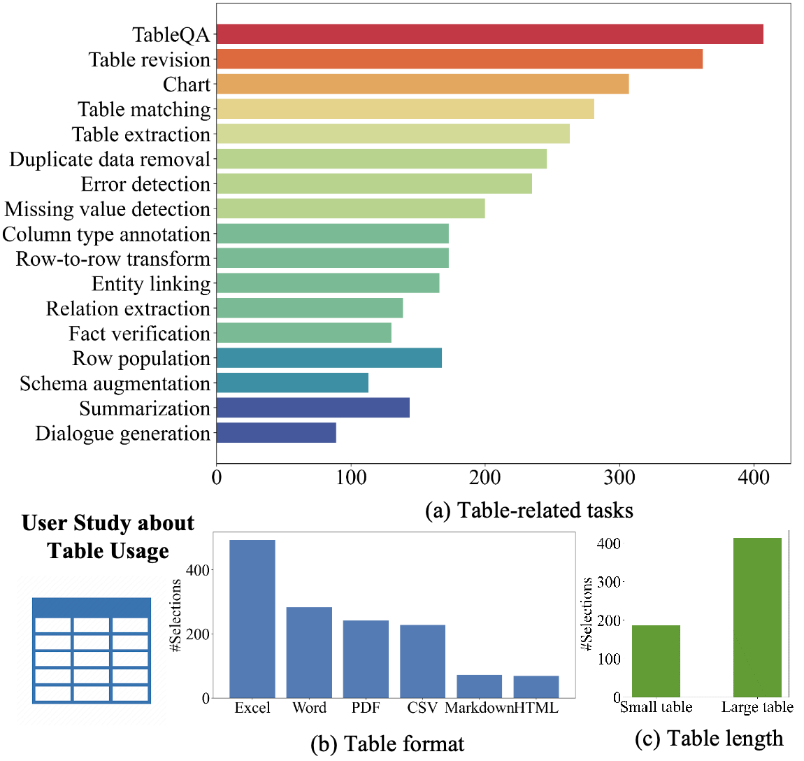
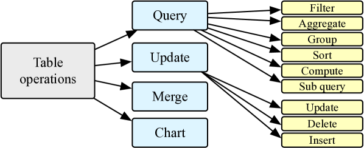
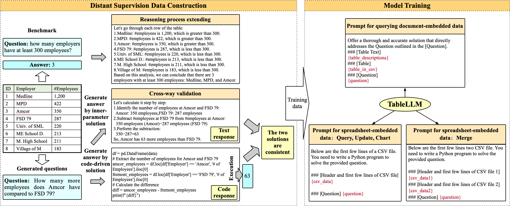

# TableLLM：让大型语言模型在真实办公环境中灵活操控表格数据

发布时间：2024年03月28日

`LLM应用` `办公自动化` `数据处理`

> TableLLM: Enabling Tabular Data Manipulation by LLMs in Real Office Usage Scenarios

# 摘要

> 我们推出了TableLLM，这是一款具备130亿参数的高效大型语言模型，专为处理表格数据任务而生，无论是在文档还是电子表格中，都能适应各种实际办公需求。我们采用了一种创新的远程监督训练法，结合推理扩展策略，让模型能更好地把握推理模式，并通过交叉验证确保数据生成的质量。为检验TableLLM的表现，我们量身打造了一套覆盖文档和电子表格的评估基准，并建立了一套高效的评估流程。经过严格评估，TableLLM在处理表格数据方面，相较于其他通用及表格数据专用的模型，展现出显著优势。目前，模型检查点、源代码、评估基准和交互式Web应用已向公众开放。

> We introduce TableLLM, a robust large language model (LLM) with 13 billion parameters, purpose-built for proficiently handling tabular data manipulation tasks, whether they are embedded within documents or spreadsheets, catering to real-world office scenarios. We propose a distant supervision method for training, which comprises a reasoning process extension strategy, aiding in training LLMs to understand reasoning patterns more effectively as well as a cross-way validation strategy, ensuring the quality of the automatically generated data. To evaluate the performance of TableLLM, we have crafted a benchmark tailored to address both document and spreadsheet formats as well as constructed a well-organized evaluation pipeline capable of handling both scenarios. Thorough evaluations underscore the advantages of TableLLM when compared to various existing general-purpose and tabular data-focused LLMs. We have publicly released the model checkpoint, source code, benchmarks, and a web application for user interaction.

[Arxiv](https://arxiv.org/abs/2403.19318)