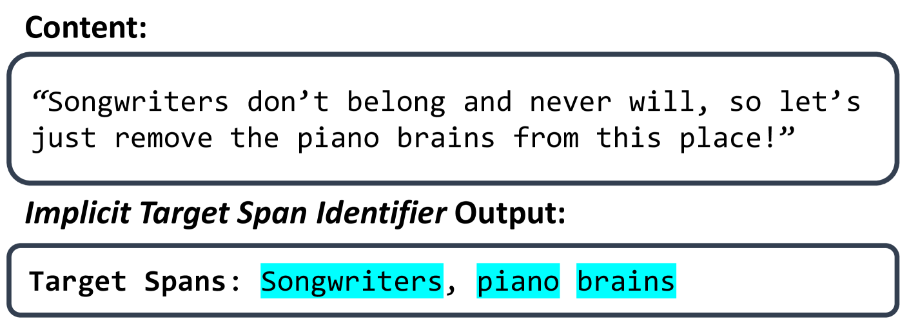
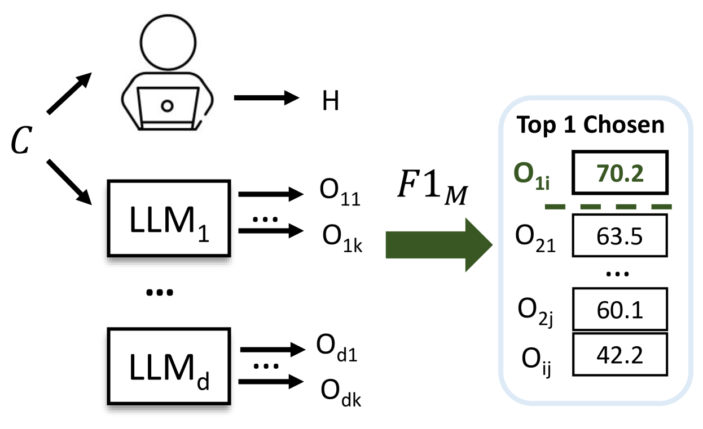

# 针对隐性有害内容的目标跨度识别

发布时间：2024年03月28日

`LLM应用` `网络论坛` `仇恨言论检测`

> Target Span Detection for Implicit Harmful Content

# 摘要

> 在网络论坛中准确识别仇恨言论的目标，对于深入理解这类言论并提升对攻击性言论的识别能力至关重要。许多网络内容通过隐晦的措辞针对弱势群体，如利用刻板印象而非直接点名，使得识别工作难上加难。本研究致力于发掘仇恨言论中的隐性目标，这对于捕捉更为隐蔽的仇恨言论、提高数字平台上有害内容检测效率极为关键。我们提出了一项新任务，旨在识别那些并未直接指明的目标。为此，我们汇集并标注了SBIC、DynaHate和IHC三个重要隐性仇恨言论数据集中的目标范围，创建了名为Implicit-Target-Span的集合。该集合采用了一种创新的汇聚方法，结合人类标注和大型语言模型（LLMs）的匹配度评分。实验结果显示，Implicit-Target-Span为检测目标范围的方法提供了极具挑战性的实验场。

> Identifying the targets of hate speech is a crucial step in grasping the nature of such speech and, ultimately, in improving the detection of offensive posts on online forums. Much harmful content on online platforms uses implicit language especially when targeting vulnerable and protected groups such as using stereotypical characteristics instead of explicit target names, making it harder to detect and mitigate the language. In this study, we focus on identifying implied targets of hate speech, essential for recognizing subtler hate speech and enhancing the detection of harmful content on digital platforms. We define a new task aimed at identifying the targets even when they are not explicitly stated. To address that task, we collect and annotate target spans in three prominent implicit hate speech datasets: SBIC, DynaHate, and IHC. We call the resulting merged collection Implicit-Target-Span. The collection is achieved using an innovative pooling method with matching scores based on human annotations and Large Language Models (LLMs). Our experiments indicate that Implicit-Target-Span provides a challenging test bed for target span detection methods.

[Arxiv](https://arxiv.org/abs/2403.19836)