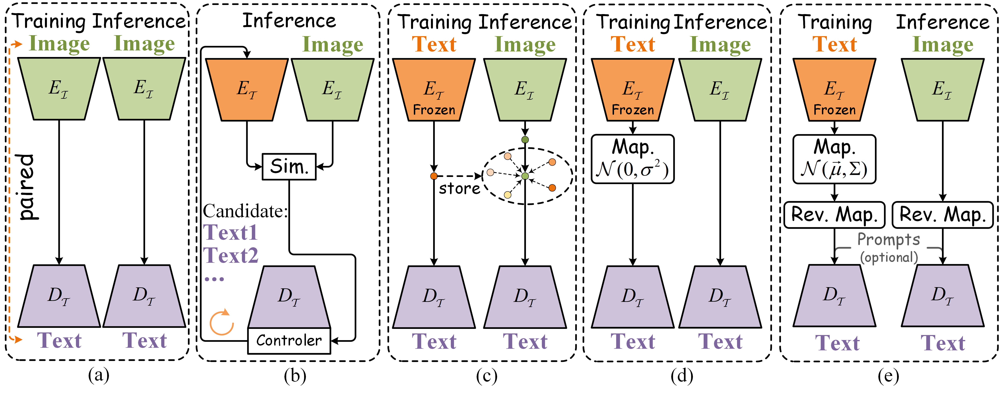
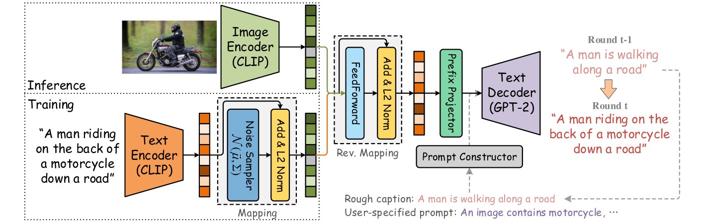
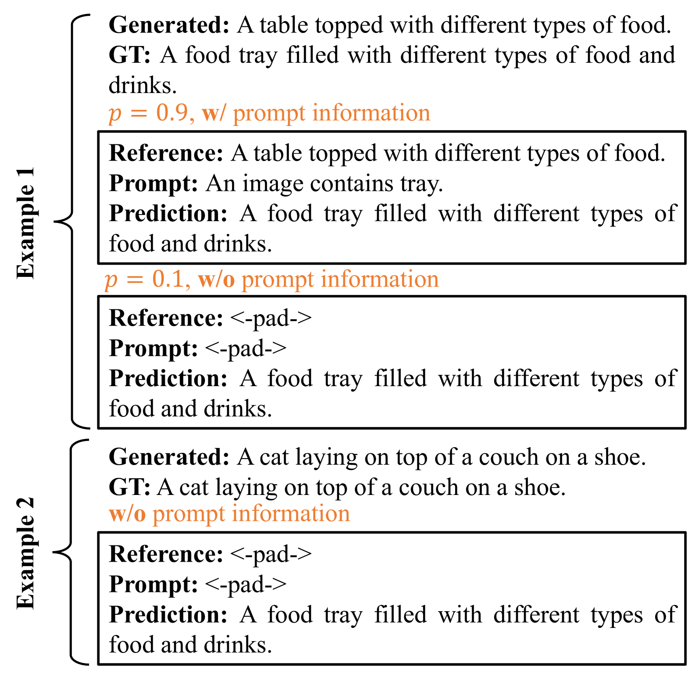
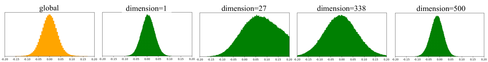
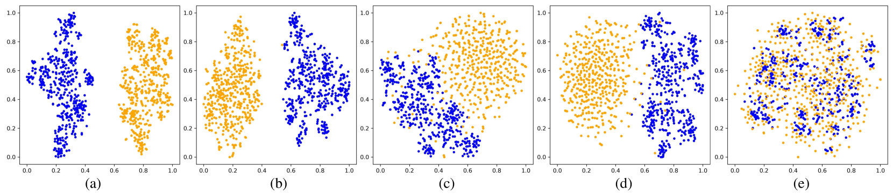

# 通过互动提示，以文本数据为核心的图像描述技术

发布时间：2024年03月28日

`LLM应用` `图像处理`

> Text Data-Centric Image Captioning with Interactive Prompts

# 摘要

> 监督图像标题技术已取得显著成果，但获取优质的图像-文本配对数据困难重重。新兴的大规模视觉语言模型如CLIP，以及生成性语言模型如GPT-2，在众多任务中表现卓越，为利用网络资源的配对或非配对数据，甚至纯文本数据进行图像标题生成提供了新思路。主流做法是借助CLIP模型中的图像-文本一致性，将图像嵌入映射到文本空间。尽管如此，现有方法在适应多样化数据配置、精确估计嵌入偏差，以及优化推理阶段的预测结果方面，仍存诸多挑战。本文介绍了一种新颖的图像标题生成方法TIPCap，以文本数据为核心，结合交互式提示。我们探索了四种逐步减少对配对数据依赖的场景，并构建了一个基于多元正态分布的映射模块来缩小模态差异。此外，我们还提出了一个提示交互模块，能在生成标题前融入额外的提示信息。经过大量实验验证，TIPCap在MS-COCO和Flickr30K两大常用数据集上，超越了其他弱监督或无监督方法，创造了新的性能高峰。

> Supervised image captioning approaches have made great progress, but it is challenging to collect high-quality human-annotated image-text data. Recently, large-scale vision and language models (e.g., CLIP) and large-scale generative language models (e.g., GPT-2) have shown strong performances in various tasks, which also provide some new solutions for image captioning with web paired data, unpaired data or even text-only data. Among them, the mainstream solution is to project image embeddings into the text embedding space with the assistance of consistent representations between image-text pairs from the CLIP model. However, the current methods still face several challenges in adapting to the diversity of data configurations in a unified solution, accurately estimating image-text embedding bias, and correcting unsatisfactory prediction results in the inference stage. This paper proposes a new Text data-centric approach with Interactive Prompts for image Captioning, named TIPCap. 1) We consider four different settings which gradually reduce the dependence on paired data. 2) We construct a mapping module driven by multivariate Gaussian distribution to mitigate the modality gap, which is applicable to the above four different settings. 3) We propose a prompt interaction module that can incorporate optional prompt information before generating captions. Extensive experiments show that our TIPCap outperforms other weakly or unsupervised image captioning methods and achieves a new state-of-the-art performance on two widely used datasets, i.e., MS-COCO and Flickr30K.

[Arxiv](https://arxiv.org/abs/2403.19193)