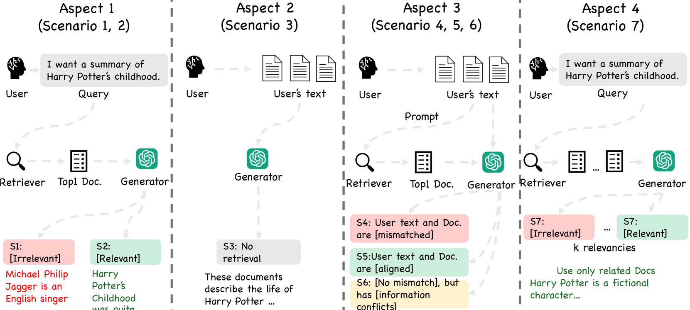
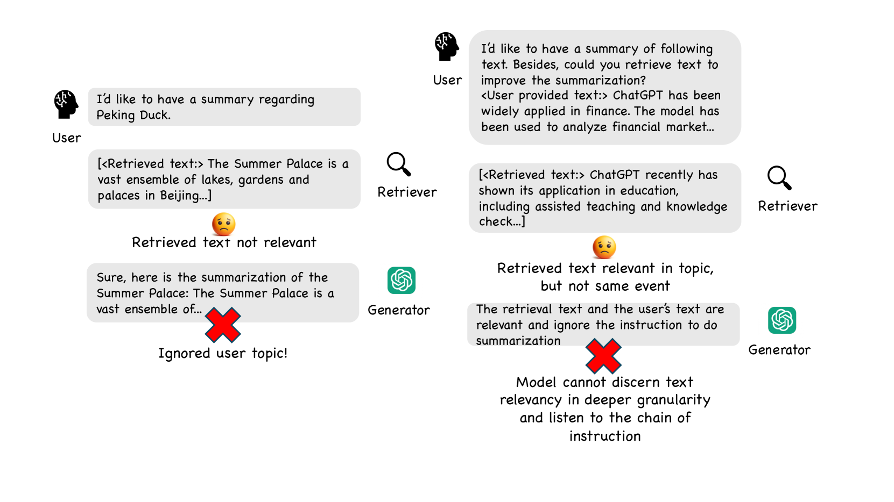
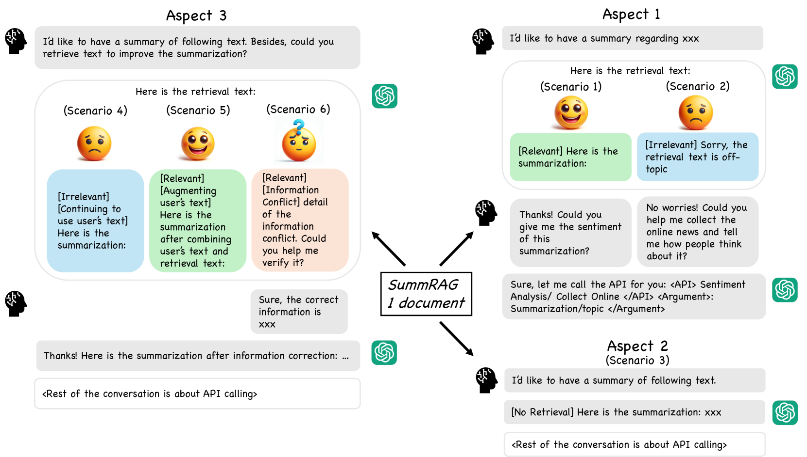
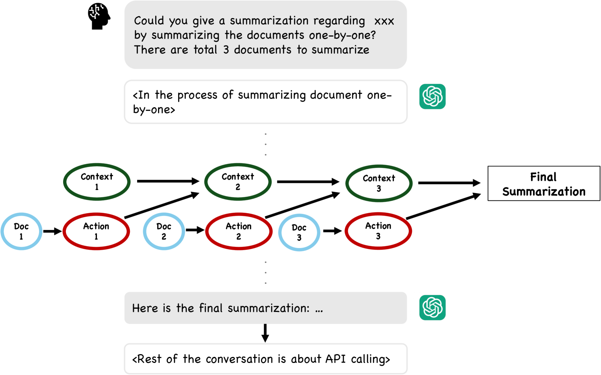
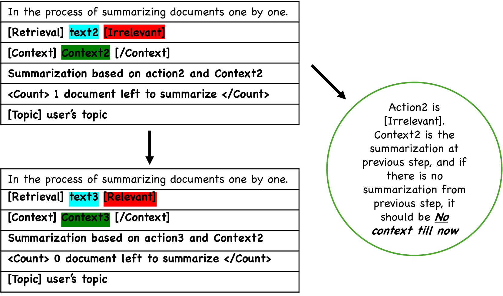

# 我们正致力于开发一个更加稳定可靠的基于检索技术的自动摘要系统。

发布时间：2024年03月28日

`RAG` `信息检索` `文本摘要`

> Towards a Robust Retrieval-Based Summarization System

# 摘要

> 本文探讨了大型语言模型（LLM）在采用检索增强生成（RAG）技术进行摘要任务时的稳健性。尽管LLM能够生成摘要，但其在处理现实世界的复杂情境时的表现尚未得到充分研究。我们首先提出了LogicSumm，这是一个新颖的评估框架，通过模拟真实场景来考验LLM在RAG摘要任务中的稳健性。针对LogicSumm揭示的不足，我们进一步开发了SummRAG系统，它能够生成训练对话并对模型进行精细调整，从而在LogicSumm设定的情境中提升模型的稳健性。SummRAG体现了我们的目标，即通过结构化的方法来评估LLM的性能，而非仅仅针对问题进行临时解决。实验结果显示，SummRAG有效提升了逻辑连贯性和摘要质量。相关数据、模型权重和Python代码已在线上公开。

> This paper describes an investigation of the robustness of large language models (LLMs) for retrieval augmented generation (RAG)-based summarization tasks. While LLMs provide summarization capabilities, their performance in complex, real-world scenarios remains under-explored. Our first contribution is LogicSumm, an innovative evaluation framework incorporating realistic scenarios to assess LLM robustness during RAG-based summarization. Based on limitations identified by LogiSumm, we then developed SummRAG, a comprehensive system to create training dialogues and fine-tune a model to enhance robustness within LogicSumm's scenarios. SummRAG is an example of our goal of defining structured methods to test the capabilities of an LLM, rather than addressing issues in a one-off fashion. Experimental results confirm the power of SummRAG, showcasing improved logical coherence and summarization quality. Data, corresponding model weights, and Python code are available online.

[Arxiv](https://arxiv.org/abs/2403.19889)