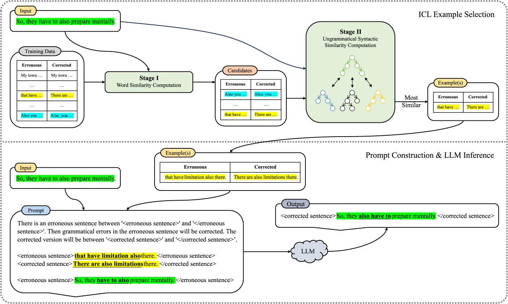

# 通过选取不符合语法的句法示例，优化上下文内的语法错误修正策略。

发布时间：2024年03月28日

`LLM应用` `语法纠正` `语言模型`

> Ungrammatical-syntax-based In-context Example Selection for Grammatical Error Correction

# 摘要

> 在大型语言模型盛行的今天，上下文学习（ICL）凸显为一种高效的提示手段，能够充分发挥LLMs在众多任务上的潜力。尽管如此，利用LLMs进行语法错误纠正（GEC）仍是一大难题。本文提出了一项创新策略，即基于非规范句法的ICL示例筛选方法，用于GEC任务。我们通过不同的算法对比句子的句法结构相似度，并筛选出与测试样本在错误句法上最为相近的ICL示例。进一步地，我们实施了两阶段优化流程，以提升筛选质量。在标准的英语GEC数据集上，实验证明，我们这一基于非规范句法的策略在多个LLMs中的表现超越了传统的基于单词匹配或语义的方法。这说明，在GEC这类注重句法的任务中，加强对句法信息的关注能显著提高LLMs的效能。本文发表后，我们将开放相关代码供公众使用。

> In the era of large language models (LLMs), in-context learning (ICL) stands out as an effective prompting strategy that explores LLMs' potency across various tasks. However, applying LLMs to grammatical error correction (GEC) is still a challenging task. In this paper, we propose a novel ungrammatical-syntax-based in-context example selection strategy for GEC. Specifically, we measure similarity of sentences based on their syntactic structures with diverse algorithms, and identify optimal ICL examples sharing the most similar ill-formed syntax to the test input. Additionally, we carry out a two-stage process to further improve the quality of selection results. On benchmark English GEC datasets, empirical results show that our proposed ungrammatical-syntax-based strategies outperform commonly-used word-matching or semantics-based methods with multiple LLMs. This indicates that for a syntax-oriented task like GEC, paying more attention to syntactic information can effectively boost LLMs' performance. Our code will be publicly available after the publication of this paper.

[Arxiv](https://arxiv.org/abs/2403.19283)