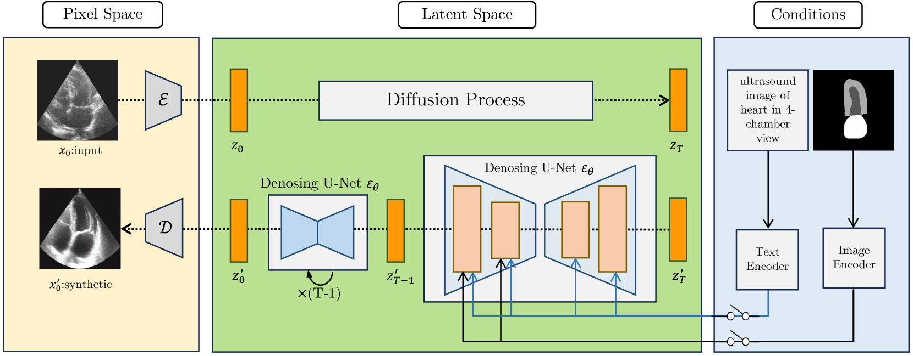
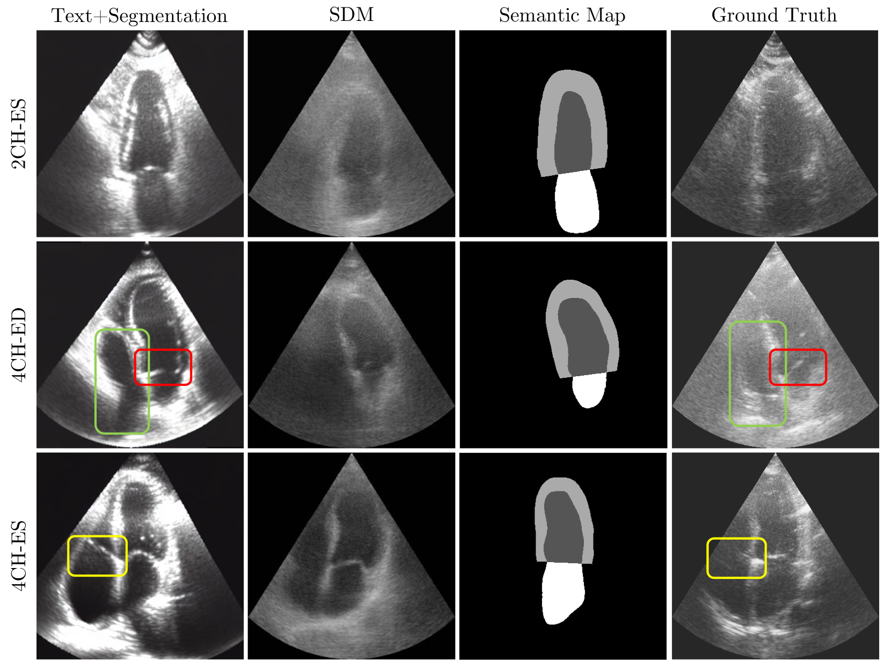
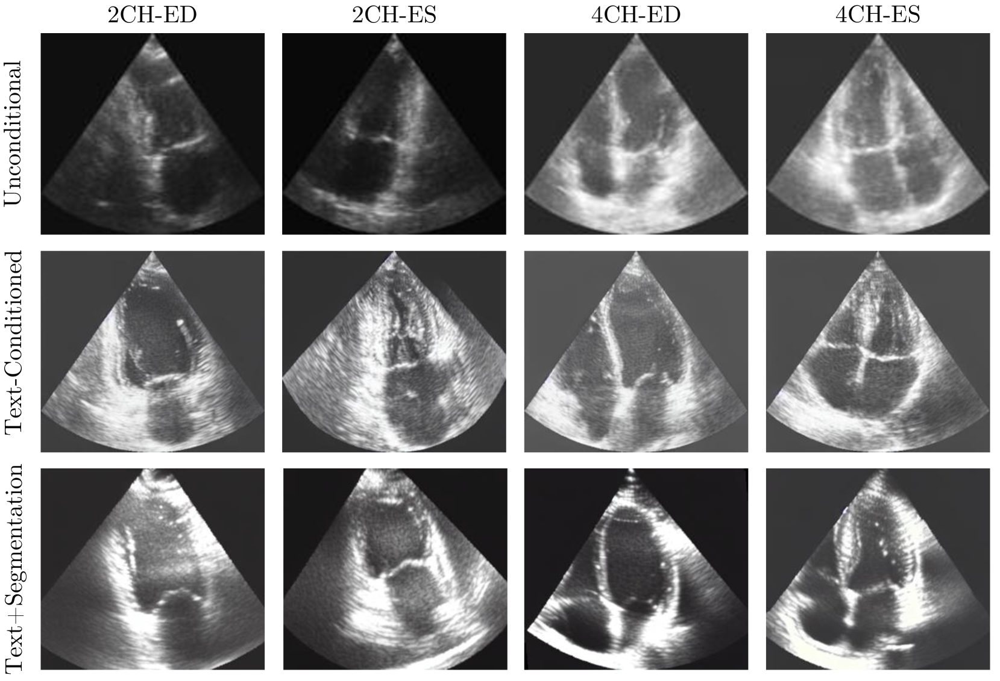

# 通过视觉-语言合成数据，我们提升了超声心动图相关下游任务的效能。

发布时间：2024年03月28日

`LLM应用` `图像生成`

> Vision-Language Synthetic Data Enhances Echocardiography Downstream Tasks

# 摘要

> 在医疗领域的深度学习模型，尤其是超声图像分析中，高质量、大量数据的支撑不可或缺。扩散模型通过生成高保真医学图像，有效降低了图像采集与标注的成本。本研究运用最新的视觉-语言模型，创造出多样且逼真的心脏超声图像数据，这些数据在文本和语义标签图的指导下，保留了原始图像的核心特征。我们探索了三种生成策略：无条件生成、文本导向生成以及融合文本与语义监督的混合生成。研究显示，合成数据中的丰富上下文信息能够提升心脏超声分割与分类等后续任务的精确度与解释力，带来更佳的评估指标和更迅速的收敛效果。我们将实现过程中的检查点、提示以及合成数据集一并发布在 \href{https://github.com/Pooria90/DiffEcho}{GitHub}，供公众使用。

> High-quality, large-scale data is essential for robust deep learning models in medical applications, particularly ultrasound image analysis. Diffusion models facilitate high-fidelity medical image generation, reducing the costs associated with acquiring and annotating new images. This paper utilizes recent vision-language models to produce diverse and realistic synthetic echocardiography image data, preserving key features of the original images guided by textual and semantic label maps. Specifically, we investigate three potential avenues: unconditional generation, generation guided by text, and a hybrid approach incorporating both textual and semantic supervision. We show that the rich contextual information present in the synthesized data potentially enhances the accuracy and interpretability of downstream tasks, such as echocardiography segmentation and classification with improved metrics and faster convergence. Our implementation with checkpoints, prompts, and the created synthetic dataset will be publicly available at \href{https://github.com/Pooria90/DiffEcho}{GitHub}.

[Arxiv](https://arxiv.org/abs/2403.19880)