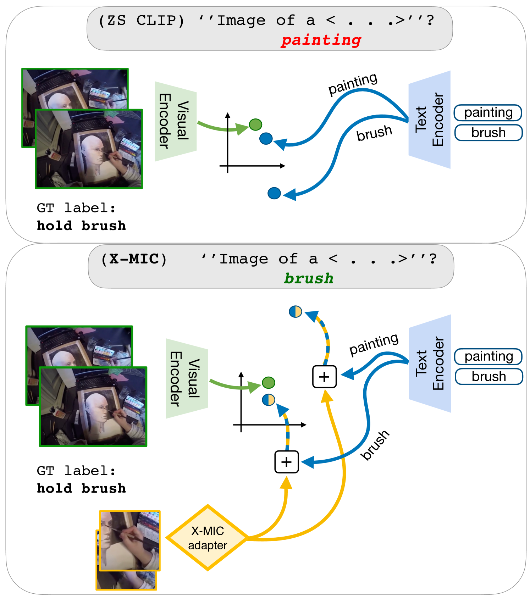
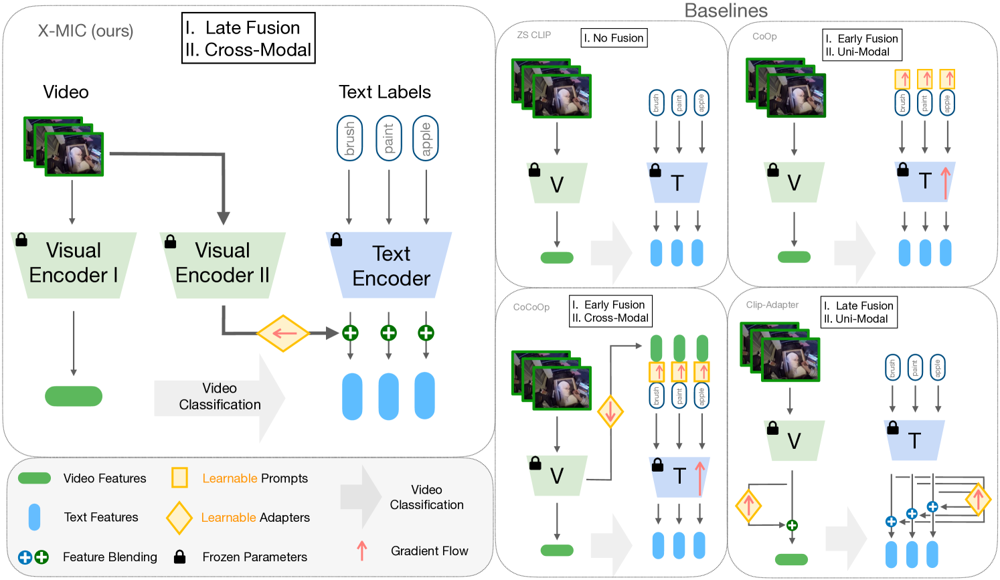
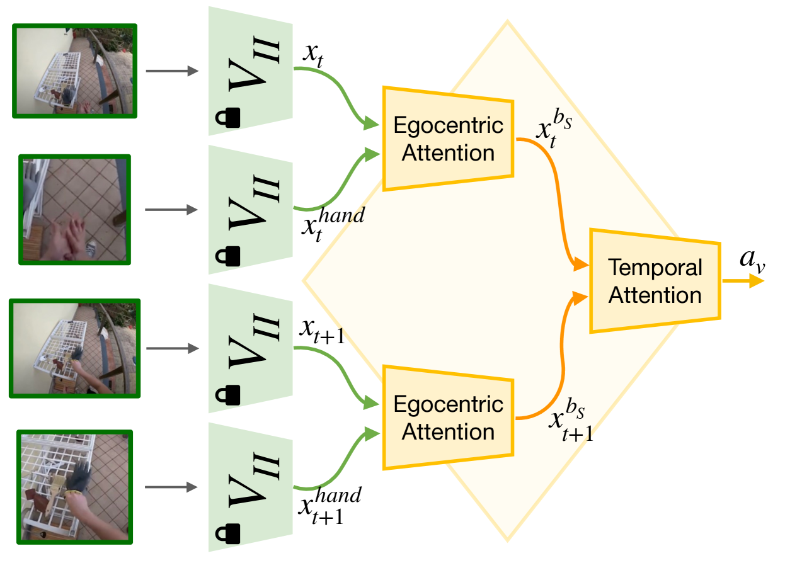

# X-MIC：跨模态实例调控以实现自我中心动作的泛化推广

发布时间：2024年03月28日

`Agent` `视频处理`

> X-MIC: Cross-Modal Instance Conditioning for Egocentric Action Generalization

# 摘要

> 近期，视觉-语言模型（VLMs）因其在零样本识别领域的卓越表现，越来越受到关注，尤其在图像和第三人称视频分类的应用上。然而，将这些模型适配到以自我为中心的视频分类上还鲜有研究。为填补这一空白，我们提出了一个名为X-MIC的跨模态适配框架，它简单却效果显著。通过视频适配器，我们的系统能够直接在共享嵌入空间内，将文本嵌入与每个以自我为中心的视频进行精准对齐。这一创新的适配器架构通过解耦可学习的时序建模和固定的视频编码器，不仅保留了预训练VLMs的泛化能力，还进一步提升了其性能。这样的改进使得文本嵌入与视频的对齐更加精确，显著提升了跨数据集的泛化能力。我们在Epic-Kitchens、Ego4D和EGTEA等数据集上进行了细致的跨数据集动作泛化测试，结果证明了X-MIC方法的有效性。相关代码已在GitHub上公开，地址为 https://github.com/annusha/xmic。

> Lately, there has been growing interest in adapting vision-language models (VLMs) to image and third-person video classification due to their success in zero-shot recognition. However, the adaptation of these models to egocentric videos has been largely unexplored. To address this gap, we propose a simple yet effective cross-modal adaptation framework, which we call X-MIC. Using a video adapter, our pipeline learns to align frozen text embeddings to each egocentric video directly in the shared embedding space. Our novel adapter architecture retains and improves generalization of the pre-trained VLMs by disentangling learnable temporal modeling and frozen visual encoder. This results in an enhanced alignment of text embeddings to each egocentric video, leading to a significant improvement in cross-dataset generalization. We evaluate our approach on the Epic-Kitchens, Ego4D, and EGTEA datasets for fine-grained cross-dataset action generalization, demonstrating the effectiveness of our method. Code is available at https://github.com/annusha/xmic

[Arxiv](https://arxiv.org/abs/2403.19811)