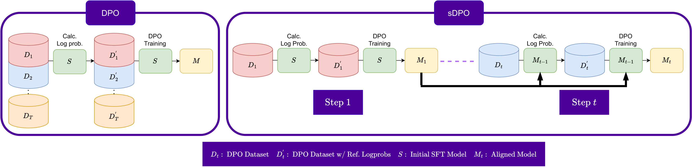
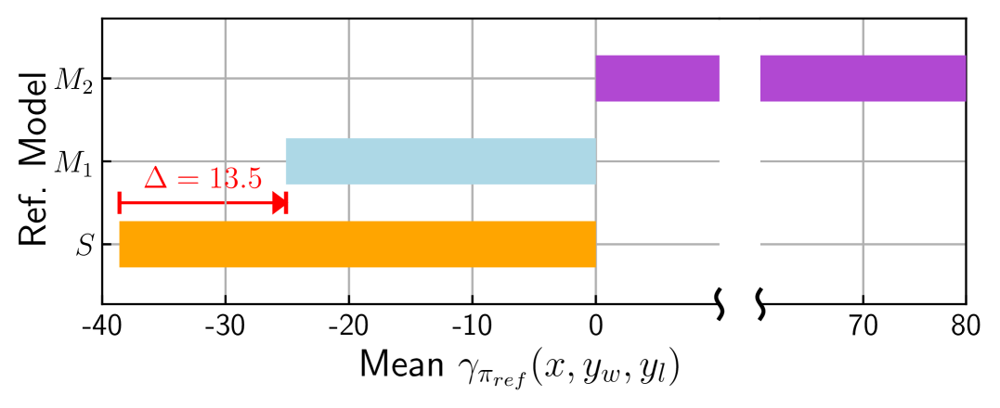
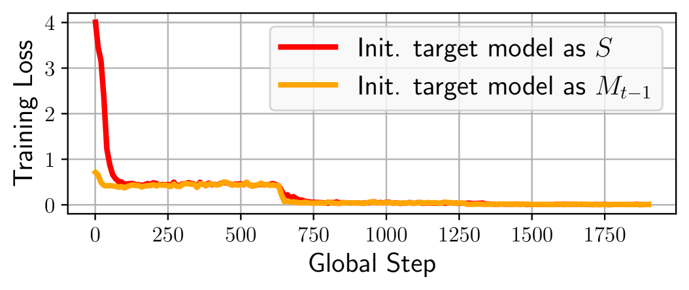

# sDPO：避免一次性耗尽数据资源

发布时间：2024年03月28日

`LLM理论` `人工智能` `模型优化`

> sDPO: Don't Use Your Data All at Once

# 摘要

> 随着大型语言模型（LLM）技术的不断进步，让模型更贴合人类偏好显得尤为关键。我们提出了分步直接偏好优化（sDPO），这是一种新颖的优化方法，通过分阶段利用偏好数据集，而非一次性整合，从而实现更精准的模型对齐。实践表明，sDPO不仅让参考模型在训练过程中更加精确，还能让最终模型的性能更上一层楼，有时甚至超越了参数更多的其他主流LLM。

> As development of large language models (LLM) progresses, aligning them with human preferences has become increasingly important. We propose stepwise DPO (sDPO), an extension of the recently popularized direct preference optimization (DPO) for alignment tuning. This approach involves dividing the available preference datasets and utilizing them in a stepwise manner, rather than employing it all at once. We demonstrate that this method facilitates the use of more precisely aligned reference models within the DPO training framework. Furthermore, sDPO trains the final model to be more performant, even outperforming other popular LLMs with more parameters.

[Arxiv](https://arxiv.org/abs/2403.19270)