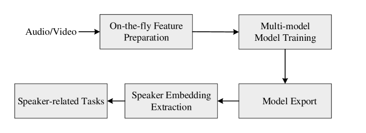
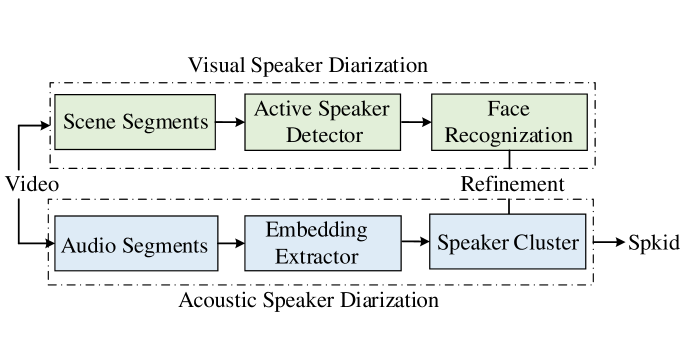

# 3D-Speaker-Toolkit：一款开源的多模态说话人识别与分离工具集。

发布时间：2024年03月29日

`LLM应用` `说话人识别` `多模态分析`

> 3D-Speaker-Toolkit: An Open Source Toolkit for Multi-modal Speaker Verification and Diarization

# 摘要

> 本研究提出了3D-Speaker-Toolkit，一个开源的多模态说话人验证和分离工具包，专为学术界和工业界量身打造。该工具包巧妙整合了声学、语义和视觉数据，通过这些模态的融合，提供了更为强大的说话人识别功能。声学部分通过全监督和自监督学习提取说话人特征，语义模块则运用先进的语言模型来捕捉口语的内容和语境，提升系统辨识说话人的语言模式能力。视觉模块则利用图像处理技术细致分析面部特征，提高了多人环境中的说话人分离精度。综合这些模块，3D-Speaker-Toolkit在说话人相关任务的准确性和可靠性上达到了新的高度，为多模态说话人分析领域设定了新的标准。此外，3D-Speaker项目还发布了多个最先进的开源模型和一个包含逾10,000名说话人的大型数据集，工具包已在 https://github.com/alibaba-damo-academy/3D-Speaker 上线供公众使用。

> This paper introduces 3D-Speaker-Toolkit, an open source toolkit for multi-modal speaker verification and diarization. It is designed for the needs of academic researchers and industrial practitioners. The 3D-Speaker-Toolkit adeptly leverages the combined strengths of acoustic, semantic, and visual data, seamlessly fusing these modalities to offer robust speaker recognition capabilities. The acoustic module extracts speaker embeddings from acoustic features, employing both fully-supervised and self-supervised learning approaches. The semantic module leverages advanced language models to apprehend the substance and context of spoken language, thereby augmenting the system's proficiency in distinguishing speakers through linguistic patterns. Finally, the visual module applies image processing technologies to scrutinize facial features, which bolsters the precision of speaker diarization in multi-speaker environments. Collectively, these modules empower the 3D-Speaker-Toolkit to attain elevated levels of accuracy and dependability in executing speaker-related tasks, establishing a new benchmark in multi-modal speaker analysis. The 3D-Speaker project also includes a handful of open-sourced state-of-the-art models and a large dataset containing over 10,000 speakers. The toolkit is publicly available at https://github.com/alibaba-damo-academy/3D-Speaker.

[Arxiv](https://arxiv.org/abs/2403.19971)