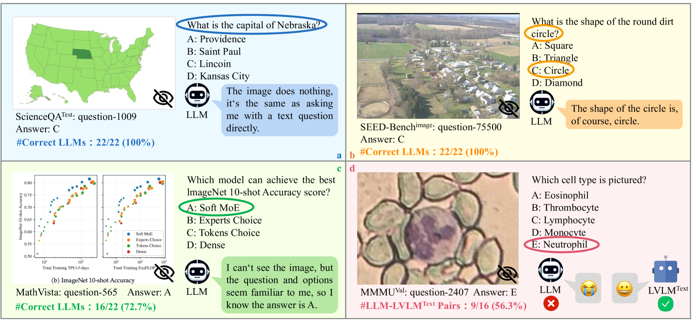
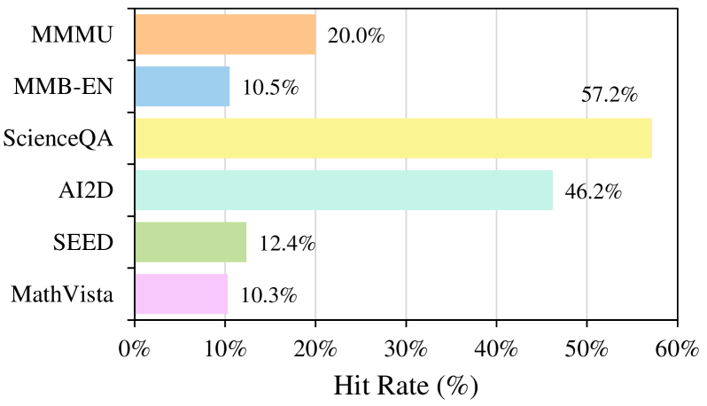
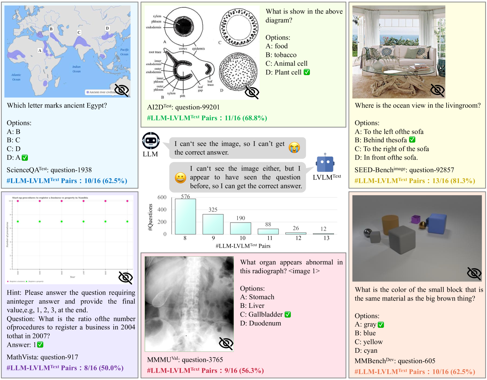
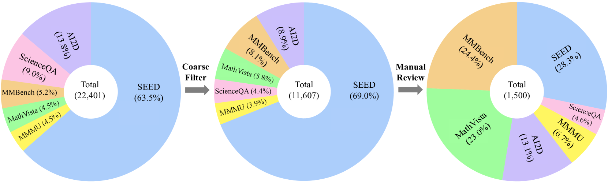
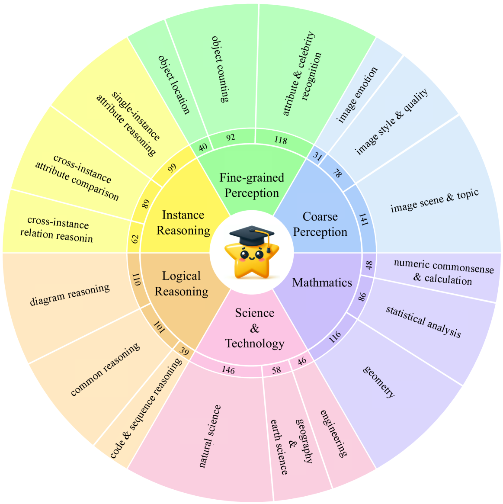

# 我们评估大型视觉-语言模型的方向是否正确？

发布时间：2024年03月29日

`LLM应用` `视觉-语言模型` `多模态评估`

> Are We on the Right Way for Evaluating Large Vision-Language Models?

# 摘要

> 近期，大型视觉-语言模型（LVLMs）发展迅速，引发众多研究对其多模态能力的评估。但我们深入分析现有评估方法后，发现两个主要问题：首先，许多样本并不需要视觉内容，答案可以直接从问题和选项中推断，或者依据LLMs内嵌的世界知识。这一现象普遍存在于现有基准测试中。例如，GeminiPro在缺乏视觉输入的情况下，在MMMU基准测试中得分高达42.9%，平均超过随机选择基线20%以上。其次，LLM和LVLM训练中存在非故意的数据泄露。即便在缺少视觉内容的情况下，LLM和LVLM仍能回答某些需要视觉信息的问题，这表明它们在大规模训练数据中记住了这些样本。例如，Sphinx-X-MoE在无法访问图像的情况下，在MMMU基准测试中得分43.6%，比其LLM基础模型高出17.9%。这些问题可能导致对多模态性能提升的误判，从而误导LVLM的研究。为此，我们推出了MMStar，这是一个由人工精心筛选的1500个样本组成的高标准多模态基准。MMStar涵盖了6大核心能力和18个细致维度，旨在通过精心挑选和净化的样本，公正评估LVLMs的多模态实力。这些样本初步从现有基准中通过自动化流程筛选，再经人工审核，确保每个样本都具有视觉依赖性、最小化数据泄露，并考验其多模态处理的高级能力。同时，我们还开发了两项指标，用以衡量多模态训练中的数据泄露和实际性能提升。我们在MMStar上对16个顶尖LVLMs进行了评估，检验它们的多模态能力，并结合新指标，在7个基准测试中探究它们的数据泄露情况和真正的多模态增益。

> Large vision-language models (LVLMs) have recently achieved rapid progress, sparking numerous studies to evaluate their multi-modal capabilities. However, we dig into current evaluation works and identify two primary issues: 1) Visual content is unnecessary for many samples. The answers can be directly inferred from the questions and options, or the world knowledge embedded in LLMs. This phenomenon is prevalent across current benchmarks. For instance, GeminiPro achieves 42.9% on the MMMU benchmark without any visual input, and outperforms the random choice baseline across six benchmarks over 20% on average. 2) Unintentional data leakage exists in LLM and LVLM training. LLM and LVLM could still answer some visual-necessary questions without visual content, indicating the memorizing of these samples within large-scale training data. For example, Sphinx-X-MoE gets 43.6% on MMMU without accessing images, surpassing its LLM backbone with 17.9%. Both problems lead to misjudgments of actual multi-modal gains and potentially misguide the study of LVLM. To this end, we present MMStar, an elite vision-indispensable multi-modal benchmark comprising 1,500 samples meticulously selected by humans. MMStar benchmarks 6 core capabilities and 18 detailed axes, aiming to evaluate LVLMs' multi-modal capacities with carefully balanced and purified samples. These samples are first roughly selected from current benchmarks with an automated pipeline, human review is then involved to ensure each curated sample exhibits visual dependency, minimal data leakage, and requires advanced multi-modal capabilities. Moreover, two metrics are developed to measure data leakage and actual performance gain in multi-modal training. We evaluate 16 leading LVLMs on MMStar to assess their multi-modal capabilities, and on 7 benchmarks with the proposed metrics to investigate their data leakage and actual multi-modal gain.

[Arxiv](https://arxiv.org/abs/2403.20330)