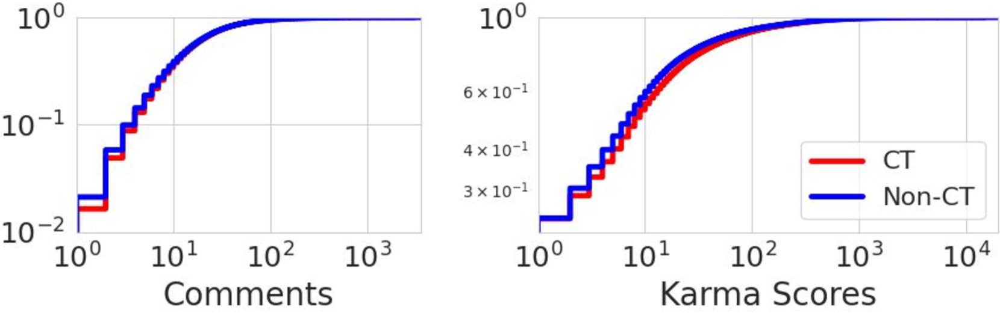

# 大规模识别阴谋论叙事：避免误报与错误的关联

发布时间：2024年03月29日

`LLM应用` `网络内容分析` `机器学习`

> Classifying Conspiratorial Narratives At Scale: False Alarms and Erroneous Connections

# 摘要

> 网络讨论常涉及阴谋论，有时助长了人们对这些理论的信仰。但并非所有讨论都在推动阴谋论，有些实际上旨在驳斥它们。以往的研究通常使用简单的代理或局限于特定信号集来识别阴谋论，这限制了我们对不同领域和网络社群中阴谋论讨论的全面理解。本研究提出了一种新的通用方法，根据作者对阴谋信仰的态度对相关讨论进行分类，这种态度可以通过故事中的行动者、行为或目标等元素明确展现，或通过提及化学尾迹、新世界秩序等已知理论隐晦表达。我们运用人工标注的真实数据训练了一个基于BERT的模型，对网络阴谋论进行分类，并将其与GPT模型在检测网络阴谋内容方面的表现进行了对比。尽管GPT在表达力和情境理解上表现出色，我们的研究却发现了其在逻辑推理上的明显不足，同时也证实了我们的分类器具有相当的竞争力。我们首次利用Reddit上最活跃的阴谋论相关论坛的帖子进行了大规模分类研究，结果显示仅有三分之一的帖子被视为正面内容。这项研究为大型语言模型在需要精细情境理解的任务中的潜在应用提供了新的见解。

> Online discussions frequently involve conspiracy theories, which can contribute to the proliferation of belief in them. However, not all discussions surrounding conspiracy theories promote them, as some are intended to debunk them. Existing research has relied on simple proxies or focused on a constrained set of signals to identify conspiracy theories, which limits our understanding of conspiratorial discussions across different topics and online communities. This work establishes a general scheme for classifying discussions related to conspiracy theories based on authors' perspectives on the conspiracy belief, which can be expressed explicitly through narrative elements, such as the agent, action, or objective, or implicitly through references to known theories, such as chemtrails or the New World Order. We leverage human-labeled ground truth to train a BERT-based model for classifying online CTs, which we then compared to the Generative Pre-trained Transformer machine (GPT) for detecting online conspiratorial content. Despite GPT's known strengths in its expressiveness and contextual understanding, our study revealed significant flaws in its logical reasoning, while also demonstrating comparable strengths from our classifiers. We present the first large-scale classification study using posts from the most active conspiracy-related Reddit forums and find that only one-third of the posts are classified as positive. This research sheds light on the potential applications of large language models in tasks demanding nuanced contextual comprehension.

[Arxiv](https://arxiv.org/abs/2404.00141)