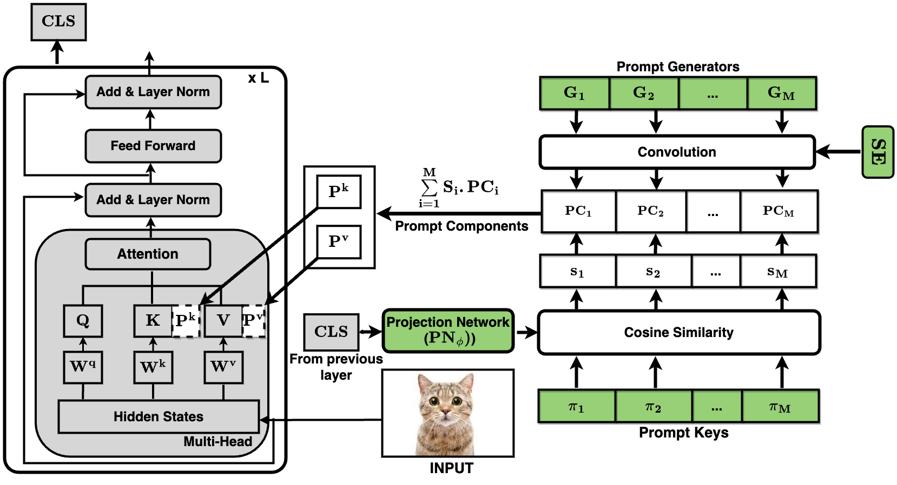
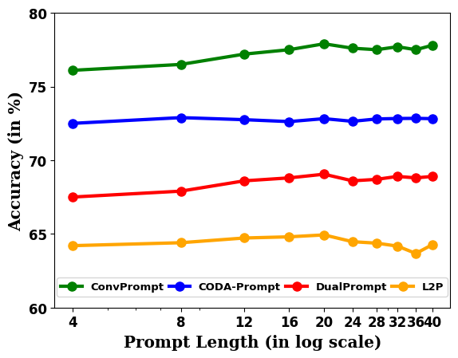
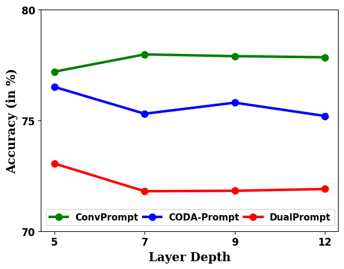
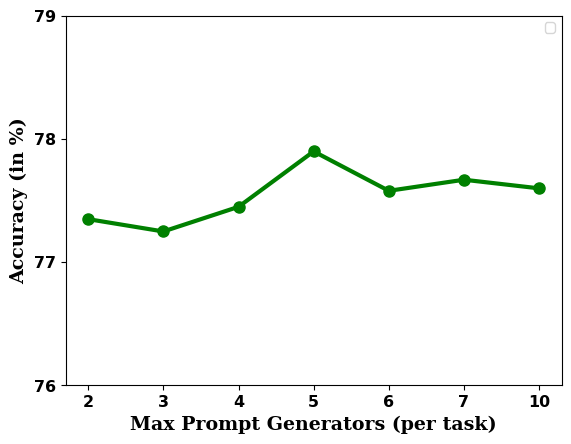
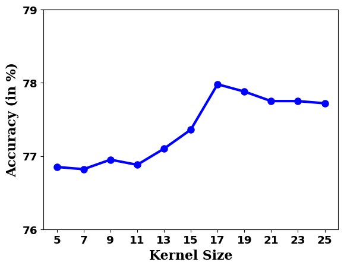
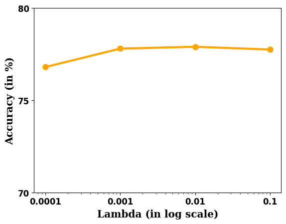
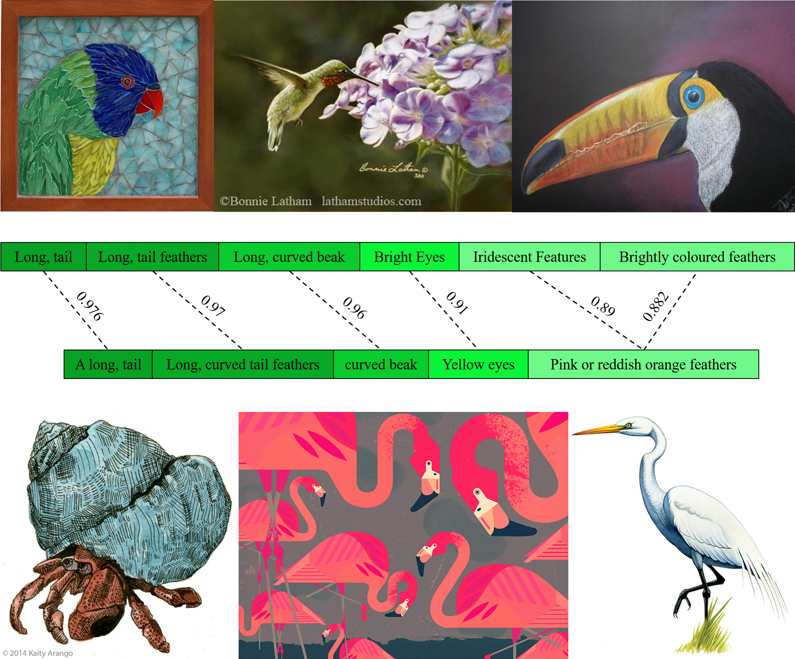
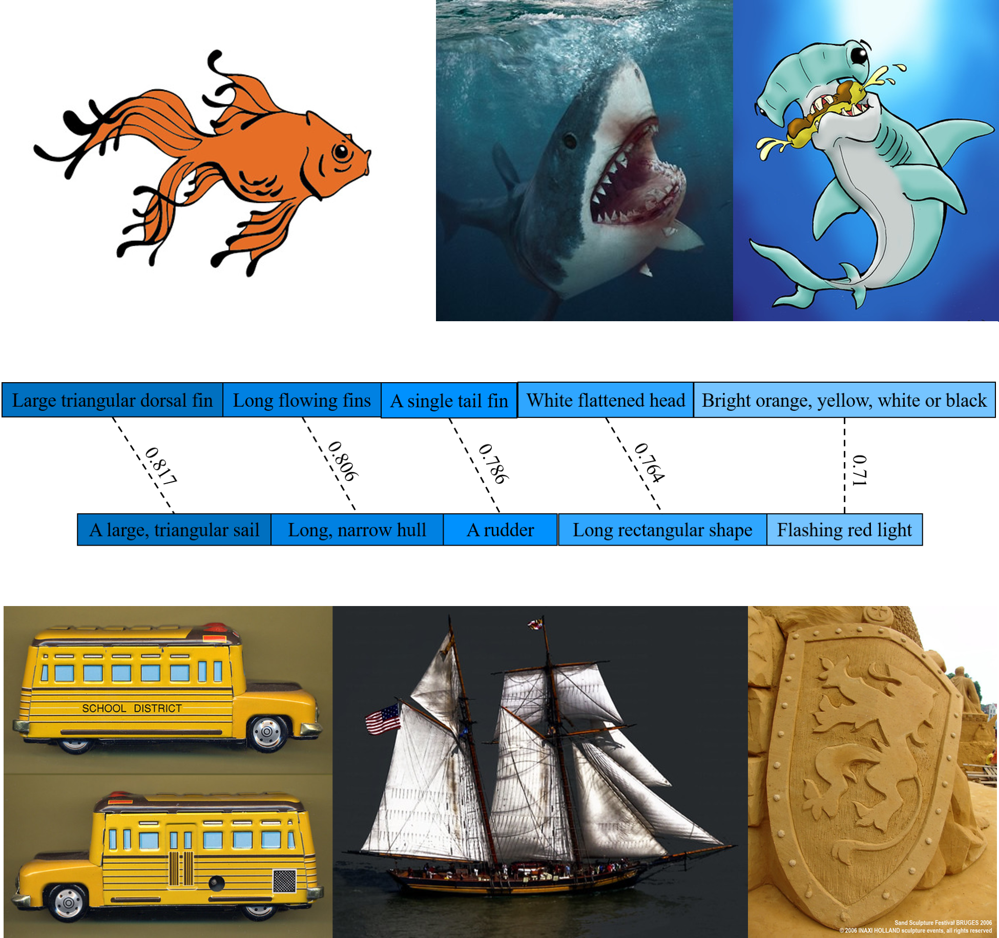

# 卷积式提示技术与语言模型相融合，以实现持续学习的目标。

发布时间：2024年03月29日

`LLM理论` `持续学习` `计算机视觉`

> Convolutional Prompting meets Language Models for Continual Learning

# 摘要

> 持续学习（CL）赋予模型在缺少过往任务数据的情况下，持续吸收新训练信息的能力。近期，结合提示调整技术的预训练视觉变换器在解决CL中的灾难性遗忘问题上展现出潜力。然而，这些方法依赖的可学习提示池在跨任务传递知识时效率不高，导致性能不尽人意。同时，缺乏针对不同层次的精细提示限制了其在CL中发挥最大效用。为此，我们提出了ConvPrompt，一种创新的卷积提示生成机制，它保留了层次间的共享嵌入，使得层次特定的学习和跨任务的概念传递更为高效。卷积的巧妙运用让我们在保持性能的同时，大幅降低了参数负担。我们还利用大型语言模型生成针对各个类别的细致文本描述，以此来评估任务间的相似度，并动态确定所需学习的提示数量。大量实验验证了ConvPrompt的卓越性能，相较于现有技术（SOTA）提升了约3%，同时显著减少了参数开销。此外，我们通过深入的消融实验，揭示了不同组件的关键作用。

> Continual Learning (CL) enables machine learning models to learn from continuously shifting new training data in absence of data from old tasks. Recently, pretrained vision transformers combined with prompt tuning have shown promise for overcoming catastrophic forgetting in CL. These approaches rely on a pool of learnable prompts which can be inefficient in sharing knowledge across tasks leading to inferior performance. In addition, the lack of fine-grained layer specific prompts does not allow these to fully express the strength of the prompts for CL. We address these limitations by proposing ConvPrompt, a novel convolutional prompt creation mechanism that maintains layer-wise shared embeddings, enabling both layer-specific learning and better concept transfer across tasks. The intelligent use of convolution enables us to maintain a low parameter overhead without compromising performance. We further leverage Large Language Models to generate fine-grained text descriptions of each category which are used to get task similarity and dynamically decide the number of prompts to be learned. Extensive experiments demonstrate the superiority of ConvPrompt and improves SOTA by ~3% with significantly less parameter overhead. We also perform strong ablation over various modules to disentangle the importance of different components.

[Arxiv](https://arxiv.org/abs/2403.20317)