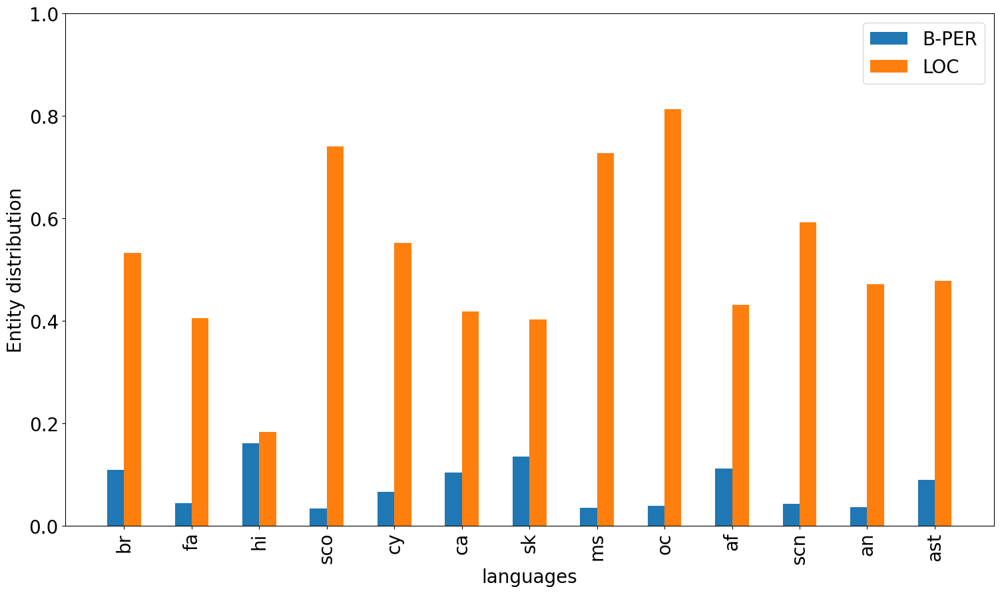
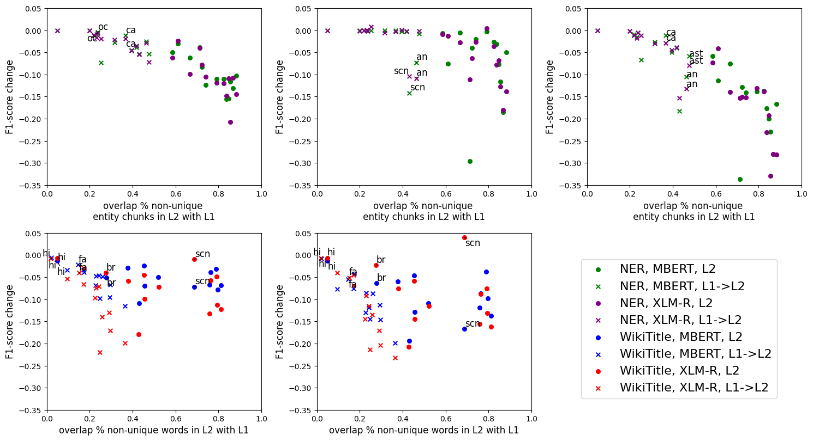

# 本研究探讨了在对抗性数据集中，跨语言迁移对于低资源语言的稳健性问题。

发布时间：2024年03月29日

`LLM应用` `跨语言迁移`

> Cross-Lingual Transfer Robustness to Lower-Resource Languages on Adversarial Datasets

# 摘要

> 多语言模型（MLLMs）擅长跨语言迁移，即将所学知识从一个语言迁移到另一个语言。比如在命名实体识别（NER）这类NLP核心任务中，这种能力大有用处。本研究探讨了在干扰测试集的情况下，源语言对目标语言的影响。我们针对13对存在地理或血缘联系的语言进行了测试，每对中包括一种资源丰富的语言和一种资源匮乏的语言。在这两种语言环境下，我们对MBERT和XLM-R两个著名的多语言模型进行了评估。结果显示，NER任务的跨语言迁移效果与实体间的相似度密切相关，两种语言共享的实体越多，迁移效果越好。此外，这些模型在面对输入干扰时表现出更强的鲁棒性，可能是因为它们能更好地利用资源丰富语言中的深层语义。这项研究不仅深化了我们对跨语言迁移的理解，也为NLP领域的实际应用提供了重要启示，同时提醒我们在应用多语言模型时要注意语言差异和潜在的局限性。

> Multilingual Language Models (MLLMs) exhibit robust cross-lingual transfer capabilities, or the ability to leverage information acquired in a source language and apply it to a target language. These capabilities find practical applications in well-established Natural Language Processing (NLP) tasks such as Named Entity Recognition (NER). This study aims to investigate the effectiveness of a source language when applied to a target language, particularly in the context of perturbing the input test set. We evaluate on 13 pairs of languages, each including one high-resource language (HRL) and one low-resource language (LRL) with a geographic, genetic, or borrowing relationship. We evaluate two well-known MLLMs--MBERT and XLM-R--on these pairs, in native LRL and cross-lingual transfer settings, in two tasks, under a set of different perturbations. Our findings indicate that NER cross-lingual transfer depends largely on the overlap of entity chunks. If a source and target language have more entities in common, the transfer ability is stronger. Models using cross-lingual transfer also appear to be somewhat more robust to certain perturbations of the input, perhaps indicating an ability to leverage stronger representations derived from the HRL. Our research provides valuable insights into cross-lingual transfer and its implications for NLP applications, and underscores the need to consider linguistic nuances and potential limitations when employing MLLMs across distinct languages.

[Arxiv](https://arxiv.org/abs/2403.20056)