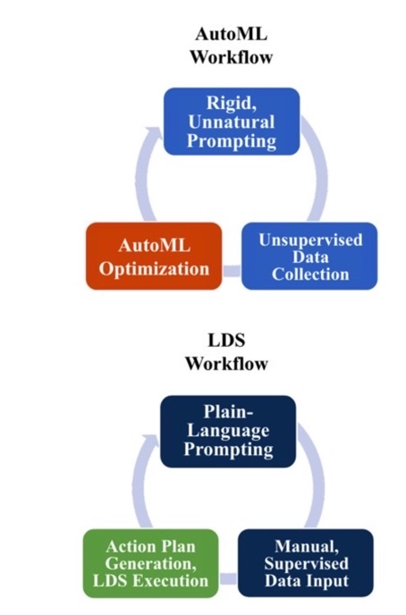
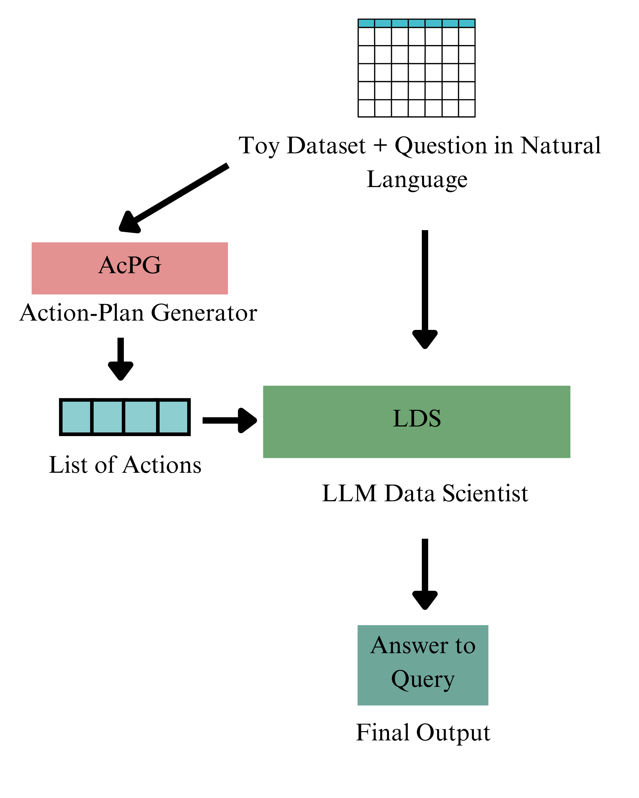

# DataAgent：探究大型语言模型回应自然语言零-shot查询的效能

发布时间：2024年03月29日

`LLM应用` `数据科学` `自动化编程`

> DataAgent: Evaluating Large Language Models' Ability to Answer Zero-Shot, Natural Language Queries

# 摘要

> 传统方法分析数据集提取有价值信息既繁琐又耗时。先前研究指出，重复性的编程和数据收集是阻碍数据科学家投身于更复杂劳动和高级项目的瓶颈。为此，我们对 OpenAI 的 GPT-3.5 进行了评估，将其视作一位“语言数据科学家”（LDS），它能从特定数据集中提炼出关键见解和基本信息。该模型在多个不同的基准数据集上进行了测试，评估其在包括使用 NumPy、Pandas、Scikit-Learn 和 TensorFlow 等库的数据科学代码生成任务等多个标准上的表现，并且在准确回答与基准数据集相关的数据科学问题方面表现出色。LDS 运用了诸如思维链增强和 SayCan 提示工程等创新的提示技术来有效回答问题。我们的研究结果表明，大型语言模型在低层次、零-shot 数据分析方面具有巨大的应用前景。

> Conventional processes for analyzing datasets and extracting meaningful information are often time-consuming and laborious. Previous work has identified manual, repetitive coding and data collection as major obstacles that hinder data scientists from undertaking more nuanced labor and high-level projects. To combat this, we evaluated OpenAI's GPT-3.5 as a "Language Data Scientist" (LDS) that can extrapolate key findings, including correlations and basic information, from a given dataset. The model was tested on a diverse set of benchmark datasets to evaluate its performance across multiple standards, including data science code-generation based tasks involving libraries such as NumPy, Pandas, Scikit-Learn, and TensorFlow, and was broadly successful in correctly answering a given data science query related to the benchmark dataset. The LDS used various novel prompt engineering techniques to effectively answer a given question, including Chain-of-Thought reinforcement and SayCan prompt engineering. Our findings demonstrate great potential for leveraging Large Language Models for low-level, zero-shot data analysis.

[Arxiv](https://arxiv.org/abs/2404.00188)