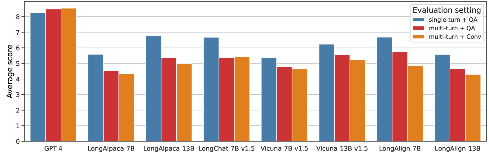
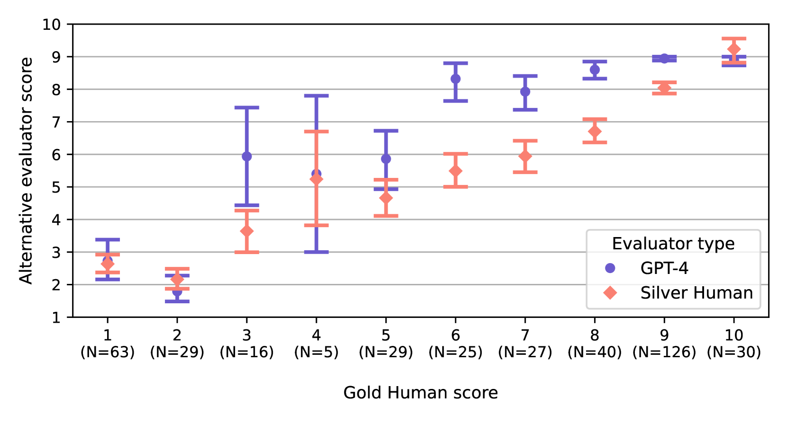
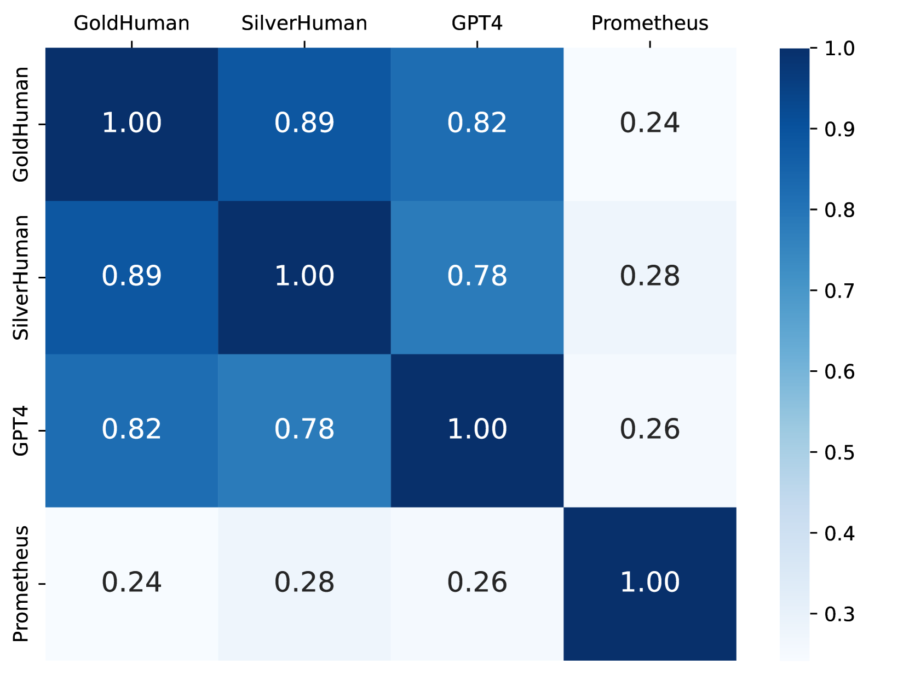
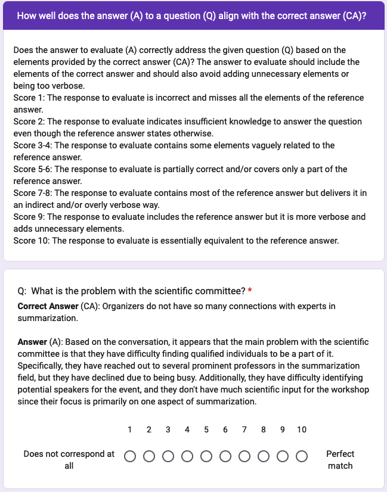

# ELITR-Bench：为长文本上下文语言模型设计的会议助手性能评估标准。

发布时间：2024年03月29日

`LLM应用` `会议助理` `语音识别`

> ELITR-Bench: A Meeting Assistant Benchmark for Long-Context Language Models

# 摘要

> 近期研究在扩展大型语言模型（LLMs）的上下文长度方面表现出浓厚兴趣，目的是更精准地捕捉长文本间的关联。尽管已有评估远程依赖能力的基准测试，但这些尝试主要针对通用任务，与现实世界的运用场景并不完全契合。相较之下，我们的研究提出了一种新的长上下文LLMs基准测试，着眼于实际的会议助理场景。这些长上下文由自动语音识别生成的转录构成，因其数据的噪声和口语特征，给LLMs带来了前所未有的挑战。我们创建的ELITR-Bench基准测试，在现有的ELITR语料库基础上增加了271个精心设计的问题和标准答案。通过在ELITR-Bench上对最新的长上下文LLMs进行实验，我们发现开源模型与专有模型之间存在显著差异，尤其是在对话中连续提问时。此外，我们还深入分析了基于GPT-4的评估方法，涵盖了众包研究提供的洞见。研究结果显示，尽管GPT-4的评估得分与人类评审的判断有一定相关性，但在区分超过三个评分等级时，其能力可能受限。

> Research on Large Language Models (LLMs) has recently witnessed an increasing interest in extending models' context size to better capture dependencies within long documents. While benchmarks have been proposed to assess long-range abilities, existing efforts primarily considered generic tasks that are not necessarily aligned with real-world applications. In contrast, our work proposes a new benchmark for long-context LLMs focused on a practical meeting assistant scenario. In this scenario, the long contexts consist of transcripts obtained by automatic speech recognition, presenting unique challenges for LLMs due to the inherent noisiness and oral nature of such data. Our benchmark, named ELITR-Bench, augments the existing ELITR corpus' transcripts with 271 manually crafted questions and their ground-truth answers. Our experiments with recent long-context LLMs on ELITR-Bench highlight a gap between open-source and proprietary models, especially when questions are asked sequentially within a conversation. We also provide a thorough analysis of our GPT-4-based evaluation method, encompassing insights from a crowdsourcing study. Our findings suggest that while GPT-4's evaluation scores are correlated with human judges', its ability to differentiate among more than three score levels may be limited.

[Arxiv](https://arxiv.org/abs/2403.20262)