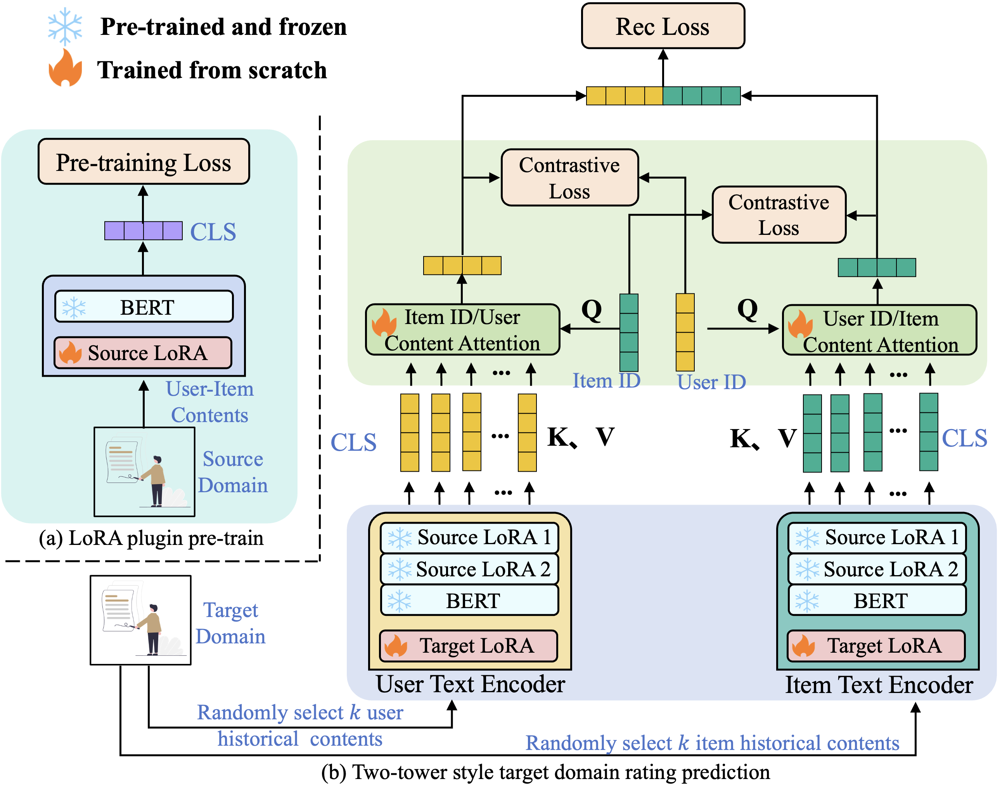

# 借助大型语言模型，提升基于内容的推荐系统

发布时间：2024年03月29日

`RAG` `推荐系统` `语义分析`

> Enhancing Content-based Recommendation via Large Language Model

# 摘要

> 在现实应用中，用户与不同项目互动时的行为千差万别，从隐性的点击到显性的评价评论。尽管如此，推荐系统研究大多集中于通过点击行为揭示用户偏好，寻求群体间的共鸣。对于显性的评价评论，虽有研究试图从中挖掘语义知识以提升推荐效果，但仍忽略了两个关键问题：一是内容语义作为普遍知识，如何从中提取多维度信息以适应不同领域；二是用户和项目ID作为推荐模型的基础，如何整合ID与内容语义特征空间。本文提出了一种新颖的“插件式”语义知识迁移方法\textbf{LoID}，包含两大核心：基于LoRA的预训练以获取多维度语义信息，以及基于ID的对比目标以协调特征空间。通过在真实世界数据集上的广泛实验，我们的LoID方法展现出显著的提升效果。

> In real-world applications, users express different behaviors when they interact with different items, including implicit click/like interactions, and explicit comments/reviews interactions. Nevertheless, almost all recommender works are focused on how to describe user preferences by the implicit click/like interactions, to find the synergy of people. For the content-based explicit comments/reviews interactions, some works attempt to utilize them to mine the semantic knowledge to enhance recommender models. However, they still neglect the following two points: (1) The content semantic is a universal world knowledge; how do we extract the multi-aspect semantic information to empower different domains? (2) The user/item ID feature is a fundamental element for recommender models; how do we align the ID and content semantic feature space? In this paper, we propose a `plugin' semantic knowledge transferring method \textbf{LoID}, which includes two major components: (1) LoRA-based large language model pretraining to extract multi-aspect semantic information; (2) ID-based contrastive objective to align their feature spaces. We conduct extensive experiments with SOTA baselines on real-world datasets, the detailed results demonstrating significant improvements of our method LoID.

[Arxiv](https://arxiv.org/abs/2404.00236)