# EventGround：通过关联事件中心化知识图谱进行叙事逻辑推理

发布时间：2024年03月29日

`Agent` `叙事推理` `知识图谱`

> EventGround: Narrative Reasoning by Grounding to Eventuality-centric Knowledge Graphs

# 摘要

> 叙事推理需要理解故事情境中的事件，这离不开广泛的背景知识。为了让机器掌握这些知识，现有策略大致分为两种。一种是通过预训练语言模型时加入事件认知目标，隐式构建事件知识，但这种方法会使知识结构瓦解，且难以解释。另一种是直接将事件知识整合进结构化的知识图谱，但目前对如何将这些知识应用于自由文本的研究还不多。我们提出了一个名为EventGround的全新框架，致力于将自由文本与事件中心的知识图谱相结合，以促进情境化的叙事推理。我们针对事件表示和数据稀疏性这两个关键难题，提供了简洁有效的解析和信息提取方法。实验显示，结合图神经网络或大型语言模型，我们的方法在性能上持续超越传统模型。通过整合基础知识，我们的框架不仅达到了最先进的水平，还能提供清晰的解释依据。

> Narrative reasoning relies on the understanding of eventualities in story contexts, which requires a wealth of background world knowledge. To help machines leverage such knowledge, existing solutions can be categorized into two groups. Some focus on implicitly modeling eventuality knowledge by pretraining language models (LMs) with eventuality-aware objectives. However, this approach breaks down knowledge structures and lacks interpretability. Others explicitly collect world knowledge of eventualities into structured eventuality-centric knowledge graphs (KGs). However, existing research on leveraging these knowledge sources for free-texts is limited. In this work, we propose an initial comprehensive framework called EventGround, which aims to tackle the problem of grounding free-texts to eventuality-centric KGs for contextualized narrative reasoning. We identify two critical problems in this direction: the event representation and sparsity problems. We provide simple yet effective parsing and partial information extraction methods to tackle these problems. Experimental results demonstrate that our approach consistently outperforms baseline models when combined with graph neural network (GNN) or large language model (LLM) based graph reasoning models. Our framework, incorporating grounded knowledge, achieves state-of-the-art performance while providing interpretable evidence.

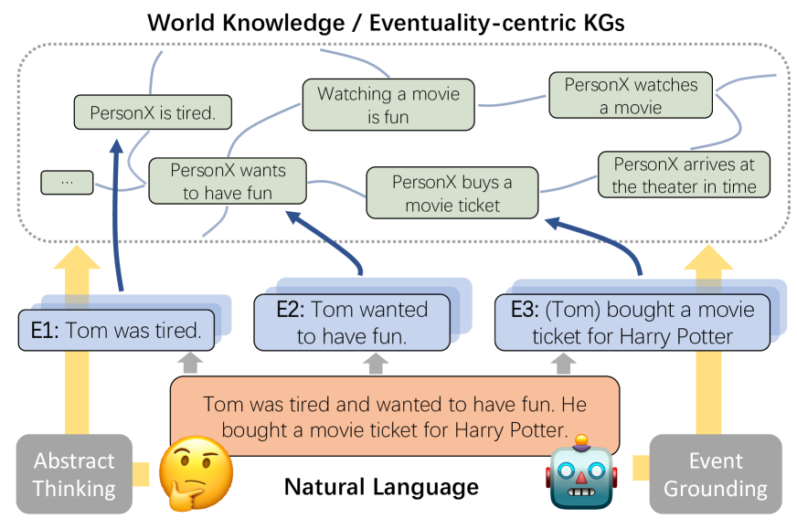

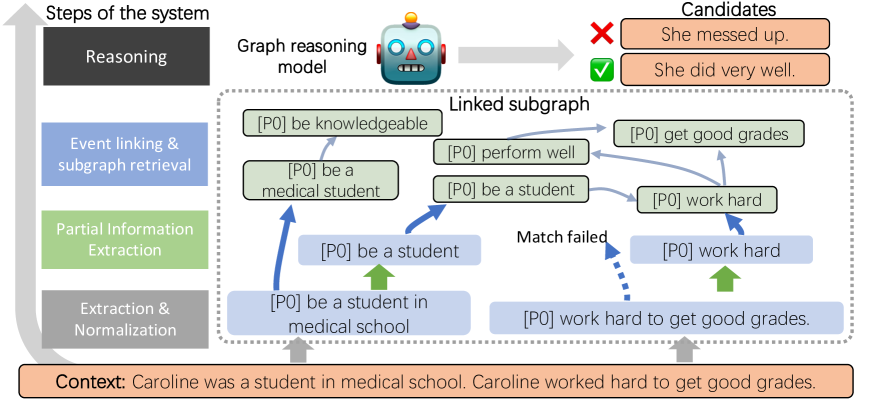

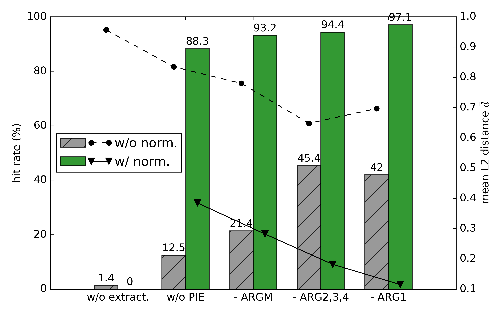

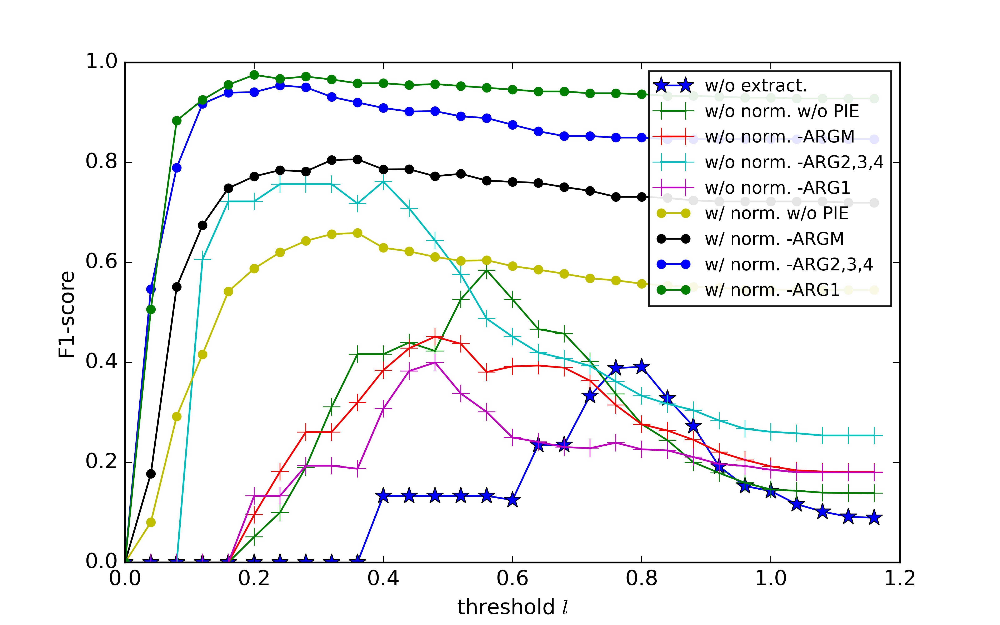

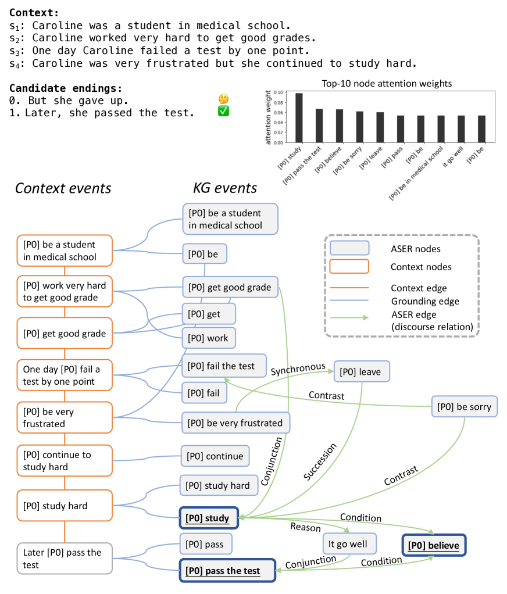

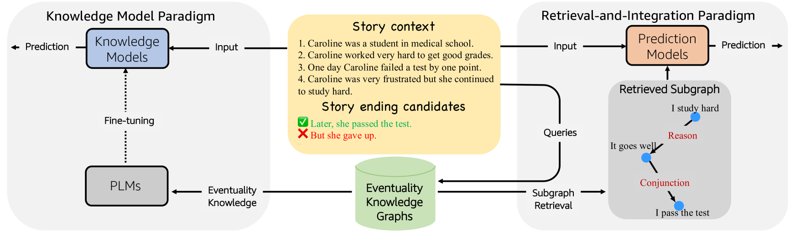

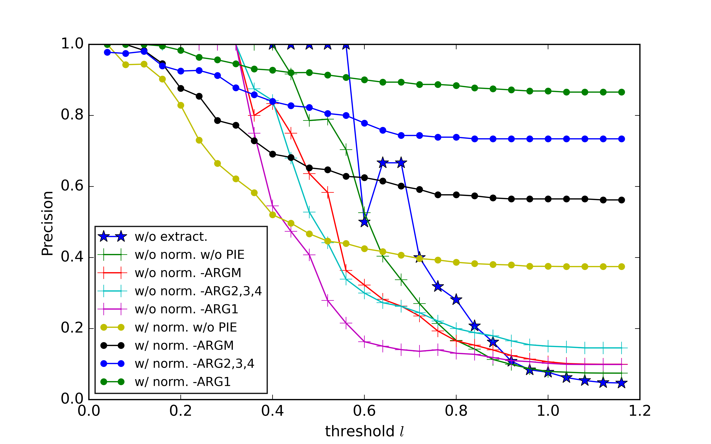

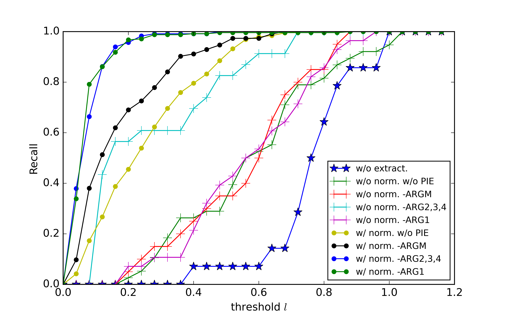

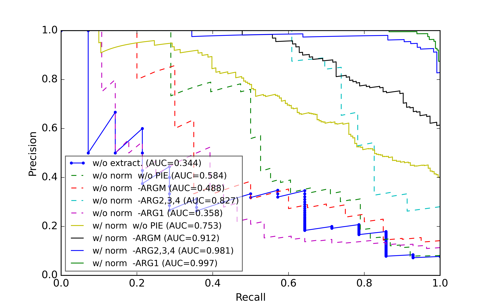

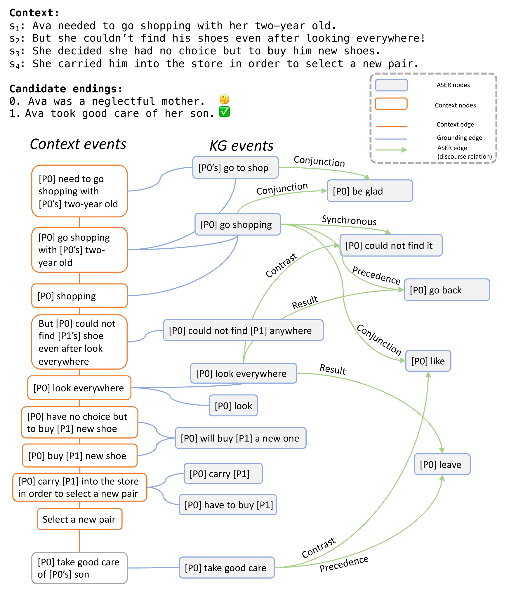

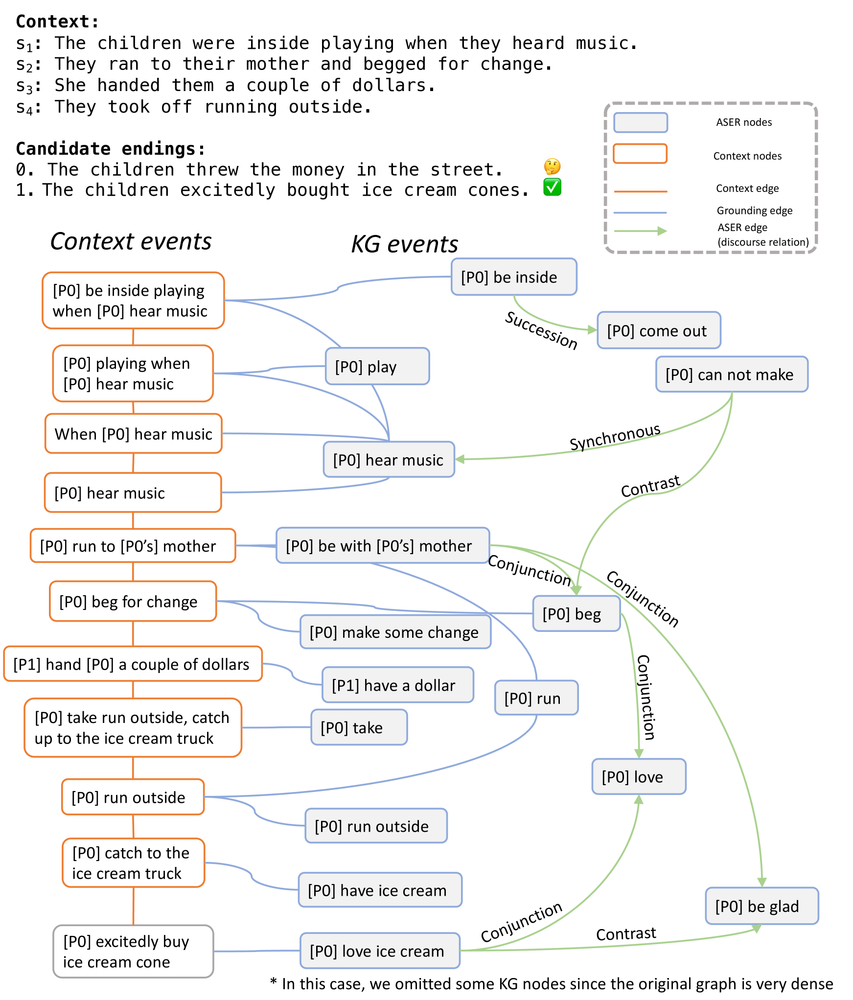

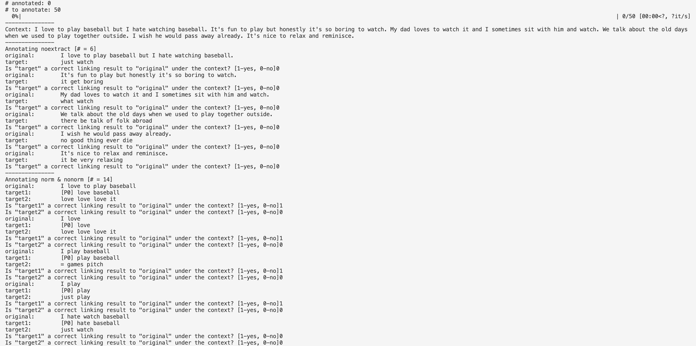

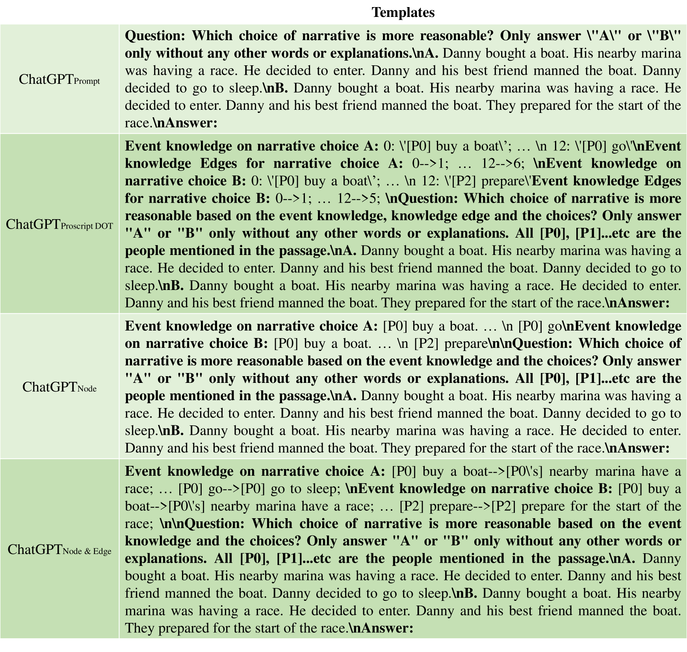

[Arxiv](https://arxiv.org/abs/2404.00209)