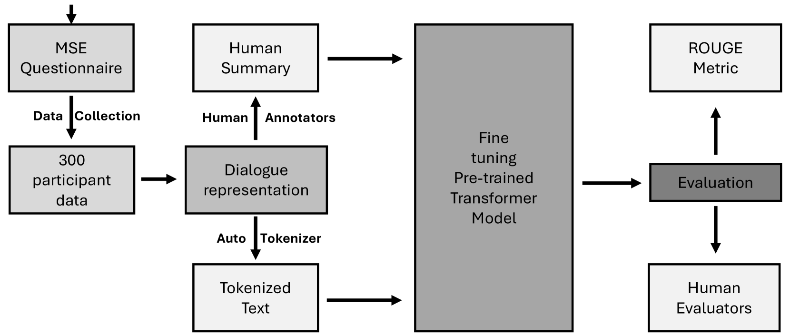
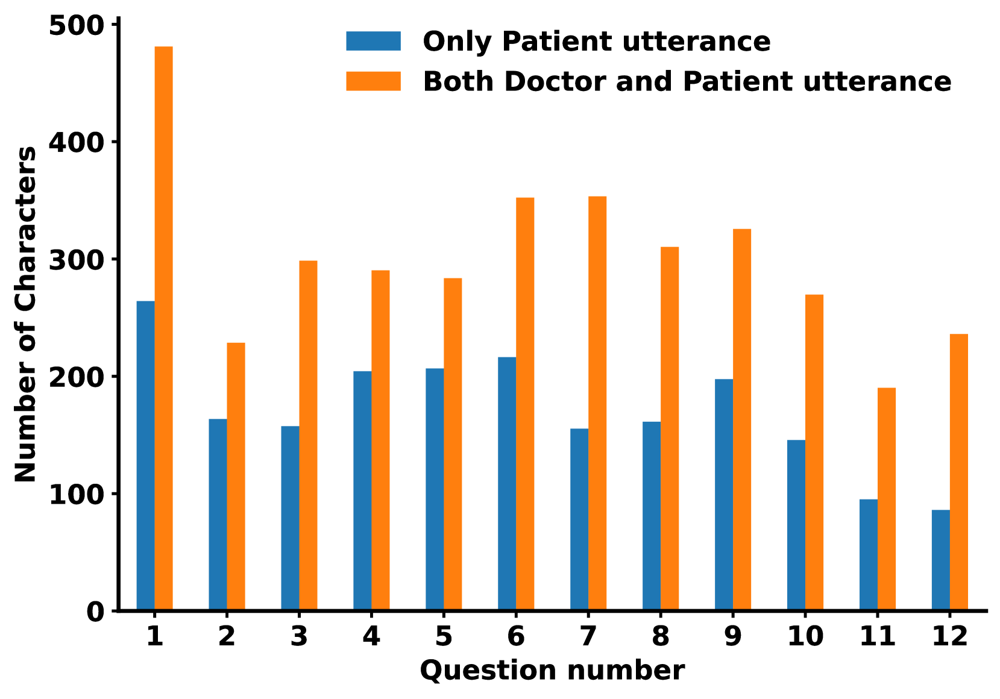
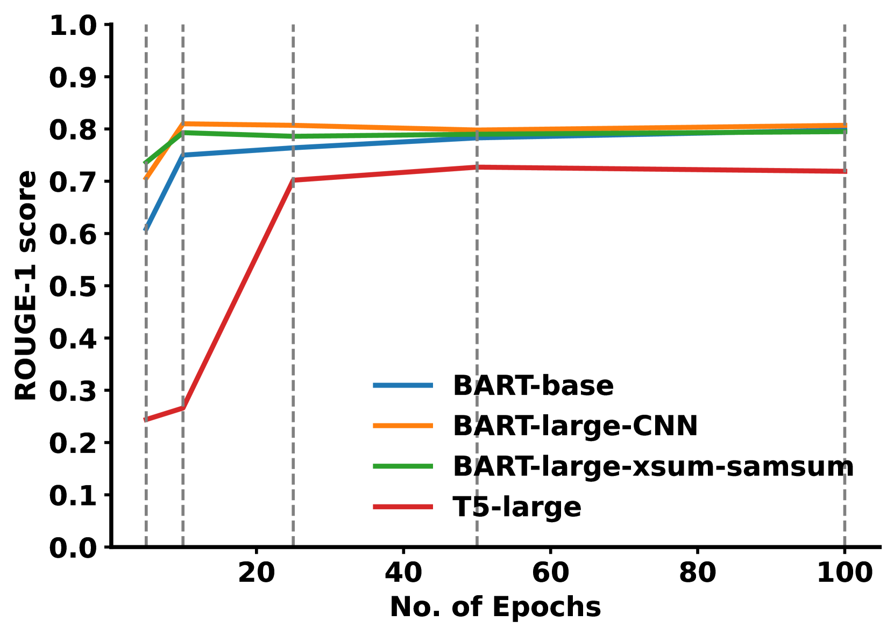
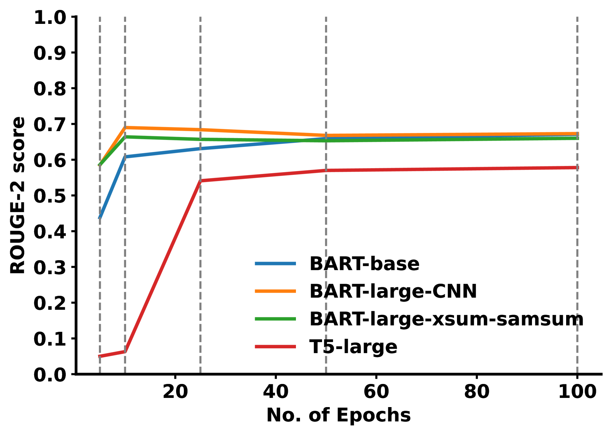
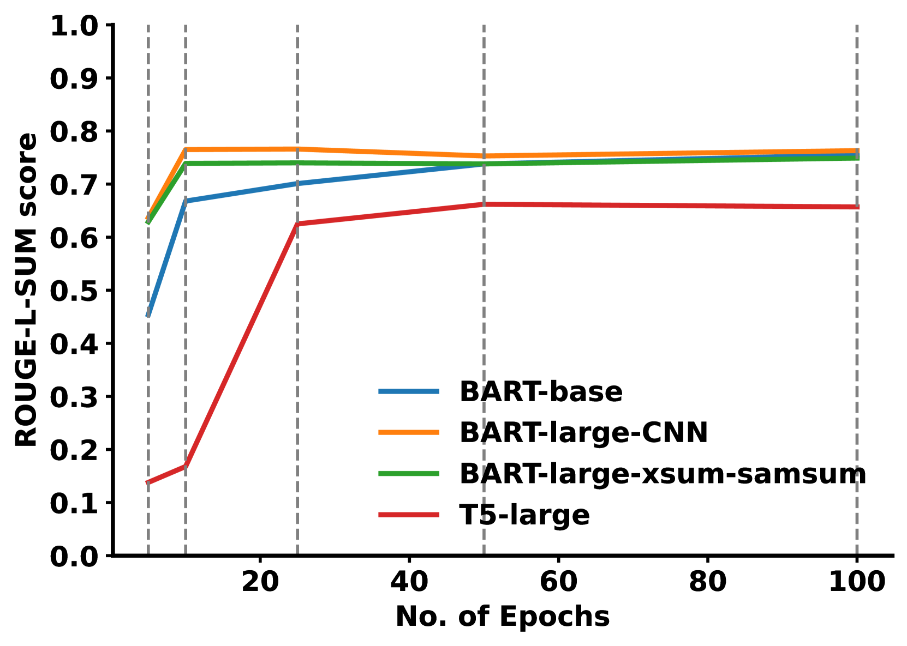

# 在自动生成诊断摘要方面，通过微调大型语言模型以提升其性能。

发布时间：2024年03月29日

`LLM应用` `心理健康` `自动化系统`

> Fine-tuning Large Language Models for Automated Diagnostic Screening Summaries

# 摘要

> 提升发展中地区的心理健康援助迫在眉睫。开发可扩展的自动化系统进行诊断筛查，有助于缓解心理健康专家的压力。本研究针对我们定制的心理健康检查摘要生成数据集，评估了几种大型语言模型（LLMs）的微调和非微调表现。通过ROUGE评分标准和人类评审员的反馈，我们对四款模型的摘要生成能力进行了严格测试。结果显示，经过微调的顶尖模型表现卓越，ROUGE-1和ROUGE-L得分分别达到0.810和0.764。此外，我们还考察了该微调模型在公开的D4数据集上的泛化效果，成果令人鼓舞，预示着其应用潜力可能超越我们的特定数据集。

> Improving mental health support in developing countries is a pressing need. One potential solution is the development of scalable, automated systems to conduct diagnostic screenings, which could help alleviate the burden on mental health professionals. In this work, we evaluate several state-of-the-art Large Language Models (LLMs), with and without fine-tuning, on our custom dataset for generating concise summaries from mental state examinations. We rigorously evaluate four different models for summary generation using established ROUGE metrics and input from human evaluators. The results highlight that our top-performing fine-tuned model outperforms existing models, achieving ROUGE-1 and ROUGE-L values of 0.810 and 0.764, respectively. Furthermore, we assessed the fine-tuned model's generalizability on a publicly available D4 dataset, and the outcomes were promising, indicating its potential applicability beyond our custom dataset.

[Arxiv](https://arxiv.org/abs/2403.20145)