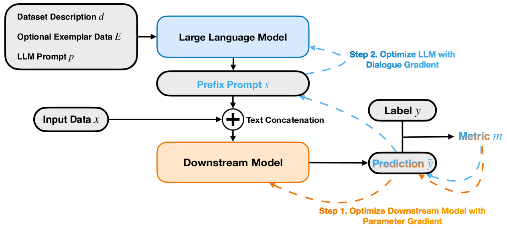
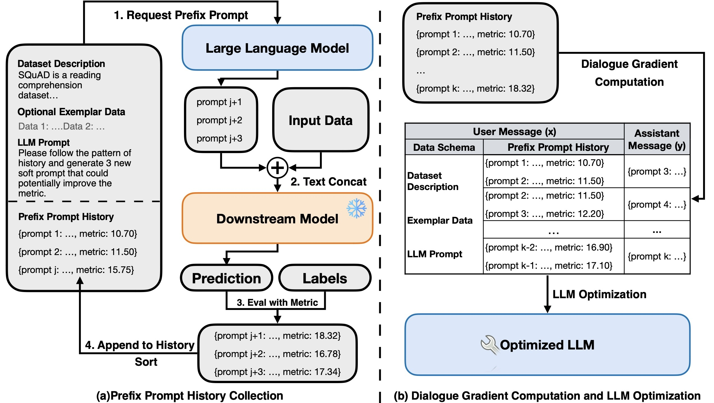
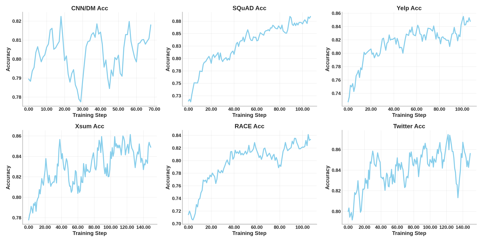
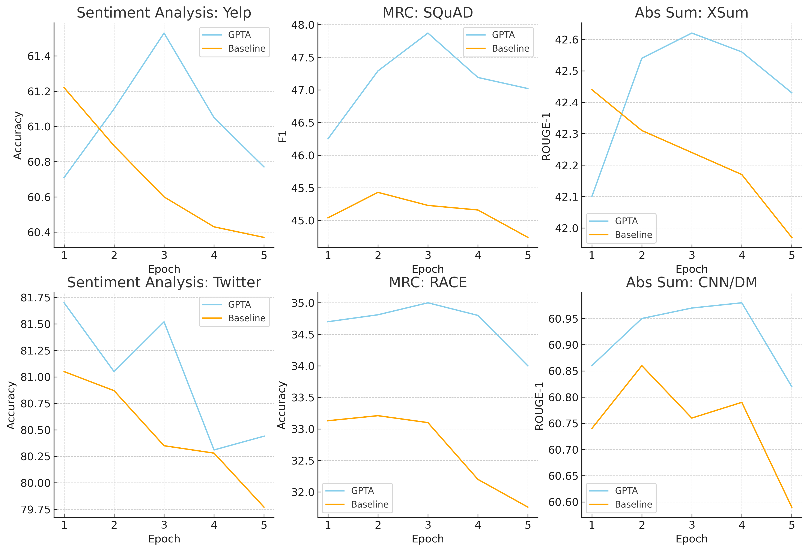
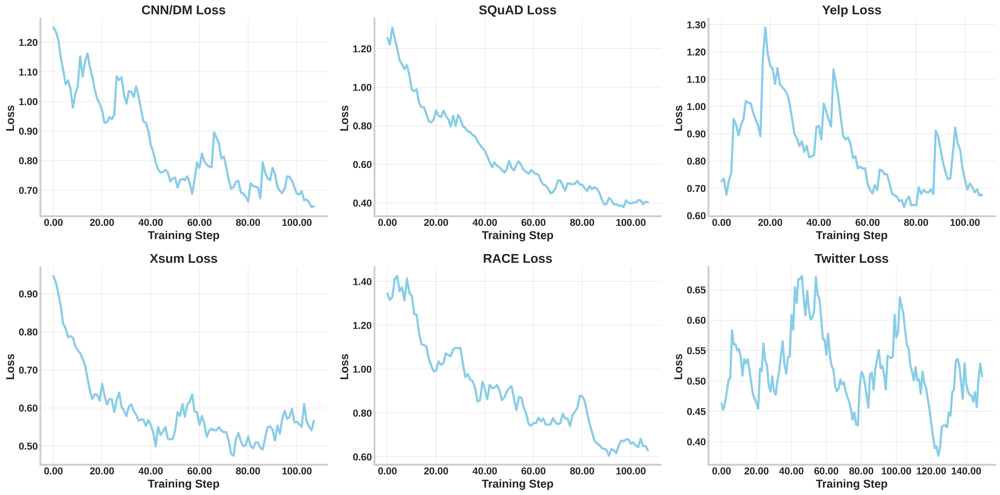

# GPTA：携手大型语言模型，助力下游神经网络的生成式提示调优助手。

发布时间：2024年03月29日

`LLM应用` `机器学习`

> GPTA: Generative Prompt Tuning Assistant for Synergistic Downstream Neural Network Enhancement with LLMs

# 摘要

> 本研究提出了GPTA框架，这是一种大型语言模型辅助训练方法，它通过前缀提示来加强下游任务模型的训练效果。该框架通过减少对LLM的数据依赖，应对了在模型训练中使用LLM所面临的安全与法律问题。GPTA采用了创新的协同训练策略，不仅通过参数梯度提升下游模型性能，还引入了独特的“对话梯度”来优化LLM。这一框架不仅在六大NLP基准数据集上取得了显著的性能提升，还有效减轻了低资源环境下的过拟合问题。深入分析进一步证实，GPTA作为一种经济高效、灵活应变的LLM辅助训练方法，为下游任务模型训练提供了有力支持。

> This study introduces GPTA, a Large Language Model assistance training framework, that enhances the training of downstream task models via prefix prompt. By minimizing data exposure to LLM, the framework addresses the security and legal challenges of applying LLM in downstream task model training. GPTA utilizes a new synergistic training approach, optimizing the downstream models with parameter gradients and LLMs with the novel ``dialogue gradient''. The framework not only demonstrates significant improvements in model performance across six NLP benchmark datasets, but also reduces overfitting in low-resource scenarios effectively. The detailed analyses further validate that our pioneer framework provides a cost-efficient and adaptive method for downstream task model training with LLM support.

[Arxiv](https://arxiv.org/abs/2404.00189)