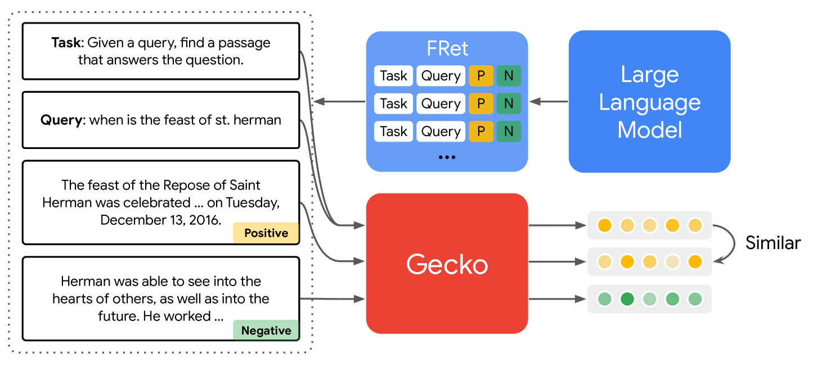
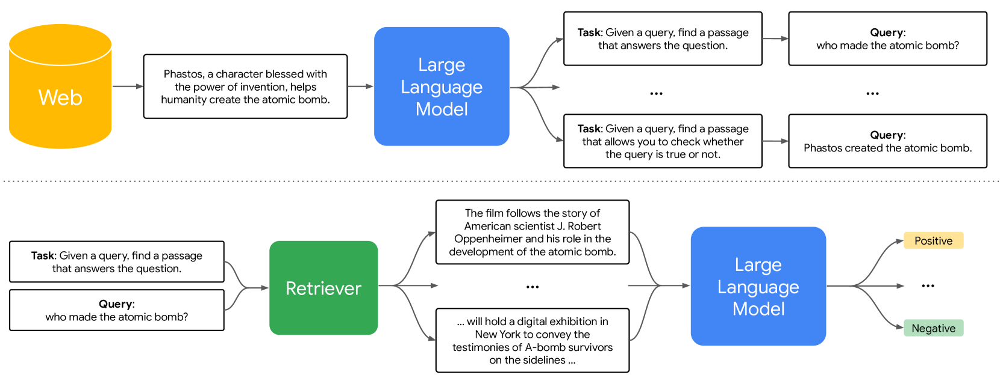

# Gecko：灵活多样，从大型语言模型中提炼出文本嵌入技术

发布时间：2024年03月29日

`LLM应用` `文本嵌入` `信息检索`

> Gecko: Versatile Text Embeddings Distilled from Large Language Models

# 摘要

> 我们推出了 Gecko，一款轻巧而全能的文本嵌入模型。Gecko 通过巧妙地从大型语言模型（LLMs）提取知识，打造出卓越的检索能力。其独特的两阶段蒸馏流程，先利用 LLM 生成多样化的模拟配对数据，再通过检索每个查询的相关候选文本，并对其中的正面及高难度负面文本重新标注，以提升数据品质。Gecko 的效率在其小巧的体积中得到显现。在大规模文本嵌入基准测试（MTEB）上，仅256维度的 Gecko 便超越了所有768维度的现有模型。而768维度的 Gecko 以66.31的平均分，与体积大七倍、维度高五倍的模型相抗衡。

> We present Gecko, a compact and versatile text embedding model. Gecko achieves strong retrieval performance by leveraging a key idea: distilling knowledge from large language models (LLMs) into a retriever. Our two-step distillation process begins with generating diverse, synthetic paired data using an LLM. Next, we further refine the data quality by retrieving a set of candidate passages for each query, and relabeling the positive and hard negative passages using the same LLM. The effectiveness of our approach is demonstrated by the compactness of the Gecko. On the Massive Text Embedding Benchmark (MTEB), Gecko with 256 embedding dimensions outperforms all existing entries with 768 embedding size. Gecko with 768 embedding dimensions achieves an average score of 66.31, competing with 7x larger models and 5x higher dimensional embeddings.

[Arxiv](https://arxiv.org/abs/2403.20327)