# H2RSVLM：探索有益且真实的遥感领域的大型视觉语言模型

发布时间：2024年03月29日

`LLM应用` `视觉-语言模型`

> H2RSVLM: Towards Helpful and Honest Remote Sensing Large Vision Language Model

# 摘要

> 视觉-语言模型（VLMs）的发展势头强劲，但在遥感（RS）这一特定领域，其表现尚不理想。这主要是因为RS图像的专业性和技术难度，以及现有VLMs在空间感知方面的局限。为了提升特定于遥感的视觉语言模型（RSVLMs）的性能，我们创建了HqDC-1.4M数据集，它包含140万对图像和详细描述，这不仅加深了RSVLM对遥感图像的理解，还显著提升了其空间感知技能，如准确定位和计数。此外，针对RSVLMs常见的“幻觉”问题，我们推出了RSSA数据集，旨在增强模型的自我认知能力。通过在常规的遥感视觉问答任务中加入无法回答的问题，RSSA有效地提高了模型输出的真实性，减少了不实信息的产生。基于这些创新，我们提出了H2RSVLM，这是一个既实用又诚实的遥感视觉语言模型。H2RSVLM在多个公开的遥感数据集上表现出色，能够识别并拒绝回答那些无法解答的问题，有效避免了错误的生成。相关代码、数据和模型权重将在https://github.com/opendatalab/H2RSVLM 上公布。

> The generic large Vision-Language Models (VLMs) is rapidly developing, but still perform poorly in Remote Sensing (RS) domain, which is due to the unique and specialized nature of RS imagery and the comparatively limited spatial perception of current VLMs. Existing Remote Sensing specific Vision Language Models (RSVLMs) still have considerable potential for improvement, primarily owing to the lack of large-scale, high-quality RS vision-language datasets. We constructed HqDC-1.4M, the large scale High quality and Detailed Captions for RS images, containing 1.4 million image-caption pairs, which not only enhance the RSVLM's understanding of RS images but also significantly improve the model's spatial perception abilities, such as localization and counting, thereby increasing the helpfulness of the RSVLM. Moreover, to address the inevitable "hallucination" problem in RSVLM, we developed RSSA, the first dataset aimed at enhancing the Self-Awareness capability of RSVLMs. By incorporating a variety of unanswerable questions into typical RS visual question-answering tasks, RSSA effectively improves the truthfulness and reduces the hallucinations of the model's outputs, thereby enhancing the honesty of the RSVLM. Based on these datasets, we proposed the H2RSVLM, the Helpful and Honest Remote Sensing Vision Language Model. H2RSVLM has achieved outstanding performance on multiple RS public datasets and is capable of recognizing and refusing to answer the unanswerable questions, effectively mitigating the incorrect generations. We will release the code, data and model weights at https://github.com/opendatalab/H2RSVLM .

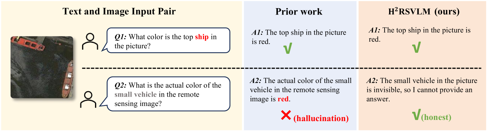

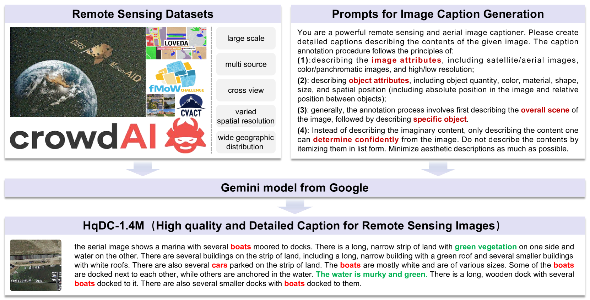

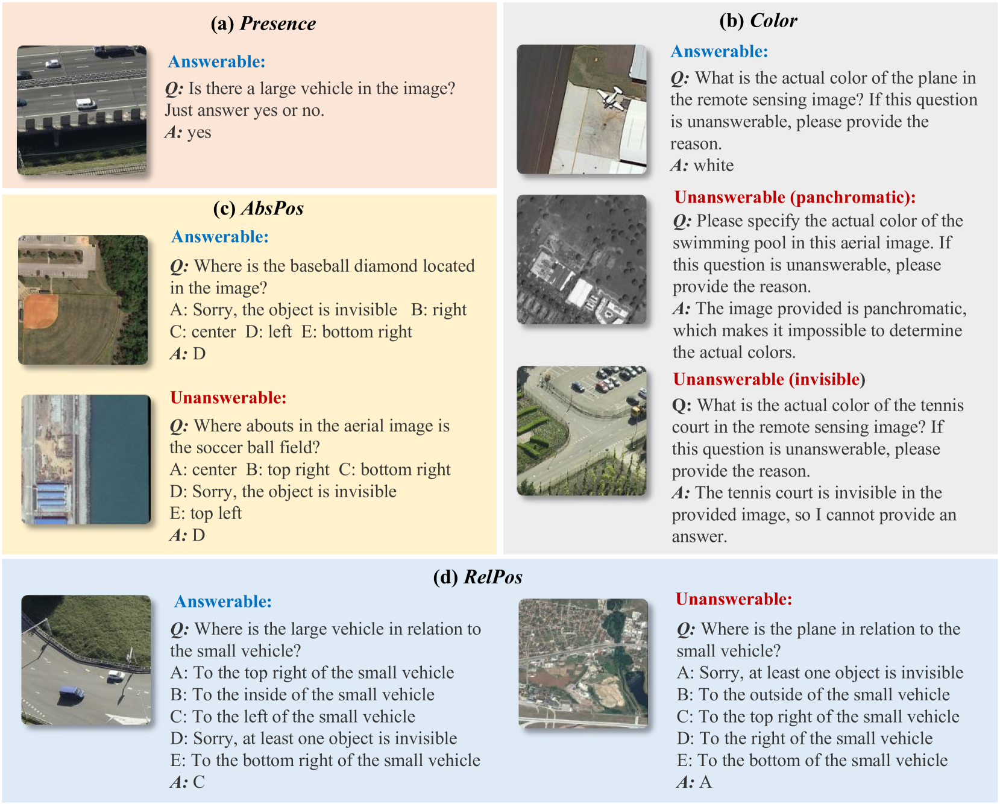

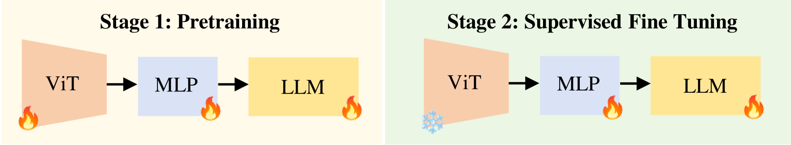

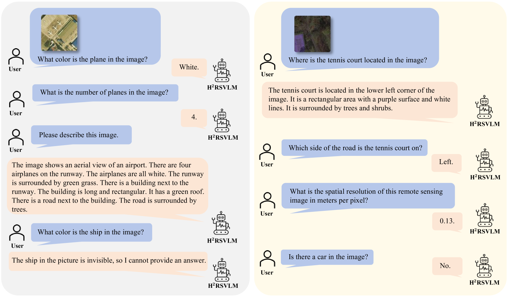

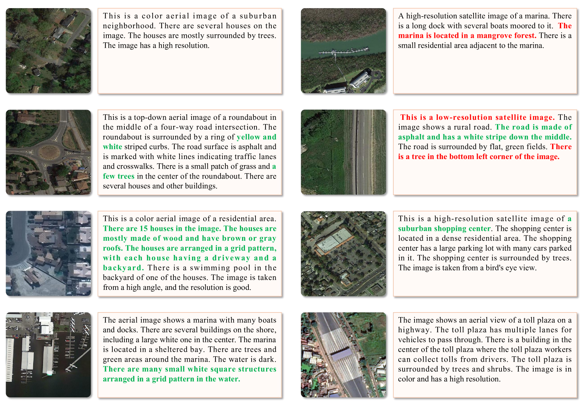

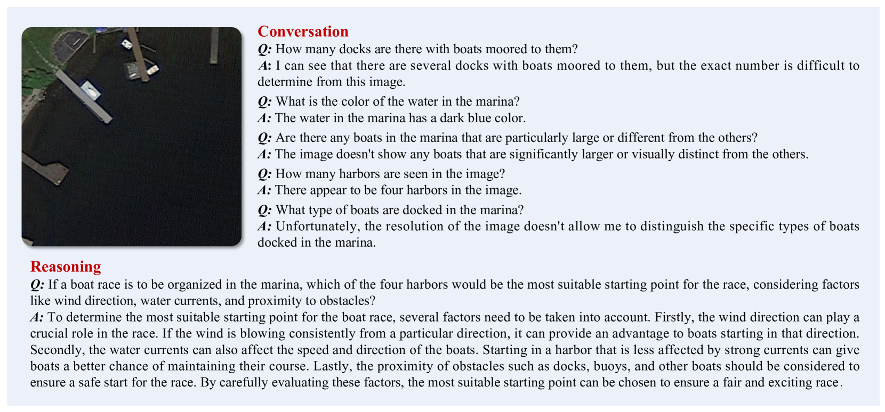

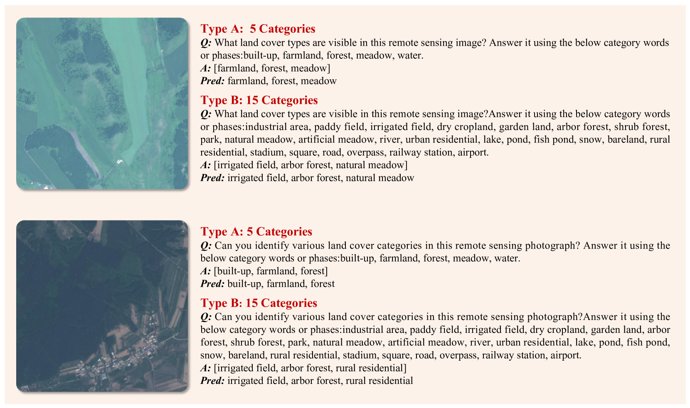

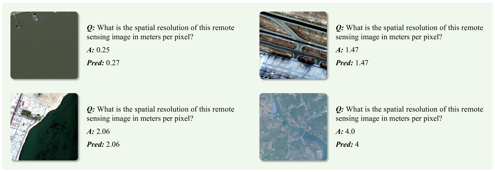

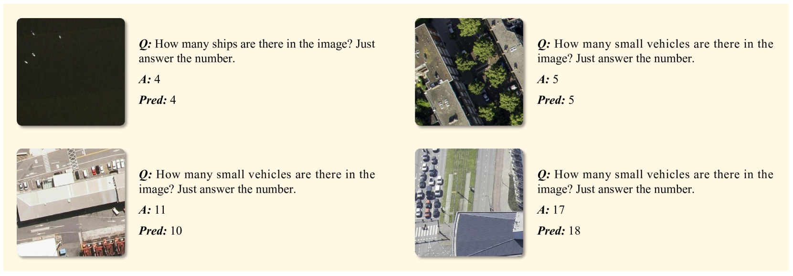

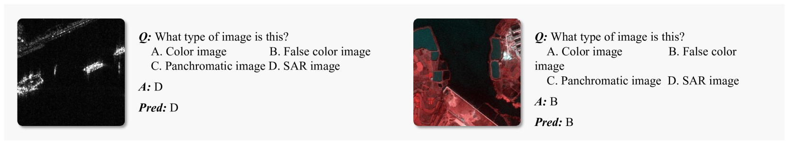

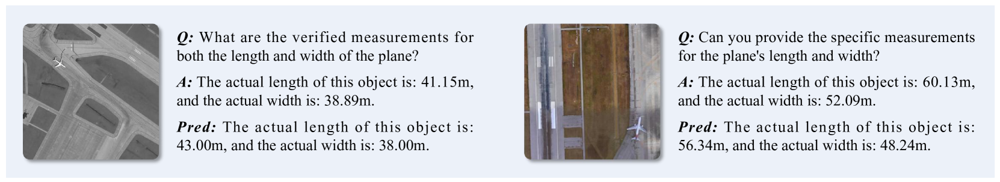

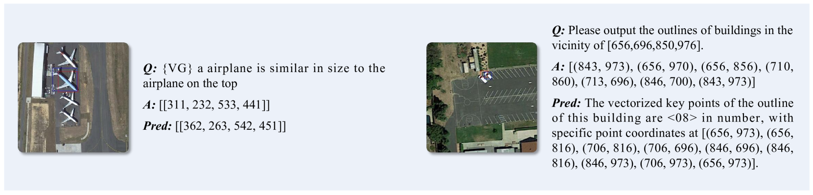

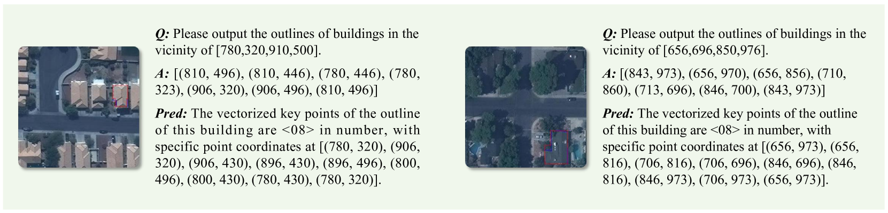

[Arxiv](https://arxiv.org/abs/2403.20213)